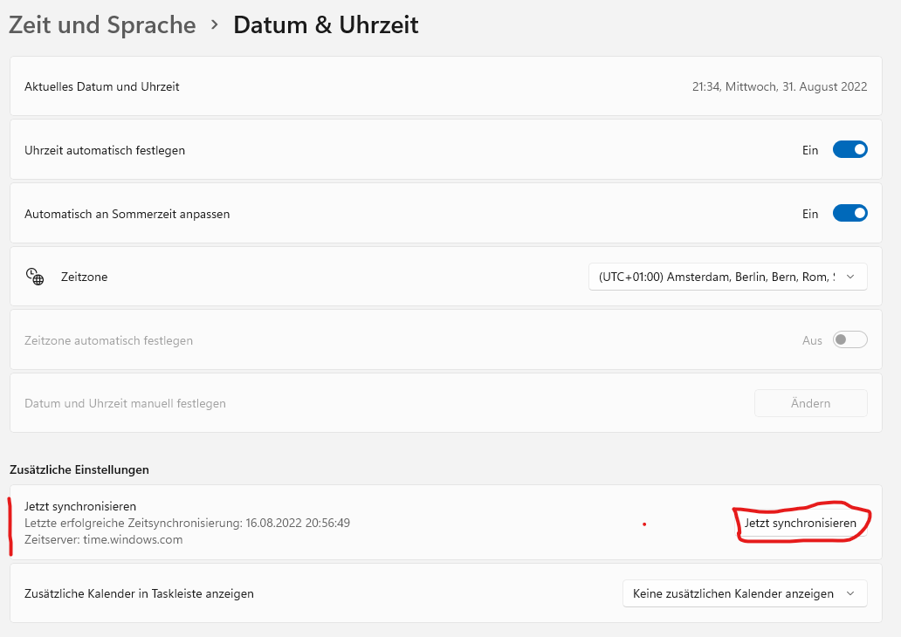

I have an error message in DeFi Wallet: : ▶ [DeFi Wallet error messages](./DeFi_Wallet_error_messages.md)

There is a community suggestion on how best to use the DeFi app. Please read this test first to better understand the topic. [Suggestion for using the DeFi app](./Suggestion_for_using_the_DeFi_app.md)

## The DeFi Wallet does not start and I do not get an error message

_DeFi Wallet does not start_  

There are different causes for this problem and different solutions.

1.  Restart the computer and try again
2.  You can try to find out more about the problem: [Debug.log](./Debug.log.md)
3.  In part, this approach helps: [Delete .defi](./Delete_dot_defi.md)

## I cannot find the AppData or Library folder

Here you can find an explanation to show hidden folders like Library or AppData.

[Show hidden folders](./Show_hidden_folders.md)

## My backup file was deleted with the update

When installing an update, some folders are overwritten. On Windows these are the following folders:

`C:\Users\%username%\AppData\Local\Programs\defi-app`

`C:\Users\%username%\AppData\Roaming\defi-app`

If the backup was stored in one of these folders before the update, it was most likely deleted during the update.

To avoid such problems, it's best to read our wiki recommendation on how to use the DeFi app safely.

[Suggestion for using the DeFi app](./Suggestion_for_using_the_DeFi_app.md)

## The blockchain-sync doesn't complete to 100%

Some users descirbe the problem that the blockchain-sync doesn't come up to 100%. Instead it always stays some blocks behind, e.g. 99.95%. In this case it can be helpful to go to the windows-settings and re-sync the Windows-System time.

