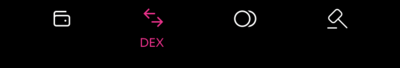
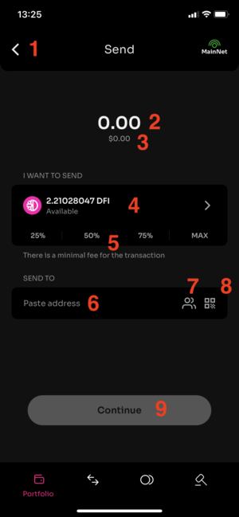
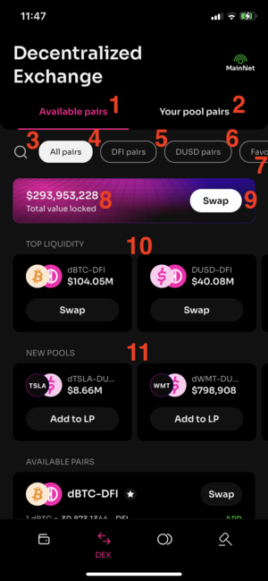
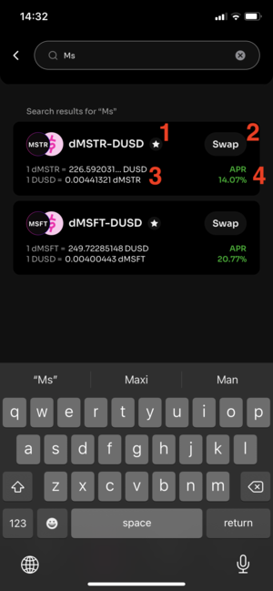
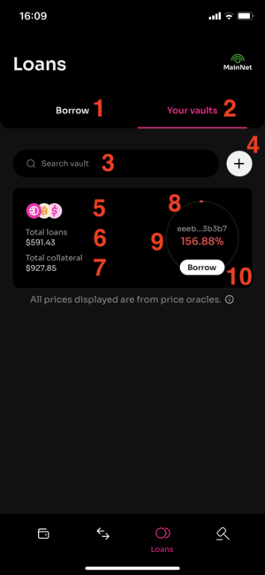
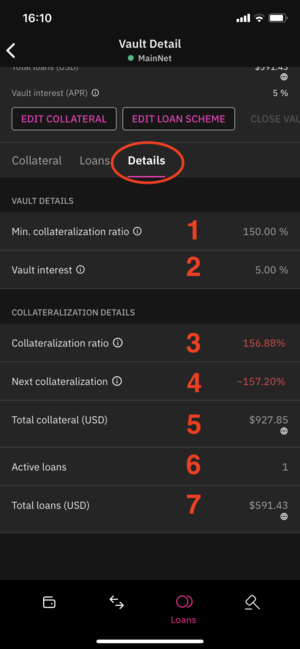
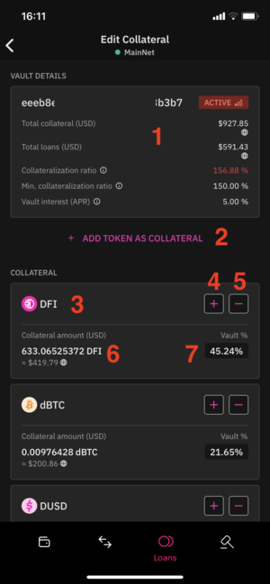
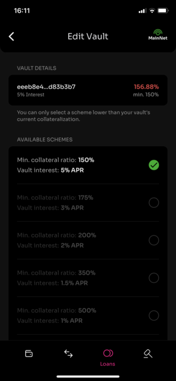

## Background and general infos

The most common wallet for DeFiChain, the so called light wallet is the app for mobile devices “DeFiChain Wallet“. You find it on the google app store for Android or apples app store for iOs devices.

<https://play.google.com/store/apps/details?id=com.defichain.app>

<https://apps.apple.com/app/defichain-wallet/id1572472820>

The app is developed and actively maintained by Birthday Research – the R&D (Research and Development) arm of Cake DeFi <https://birthday.dev/>

The app gets updated frequently so always check if you are using the latest version.

You can find some more basics on all available wallets in the article [Beginners Guide](./Beginners_Guide.md)

As the name already tells you, it is a light wallet. So, it does not require a full node having the whole blockchain data downloaded. Instead, an API is used to connect to servers that provides this data – on the DeFiChain this is the so called ocean API. You can specify the endpoint you want to use in the setting as described in the article [Lightwallet change Ocean](./Lightwallet_change_Ocean.md)

Everytime you want to do a transaction on the blockcahin (like for example sending or swapping coins) you will have to provide your passcode. While the transaction is processed you see an information pop up in the lower end of the app. There is also a link to open the transaction on defiscan.info. You have to wait until a transaction was finished to be able to sign the next one.

## App Overview

Here is a detailed user guide for the light wallet.

The interface of the Light Wallet consists of 4 major categories. You can switch between those categories with the buttons at the bottom of the app.

- Portfolio
- DEX
- Loans
- Auctions

### Portfolio

This is the main screen where you have an overview of the assets in your wallet.

_Main screen - portfolio_  

1.  You can go to the settings from here (cogwheel at the top left)
2.  You can select the network (MainNet, [TestNet](./Testnet.md) or Playground) with the button on the top right. This button is visible on all tabs, so you always see at one glance if you are on the MainNet
3.  You can add multiple Adresses to you wallet. Each address will get a generated icon and it is possible to label each address. The labels can help to organize your addresses but are not shared on the blockchain and not visible to others. By clicking the icon or the label you get a pop up window where you can organize your addresses (add additional ones or rename them) and select the address you want to use in the wallet. The popup also lets you copy the addresses to the clipboard.
4.  With the Eye button you can toggle if the amounts and values of the assets are shown. For example, if you are using the wallet in public like on a train and some stranger sits beside you - you might want to hide the values.
5.  The total worth of assets in this address. By clicking you can choose the reference currency in which the total but also all other positions in the wallet are displayed. The available options are
    - BTC - Bitcoin
    - DUSD - The stablecoin on the DeFiChain
    - USDC – USD Coin, it is an ERC-20-Tokens issued by the Centre consortium
    - USDT – Tether, an ERC-20-Tokens issued by Tether Limited, when using Tether as reference currency the dollar sign is used in all amounts over the app
    - DFI – The native coin of the DeFiChain
6.  With the little arrow you can show or hide the details on how the total worth is calculated. This is especially helpful when you are using vaults as the details show how much is in the collateral (locked in vaults) and how much loans sum up as debit
7.  Send Button - forwards you to the send screen, described in detail bellow
8.  Receive Button - shows the current address on the DeFiChain, lets you copy this address in to the clipboard to be able to paste it in nother app. The address is also shown as a QR code that lets you scan the address with another devices camera.
9.  Swap Button- forwards you to the swap screen for trading one kind of token to another via the liquidity pools on the DEX, described in detail bellow
10. Transactions - shows you the history of transactions of the current address on the blockchain. You can look up details for every transaction directly in the app or use a link to the transaction on defiscan.live
11. Filter displayed Assets in the Portfolio. Available are the options
    - All tokens – show everything you got in the portfolio
    - dTokens – show DUSD and all stock tokens (like dTesla for Tesla or dMSTR for Microstrategy)
    - Crypto – show he dAssets representing crypto currencies like dBTC for Bitcoin or dETH for Etherium
    - LP tokens – show just the positions in liquidity mining pools (no matter if crypto or stocks) No matter which one of the 4 filters you choose, you will always see your DFI position on top.
12. Here you can select the order in which the positions of the portfolio are listed. You can select ascending or descending by value (in the chosen reference currency mentioned in point 5), by amount of token or alphabetically.

#### Send

With the Send button (Nr 7 on the main screen - Portfolio) you are forwarded to an interface where you can send any token in your portfolio (no matter if crypto, stock token or even pool token) to another address.

_Send screen_  

1.  Back arrow - you can always cancel the current sending and go back to the previous screen
2.  The amount (number of token) you want to send
3.  The value of the amount to send in the reference currency, gets updated while you type the amount (2)
4.  The token you want to send, default when opening is DFI, when you click on it you can choose from all the token you have in the wallet. You are also informed about the amount of the token that you have available in the current address
5.  Presets for amounts, you can directly choose with these four presets 25, 50, 75 or 100 percent of the token that are available in the current address
6.  DeFiChain Address of the receiver, a text field where you can paste an address that you have in the clipboard, such an address starts with d followed by lots of characters and numbers
7.  Choose an address from your address book. In the settings menu (cogwheel on the main screen - Portfolio) you can add addresses to a whitelist and provide a label for each of these bookmarked addresses. Here in the send screen, you can choose from your whitelisted addresses and also all the addresses that you have in your wallet.
8.  Scan QR code – this lets you use the camera of your device to scan a QR code that represents an address on the DeFiChain
9.  Continue – as soon as you have specified the amount you want to send and a valid receiver you can continue. You will have to provide your passcode. A new passcode can be set in the settings menu (cogwheel on the main screen - Portfolio). It is a six-digit numeric passcode that you set when initializing the wallet. If you lose your passcode, you will not be able to authorize any transaction. In the worst case you can still access your funds with another wallet if you still have your 24 recovery words.

#### Swap

_LightWallet-Swap screen_  

1.  Back arrow - you can always cancel the current swap and go back to the previous screen
2.  Type of swap: Instant – that is the default, meaning you directly perform the swap
3.  Type of swap: Future – in this case your swap will be performed with the next future swap, such a swap happens once a week at a defined block height, more on this topic is described in article [Future Swap](./Future_Swap.md)
4.  Token A – the type of token you want to sell, you can choose from all crypto and stock token that you hold in the current address
5.  Info on how much of this token you hold in the current address
6.  Amount A - the amount (number of token) you want to sell. While you type, the value of the swaps outcome gets calculated bellow
7.  Value A - the value of the amount to sell in the reference currency, gets updated while you type the amount (6)
8.  Presets for amounts to sell, you can directly choose with these four presets 25, 50, 75 or 100 percent of the token that are available in the current address With the button bellow you can change the direction of the trade, so swap the positions of token A and token B
9.  Token B – the type of token you want receive; you can choose from all the token that have a trading route from the asset type A
10. Amount B - the amount (number of token) you want to receive. This gets calculated by the value you provided in (6) but can be overwritten so that you define the desired output of the swap, and the necessary input gets calculated.
11. Value A - the value of the amount to sell in the reference currency, gets updated while you type the amount (6 or 10)
12. Slippage – here you can define the maximum amount of slippage you want to accept in that trade. There are presets of 0.5, 1 or 3 percent or you can also enter a custom value. The slippage is a kind of fee that depends on the size of your trade compared to the liquidity in the used pools. Best try your swap with a small slippage tolerance first to avoid high fees. If the transaction fails – you will see that as an error message in the app – you can still, try with a higher tolerance or smaller amount. Trading huge amounts is best split up in chunks and wait for the pool to rebalance between the separate transactions.
13. Info about the exchange rates - how much token of type B do you get for one token of type A and vice versa. As soon as you have specified the amount, token types and accepted slippage you can click continue to perform the transaction. You will see a summary of that swap that you then can accept with a click on the button ‘swap’. You will have to provide your passcode. This is the six-digit numeric passcode that you set when initializing the wallet.

### DEX

This 2nd tab of the app provides an overview of the trading pools of the decentralized exchange ([DEX](./DEX.md)).

_Overview of the screen DEX_  

1.  Available pairs – all the pools that are currently available are shown in the list bellow
2.  Your pool pairs – this filters the list below to just the pools that you are providing liquidity for, meaning you have the pool token in your portfolio
3.  Search – clicking the magnifying glass gives you the possibility to use a text search, just start typing the name of the asset you are looking for. The search results listed below the input field will narrow down while you type, such a search is shown in the next picture
4.  All Pairs – no filter, just list all available pools
5.  DFI Pairs – just shows the pools directly trading with native token of DeFiChain, DFI. These are the crypto pools and DUSD- DFI
6.  DUSD Pairs – just shows the pools trading with the DeFiChains stable coin DUSD, these are the stock token pools as well as the stable coin pools dUSDC-DUSD, dUSDT-DUSD and DUSD- DFI
7.  Favorites – just show the list of pools that you have bookmarked in your favorites list using the star button bellow Only when no filter got applied (Available Pairs 1 and All Pairs 4) the following parts are shown (8-11). If a filter was applied, you directly see the list of pools.
8.  Info TVL - Info total value locked informs you about the total value of the assets currently in the pools
9.  Swap Button – opens the blank swap menu, same GUI as when trigger from the main (portfolio) screen
10. Top liquidity – lists you the five pools with the most liquidity
11. New pools – lists the five pools that got added the most recently

#### View of one pool in the list

One pool is displayed in the list like this

_List of pools on the Dex - search result for "Ms"_  

1.  Next to the type icon and pool name you have the little star shaped button that lets you add this pair to your personal list of bookmarked favorites
2.  Swap button – opens the swap menu, but this time prefills the two chosen assets (input and output of the trade)
3.  Info about the current exchange rates (how many token of type B do you get for one token of type A and vice versa).
4.  Info on the APR tells you how high the rewards in this pool are currently when providing liquidity. APR stands for Annual Percentage Rate, so that is the rate of return in one years time, but other than the APY (Annual Percentage Yield) without considering the compounding (meaning reinvesting) of the rewards. Please note that the APRs vary a lot over time as they are depending on the trading volume and the value locked in the pool.

#### Pool - Detail view

By clicking on a pool in the list you are forwarded to a more detailed screen that provides even more information on the selected pool.

_Pool Details_  

1.  Link to defiscan.live showing the blockchain date of this pool token
2.  Favorites – add or remove from your personal list of bookmarked pools
3.  Volume (24H) – how high was the traded volume in this pool in the last 24h.
4.  Total liquidity – how many pool tokens are issued and what is their current value in the selected reference currency
5.  Pooled Asset A – number of tokens of one Asset in the pool and its worth in the selected reference currency
6.  Same as 5) for the other token in the pool pair
7.  Info about the current exchange rates (how many token of type B do you get for one token of type A and vice versa). The information shown in the following 3 points (8-10) are only displayed if you provided liquidity in the chosen pool
8.  Number and value in reference currency of Pool tokens in the current address, so how much liquidity you have provided to the pool
9.  Number and value in reference currency of token A in the liquidity provided (so one part of the amount in point 8)
10. Number and value in reference currency of token B in the liquidity provided (so the other part of the amount in point 8)
11. APR – info about the Annual Percentage Rate of this pool, the distribution between rewards and commission is also shown
12. Add liquidity – forwards you to the menu for providing additional liquidity to the pool. You will have to add both assets of the pool pair to receive pool token.
13. Remove liquidity (only shown if you currently hold pool token), forwards you to the menu for removing liquidity of the pool. You will have to change your pool token to receive token of both assets in the pair (beware of the impermanent loss described here [Impermanent Loss](./Impermanent_Loss.md))
14. Swap button – opens the swap menu and prefills the two chosen assets (input and output of the trade)

### Loans

#### Borrow

Opening the third of the four main tabs of the app shows you an overview of the assets that are available to me minted using vaults. Vaults are handled in the following sub pages of this tab.

1. Borrow – Show the list of token available for borrowing (“minting”), this means when you have created a vault and have added collateral to this vault you can take a loan to borrow the assets shown in this list
2. Your vaults – Show the vaults available in your current address or create a new one
3. Search filed – here you can use a textual search on the available token for borrowing

_The following four points (4 – 7) are available on each token in the list/search results_

4. Name/Ticker Symbol of the token, Next to the textual name there is also an icon of each token, for example the pink Dollar sign at the DUSD
5. Current price when minting this token
6. Interest rate – percentage you will have to pay annually for minting this token
7. Borrow – Go to screen for borrowing more, prefill with the selected token

#### Overview of your vaults

1. Borrow – Switch back to main view of the Loans tab. Shows the list of token available for borrowing (“minting”), this means when you have created a vault and have added collateral to this vault you can take a loan to borrow the assets shown in this list
2. Your vaults – the current view, Shows the vaults available in your current address or create a new one
3. Search field - here you can use a textual search to search in your vaults by vault ID
4. Add button – redirects you to the menu for creating a new vault in this address. You will be able to define a loan schema. The creation of a new vault costs a fee of 2 DFI. 1 DFI is a kind of deposit that you would get back when closing the vault later.

_The following six points (5 – 10) are available on each vault that is shown in the list of your vaults/search results_

5. Preview of the coins used as collateral
6. Total value of loans taken (Debit sum) in Dollar as the prices are taken from the oracles
7. Total value of collateral (Credit sum) in Dollar as the prices are taken from the oracles
8. Graphical representation of the vault – color indicating the status of the vault as a RAG status (Red – Amber – Green) depending on the current percentage
9. Current [Collateral ratio](./Collateral_Ratio.md) of the vault - expressed as percentage (ratio of the deposited collateral value to loan value), this has to stay above the percentage of your loan schema to don’t get liquidated
10. Borrow button - go to screen for borrowing more assets, pre-select the current vault

#### Vault Details (old version <2.10)

1. Vault status – depending on the current collateralization ratio the color is indicating the risk of liquidation in red – amber – green
2. Vault ID - the unique number identifying this vault on the blockchain, There is also a button representing a link to defiscan.live where you can further investigate this vault. This ID is needed when interacting with this vault with tools like dobby for monitoring or vault maxi for management of the vault.
3. Minimum collateralization ratio – this is the percentage where the vault would go into liquidation, depending on your selected loan schema
4. Current collateralization ratio of the vault - expressed as percentage (ratio of the deposited collateral value to loan value), this has to stay above the percentage of your loan schema (3) to don’t get liquidated, The color of the percentage is indicating the status (red – amber – green)
5. Next collateralization ratio – the wallet already gives you an indication of what the ratio will be in the next block
6. Risk chart – a simple diagram showing the current collateralization ratio as a bar, the risk levels are show with colors (red – amber – green)
7. Total collateral - shown in USD, calculated from the price feed from the oracles, this are the assets that you deposit in the vault
8. Total loans - shown in USD, calculated from the price feed from the oracles, this are the assets that you have minted with this vault
9. Interest rate - this is the annual interest rate that you will have to pay for taking for your take and loans. The rate depends on your chosen loan scheme. The interest rates are ‘paid’ continuously as they are calculated with each block and added on the loan amount.
10. Edit collateral – this button forwards you to a screen where you can add or remove the assets deposited as collateral in the vault, this screen is shown bellow
11. Edit loan scheme– this button forwards you to a screen where you can change the loan schema, this screen is shown bellow
12. Sub tab on vault details (1/3) – “Collateral” – shows the list of assets deposited as collateral
13. Sub tab on vault details (1/3) – “Loans” – shows the loans currently taken with this vault
14. Sub tab on vault details (1/3) – “Details” – more information and details on this vault

_The following three points (15 – 17) are available on each asset type that is deposited in this vault_

15. Token Icon and Name, The tokens that are available as collateral are DFI, DUSD, dETH, dBTC, dUSDC and dUSDT
16. Percentage of this token in the total collateral
17. Amount shown as number of token and the value in USD, calculated from the price feed of the oracles

#### Vault details - Sub tab "Loans" (old version <2.10)

This Sub view lists all the loans currently taken using this vault.

The following five points (1 – 5) are available on each asset type that is taken as loan with this vault

1. Name and icon of the asset taken as loan / ”minted”
2. Outstanding balance – your debit, the token taken as loan including the interest amount that summed up until now, expressed as number of token and current value in USD, calculated from the price feed of the oracles
3. Interest amount - this numbers show you how much interest rate has summed up since last payback or borrowing, in case of DUSD loans the interest amount can also be a negative number, note that the outstanding balance (2) is already considering this interest amount (especially for negative interest rates this is sometimes causing confusion)
4. Payback loan – forwards you to a screen where you can pay back the loan of this token, there you can specify the amount you want to pay back. The screen will show you the resulting collateralization ratio. When you want to close the loan, it is best to choose the amount a little bit higher because you also must pay the interest for the current block. The resulting token (what you paid back too much) will stay in your address
5. Borrow more – forwards you to a screen where you can increase the amount of minted token. The screen will show you the resulting collateralization ratio.

#### Vault Details – Sub tab “Details” Vault Details (old version <2.10)

On this page you see some figures of the current vault:

1. The minimum collateralization ratio, depending on the chosen loan scheme
2. The annual interest rate for taking loans, depending on the chosen loan scheme
3. The current collateralization ratio, color showing the risk status
4. Next collateralization ratio, a forecast of the collateralization ration in the next hour, color showing the risk status
5. Total collateral - shown in USD, calculated from the price feed from the oracles, this are the assets that you deposit in the vault
6. Number of active loans in this vault
7. Total loans - shown in USD, calculated from the price feed from the oracles, this are the assets that you have minted with this vault

#### Edit collateral (old version <2.10)

Here you can add or remove the assets deposited as collateral in the vault.

1. Details on the vault – we have seen this information already on the previous screens
2. Add another token as collateral. The tokens available are DFI, DUSD, dETH, dBTC, dUSDC and dUSDT

The following five points (3 – 7) are available on each token in the list of already added collateral

3. Name and icon of the token
4. Button to add additional collateral – this will increase you collateralization ratio
5. Button to withdraw collateral – this will decrease you collateralization ratio
6. Amount of token currently added as collateral, value in USD, calculated from the price feed from the oracles
7. Percentage of this token in the total collateral

#### Vault Details (new version >2.10.0)

1. Vault status – depending on the current [Collateral ratio](./Collateral_Ratio.md) the color is indicating the risk of liquidation in red – amber – green
2. Add collateral – this lets you choose token available in this address to be added in the collateral of this vault. Possible tokens are DFI, DUSD, dETH, dBTC, dUSDC and dUSDT
3. Borrow – lets you mint additional token and create new loans. You will get a list of available dTokens including the interest rates. Clicking a Token forwards you to the borrow screen, prefilled with this token. The screen will show you the resulting [Collateral ratio](./Collateral_Ratio.md).
4. Pay – lets you pay back a loan. All tokens currently taken as a loan in this vault are shown in a list. A Pay button on each loan forwards you to a screen where you can pay back the loan of this token. There you can specify the amount you want to pay back. The screen will show you the resulting [Collateral ratio](./Collateral_Ratio.md). When you want to close the loan, it is best to choose the amount a little bit higher because you also must pay the interest for the current block. The resulting token (what you paid back too much) will stay in your address
5. Edit – this button forwards you to a screen where you can change the loan schema for this vault (min collateralization ratio and base interest rate), this screen is shown bellow
6. Max loan amount – shows you the amount of additional loans that you could take right now to reach the minimal collateralization ratio
7. Total collateral - shown in USD, calculated from the price feed from the oracles, this are the assets that you deposit in the vault
8. Total loans - shown in USD, calculated from the price feed from the oracles, this are the assets that you have minted with this vault
9. Vault ID - the unique number identifying this vault on the blockchain, There is also a button representing a link to defiscan.live where you can further investigate this vault. This ID is needed when interacting with this vault with tools like dobby for monitoring or vault maxi for management of the vault.
10. The annual interest rate for taking loans, depending on the chosen loan scheme
11. The minimum [Collateral ratio](./Collateral_Ratio.md), depending on the chosen loan scheme

#### Vault Details - collaterals and loans (new version >2.10.0)

1. Button to withdraw collateral (for each token currently in the collateral) – this will decrease you collateralization ratio
2. Button to add additional collateral (for each token currently in the collateral) – this will increase you collateralization ratio
3. Pay button for each active loan to go to the payback screen
4. Close Vault – if you have paid back all loans you can close this vault. This will also free the one DFI deposit that had to be paid while creating the vault.

#### Edit loan scheme

Here you can change the loan scheme of the vault. Depending on the minimum [Collateral ratio](./Collateral_Ratio.md) the interest rates of the loans differ. A lower collateralization ratio means you can mint more tokens. That’s why for these schemes the interest rate is higher.

The following options are available:

150% min. ratio > 5% APR
175% min. ratio > 3% APR
200% min. ratio > 2% APR
350% min. ratio > 1.5% APR
500% min. ratio > 1% APR
1000% min. ratio > 0.5% APR

### Auctions

#### Overview

In this tab you can bid on vaults that are in liquidation.

In the overview you see a list of collaterals that are up for auction currently. You can sort by time or use different filters.

#### Details

1. Back arrow - you can always go back to the overview screen
2. List of assets in the collateral up for auction – for each the name, icon and value in USD, calculated from the price feed from the oracles
3. Total value of all assets in the collateral
4. Remaining time of this auction
5. ID of the vault in liquidation on the blockchain, link to defiscan.live
6. Address containing the vault in liquidation on the blockchain, link to defiscan.live
7. Blocktime when vault got liquidated
8. Minimum value you would need to bid

Bellow there is a button to show the bid history (next screen), or place a bid.

#### Bid History

