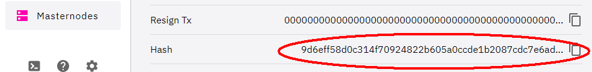
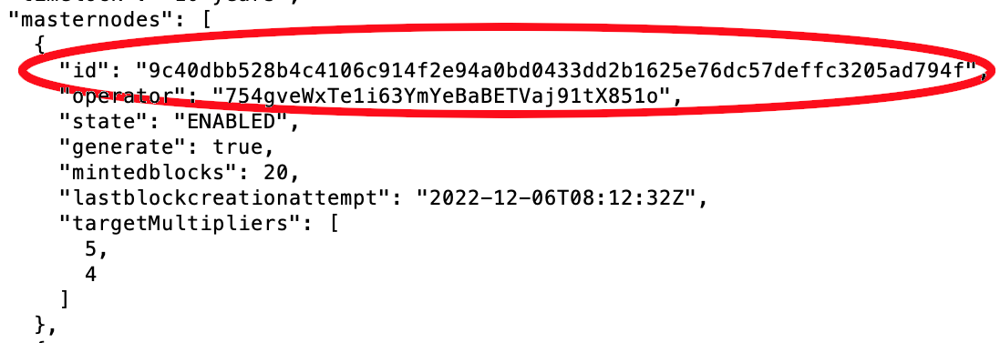

The `updatemasternode` command can be used to change an existing Masternode. The Owner address (the address with 20K DFI Collateral), Operator address and the Reward address can be changed. You may change one address or multiple addresses at the same time. The time in TRANSFERRING state is only applied once. No matter how many addresses are changed. Therefore, it helps to reduce non-generating time for a Masternode by changing all addresses in one step. Please note that only those addresses are to be specified in the command that need to be changed. Those addresses that should be kept are not to be mentioned.

You need your `MasternodeID` to use this Command. The `MasternodeID` is your `TransactionID` from the creation of your Masternode. You can find the ID in the Desktop Wallet when you click the Tab Masternodes, select your Masternode and check the last line named `Hash`.



When you have access to the operator wallet, you can find the `MasternodeID` using the command `getmininginfo`:



## Considerations

Be aware, when you redirect your Rewards to an Exchange like Bittrex or Kucoin or another Smart Contract (e.g. CAKE), make sure beforehand that the service supports this redirection. Masternode rewards are created directly from the blockchain and are initially in "immature" status for 99 blocks and cannot be used. Exchanges often use smart contracts to assign incoming transactions to your Exchange Wallet via a batch command; this is not possible in this case.

Redirecting to your Light Wallet can also be problematic, if your rewards go there directly to your main address, you can't make a transaction there for 99 blocks. If you run a Vault, this can be a problem under certain circumstances, if you have to react quickly. Optimally, you set up a new DFI address on the Light Wallet that you use only for your Masternode rewards.

## Commands for the desktop wallet

### Change Owner address:

```bash
updatemasternode "EnteryourMasternodeID" {"ownerAddress":"EnterNewOwneraddress"}
```

### Change the Operator address:

```bash
updatemasternode "EnteryourMasternodeID" {"operatorAddress":"EnterNewOperatoraddress"}
```

### Change or set a Reward address:

```bash
updatemasternode "EnteryourMasternodeID" {"rewardAddress":"EnterNewRewardaddress"}
```

### Change multiple addresses:

```bash
updatemasternode "EnteryourMasternodeID" {"operatorAddress":"EnterNewOperatoraddress","rewardAddress":"EnterNewRewardaddress"}
```

## The commands for defi-cli

### Change Owner address:

```bash
updatemasternode "EnteryourMasternodeID" '{"ownerAddress":"EnterNewOwneraddress"}'
```

### Change the Operator address:

```bash
updatemasternode "EnteryourMasternodeID" '{"operatorAddress":"EnterNewOperatoraddress"}'
```

### Change or set a Reward address:

```bash
updatemasternode "EnteryourMasternodeID" '{"rewardAddress":"EnterNewRewardaddress"}'
```

### Change multiple addresses:

```bash
updatemasternode "EnteryourMasternodeID" '{"operatorAddress":"EnterNewOperatoraddress","rewardAddress":"EnterNewRewardaddress"}'
```

## Masternode status

If you change any of the values with the `updatemasternode` command, your Masternode will go through the following states:

### Testnet

updatemasternode Rewardaddress: Switch in State `TRANSFERRING`, `ENABLED` after **60** blocks

updatemasternode Operatoraddress: Switch in State `TRANSFERRING`, `ENABLED` after **60** blocks

updatemasternode Owneraddress: Switch in State `TRANSFERRING`, `PRE-ENABLED` after 60 blocks, `ENABLED` after 10 blocks = **70** blocks

### Mainnet

updatemasternode Rewardaddress: Switch in State `TRANSFERRING`, `ENABLED` after **1008** blocks

updatemasternode Operatoraddress: Switch in State `TRANSFERRING`, `ENABLED` after **2016** blocks

updatemasternode Owneraddress: Switch in State `TRANSFERRING`, `PRE-ENABLED` after 2016 blocks, `ENABLED` after 1008 blocks = **3024** blocks (\~24h)
