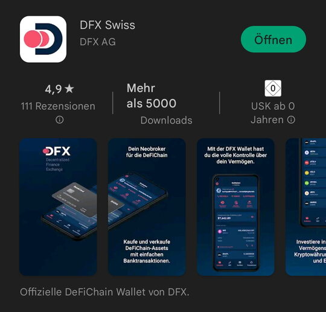

If you speak german and prefer videos you can start [here 🎬](https://www.youtube.com/watch?v=q4MUebLlLzM&list=PLc-FB8e3YKYtju2G0O7bcUB1FE2t2SD0j). Please be aware that information in the videos might be outdated due to continous development of DeFiChain and the production date of the video.

You prefer written information? Here we go!

## Decision: Which wallet should you use? {#decision-which-wallet-should-you-use}

With a wallet-app you will be able to access your DFI-Coins, which are on the blockchain.

You can use your wallet especially for

- administration of your DFI-portfolio
- send and receive coins
- use the DEX for swapping coins
- use your coins for [Liquidity Mining](./Liquidity_Mining.md)
- create a vault and manage the collateral for your loans
- take and payback a loan
- join future-swaps

Currently you can choose among the following wallets

### DeFiChain Light Wallet {#defichain-light-wallet}

The Light Wallet is available for your Android- and iOS-smartphone. This app doesn't syncronize the complet blockchain. So it needs less memory is faster ready for use. Furthermore the die userfriendly User Interface makes it easier to enter the DeFiChain ecosystem.

The light wallet uses a 24-words-seed-phrase to grant access to your funds. Please be sure you follow the safety recommendations when using the app.

The following list is not a necessarily complete on. You are completely responsible for your seed. Losing your seed means losing your funds!

- Store your 24 words safely (a word-document on any online-device like a Laptop, Smartphone is not safe)
- Don't tell them to anyone beside maybe a person of trust for emergency cases
- Watch out on Telegram. Scammers are very tricky when trying to get your 24 words. Don't tell them anyone who writes you a private message in a chat.
- Don't put your 24 words in an app or bot which you can't verify as legit.

For convenience you place a 6-digit-code for signing transactions, so you don't need your 24 words every time you use the wallet. After entering three times a wrong code the app will be reset and you need your 24 words to get access to your funds again.

### DFX Light Wallet {#dfx-light-wallet}

The DFX Light Wallet is a modified version of the Light wallet with several added functionalities concerning DFX.Swiss services. Among others those functions are Staking and participating in votings.

Further information can be found here in the [DFX-Wiki-chapters](./DFX_FAQ.md)

### Jellywallet {#jellywallet}

The Jellywallet is the youngest member of the DeFiChain-Wallet-family. It is a Chrome-extension. So it is great for users who prefer working with a PC or laptop instead of a smartphone.

Jellywallet also uses a 24-words-seed-phrase.

Usage of Vaults and Loans is not possible as of today.

The wallet with further information can be downloaded [here](https://jellywallet.io/).

### Full-Node-Wallet {#full-node-wallet}

For a beginner the start into DeFiChain with the Full-Node-Wallet is not recommended as the usability is not really intuitively possible. For technical oriented users who want to use a command line additionaly however it is the only option. Also when you want to run your own masternode you need the Full-Node-Wallet.

-   The Full-Node-Wallet is harder to use than the Wallet for the smartphon
-   This wallet always syncronizes the whole blockchain. So it need more memory capacities and time.
-   You do not have a 24-word-seed-phrase. The Full-Node-Wallet uses a safety-file. The so called "wallet.dat" and the password always need to be kept safe to have acces to your funds.
-   You can download it here: <https://defichain.com/downloads> for macOS, Windows and Linux

## Getting your first DFI-Coins ("On-ramp") {#getting-your-first-dfi-coins-on-ramp}

Buying DFI-Coins, also called on-ramp,is possible on several ways as weh show in the following paragraphs. As fees are subject of changes we do not note them here and ask you to check them live on the company's websites.

The off-ramp (changing coins into FIAT) works on the same ways except Cake.

### Exchanges {#exchanges}

Crypto-exchanges is the traditional way to change your FIAT-money into Crypto-currencies. At the beginning you open an account at an exchange of your choice. Usually this is done with a username/password-combination. Mostly there is also a KYC-process during which you have to identify with a idendity-document (e.g. passport). Afterwards your account will be usable and you can transfer Euros, Dollars oder Swiss Francs e.g. by credit card, bank-transfer or paypal to the exchange and buy DFI.

Currenty DeFiChain is listed on the following exchanges:

- Bittrex
- Kucoin
- Huobi
- bit.com
- bybit
- Deepcoin
- Hotbit
- Latoken
- bitrue
- Hoo
- Uniswap

Detailed information can be found [here](https://defichain-ecosystem.com/de/overview/exchanges/).

After your purchase you can send them from your exchange-account to your wallet. You need your DeFiChain-address to proceed which you find in your wallet. This transaction is compareable to a bank-transfer from one to another account - just in crypto instead of a bank.

As soon as the coins have arrived in your wallet (usually less than 20 minutes) you have all possibilities of the wonderful DeFiChain world.

### DFX-Swiss {#dfx-swiss}

DFX-Swiss was founded by community members and offers a very easy on-ramp-service by a simple SEPA-money transfer, even in realtime. That means as soon as you transfer your funds from your bankaccount you can find your Coins a few minutes later in your wallet. Many detailed information can be found [in the DFX-chapters of this WIki](./DFX_FAQ.md).

### Cake {#cake}

As a Cake-User you can buy DFI-Coins with a money transfer or you use other crypto-coins (e.g. BTC, ETH) on Cake to swap into DFI. Be aware that Cake is not an exchange and you can't swap back from DFI there. You can send your DFI-Coins from cake to the wallet.
