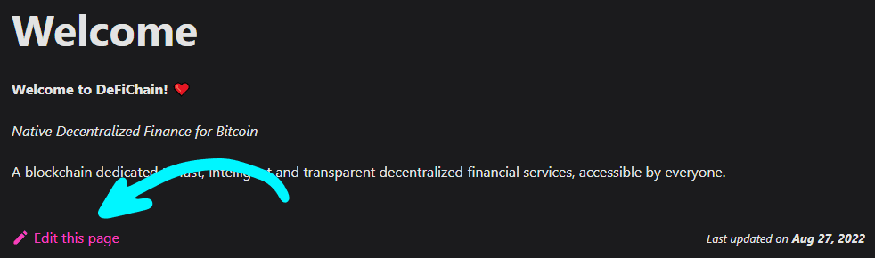
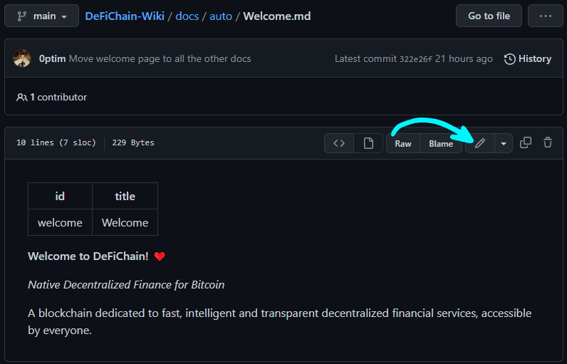
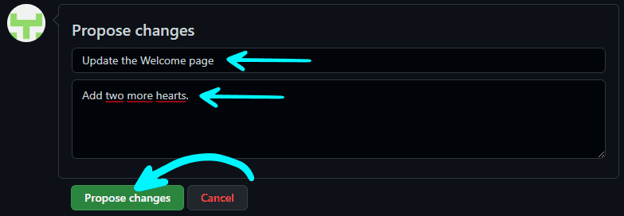
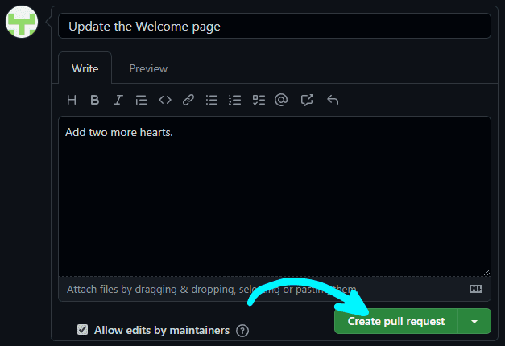

It would be appreciated if you joined our [Telegram group](https://t.me/defichain_wiki) to discuss any changes you want to make. This way we can avoid any unnecessary work and coordinate our efforts.

## Requirements

- To help work on the Wiki you need a GitHub account. You can create a free account [here](https://github.com/join).
- All the pages are written using the **Markdown** syntax. Here's a handy [cheat sheet](https://www.markdownguide.org/cheat-sheet/).

## Quick Edit

### 1. Open a wiki-page

Open the page you want to edit in the Wiki.

For example, the page ["Staking"](./Staking.md).

### 2. Start editing

Click `Edit this page` on the bottom of the page.

### 3. Enable Editor

### 4. Make Changes & Save

Change whatever you wish on the page.

When you're finished, enter a title and a description of what you have done and click on `Propose changes`.

### 5. Create the pull request

Click on the big green `Create pull request` button.

And again click on the `Create pull request` button a second time.

You successfully submitted your edit. 🔥

**Thank you!** ❤

> _A wiki maintainer will check and accept/decline your request soon._
