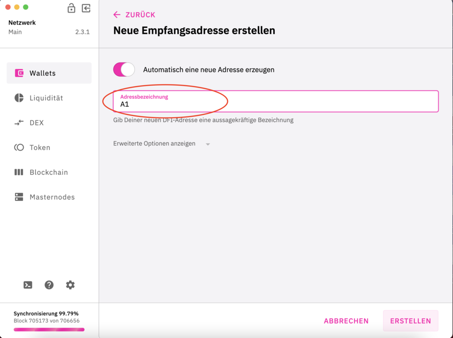

## Create a new address: {#create-a-new-address}

Click on DFI Wallet

Click on Receive

Click on new address

Name the new address with any name

Click to create

The new address is displayed

## Display an old address again: {#display-an-old-address-again}

Click on DFI Wallet

Click on Receive

Click on new address

Switch to left.
Enter old address.
Name the address with any name.
Click on create.

Schalter nach links alte Adresse eintragen.
Benenne die Adresse mit einer beliebigen Bezeichnung.  
Klick auf erstellen.

The old address is now displayed again.

