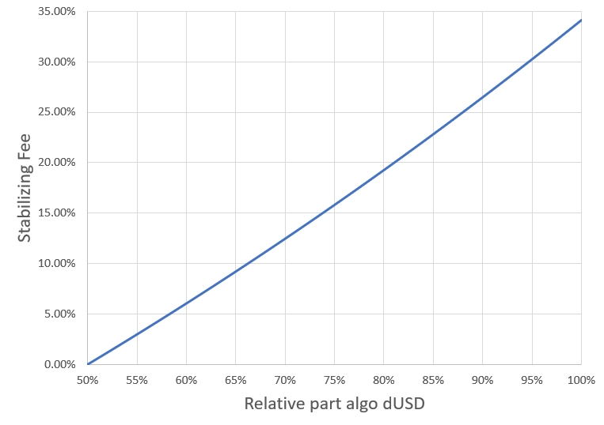

When you are swapping tokens on DeFiChain a fee is conducted. At the beginning only the part for liquidity providers - commissions - were the fee in each pool. But after successful voting on several DFIPs other fee parts were introduced for specific purposes. This article describes the current DEX fee structure on DeFiChain.

## Fees {#fees}

### Overview {#overview}

The following diagram shows the different pool swaps on DeFiChain. In general there is a commission fee for every single swap (black arrows). Additionally there is the DEX stabilizing fee (red arrow), the BTC fee (purple arrow) and the dUSD/dToken fee (blue arrow). Summary in short:

- Commissions: 0.2%
- dBTC fee: 0.1%
- dUSD/dToken fee: 0.2%
- DEX stabilizing fee: 0...\~34% (in dependence of the algo dUSD part)

*DeFiChain DEX swaps and fees*  


### Commissions {#commissions}

The commissions fee is currently 0.2% and is deducted from the tokens users want to swap on the DEX. These tokens are distributed to theholders of the liquidity token and are part of the incentive to provide liquidity. The commission fee is the same overall pools on DeFiChain - crypto and dToken.

On [defiscan.live](https://defiscan.live/dex) you can see the APR of each pool and with moving the mouse over the three blue dots the distribution between block rewards and commissions part is shown. High trading volume (e.g. in volatile market phases) will drive the commissions part.

*Defiscan showing the APR splitted into block reward and commissions part*  


### DEX stabilizing fee {#dex-stabilizing-fee}

The DEX stabilizing fee depends on the relative part of the algo dUSD token on DeFiChain. Below 50% this fee is 0% and increases with values higher than 50% (see graph below).

*DEX stabilizing fee calculationThe*  


formula behind this dependency is:

``` python
Let ALGO_DUSD_RATIO = 1 - (Loan DUSD / total DUSD supply)
Let COEFFICIENT = 1.8
If ALGO_DUSD_RATIO > 0.5
   DEX stabilization fee = (COEFFICIENT ^ (ALGO_DUSD_RATIO - 0.5)) - 1
Else
   DEX stabilization fee = 0%
```

With increasing stabilizing fee we will see a premium for dUSD on DeFiChain, because selling dUSD is getting more and more expensive. If you buy dUSD in the premium case you will get less dUSD than the dollar value you invested. And this makes minting dUSD via vaults and loans more attractive.

### dUSD/dToken fee {#dusddtoken-fee}

With introducing the DFI payback function for dUSD loans an additional fee of 0.1% in dUSD was introduced for each swap with dUSD, see [DFIP-2112-A](https://github.com/DeFiCh/dfips/issues/99). This was the first measure to remove the algo dUSD after closing the corresponding loans.

With the [DFIP-2203-A](https://github.com/DeFiCh/dfips/issues/127) Futures Swaps to handle the premium and discount of the dTokens were introduced. In the same DFIP a fee of 0.1% paid in the dTokens was activated.

Both parts (in sum 0.2%) are now applied for each dUSD-dToken pool and results in an overall fee of 0.4% for a swap with dTokens. The dUSD-DFI also had the 0.1% in the beginning, but due to newer DFIPs has now a different fee structure (see [DEX stabilizing fee](#dex-stabilizing-fee).

### BTC fee {#btc-fee}

In the first version of the Atomic-Swap on DeFiChain there was a bug and one or more users exploited it to create dBTC. Normally CakeDefi is the gateway for the crypto assets on DeFiChain and they put the native coin on a public known address of the corresponding blockchain when minting dTokens. The dBTC from this exploit were minted without a collateral and the community decided to introduce mechanisms to remove them from the system on a longer time frame. For more details have a look on the corresponding [DFIP](https://github.com/DeFiCh/dfips/issues/101).

One part is an additional fee for using the dBTC-DFI pool. From each swap a 0.1% fee is deducted as dBTC and burned. The overall fee of this dBTC-DFI pool is: 0.3%