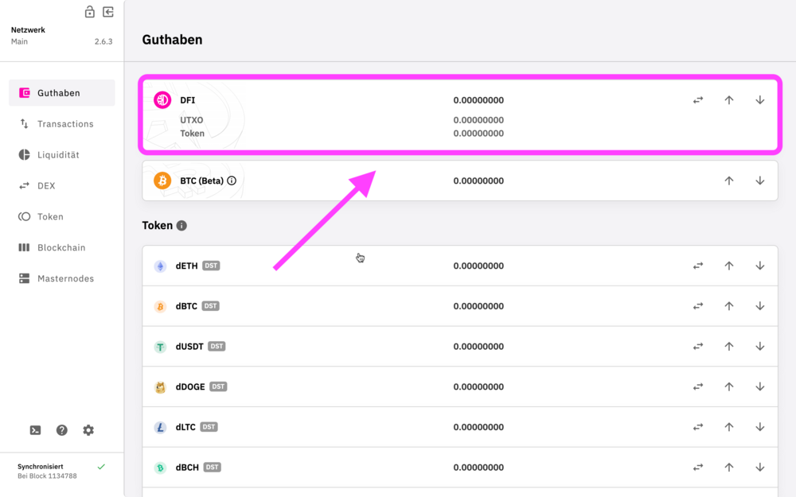
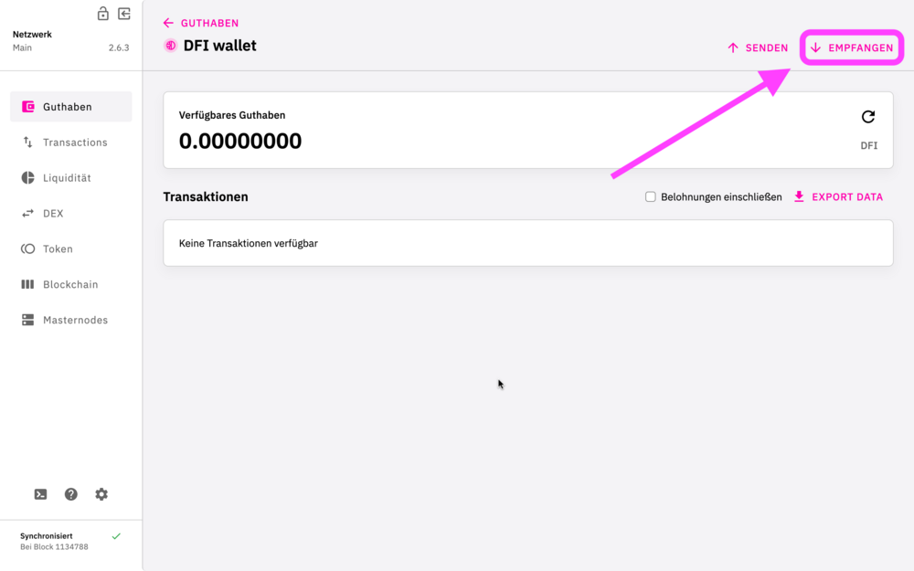
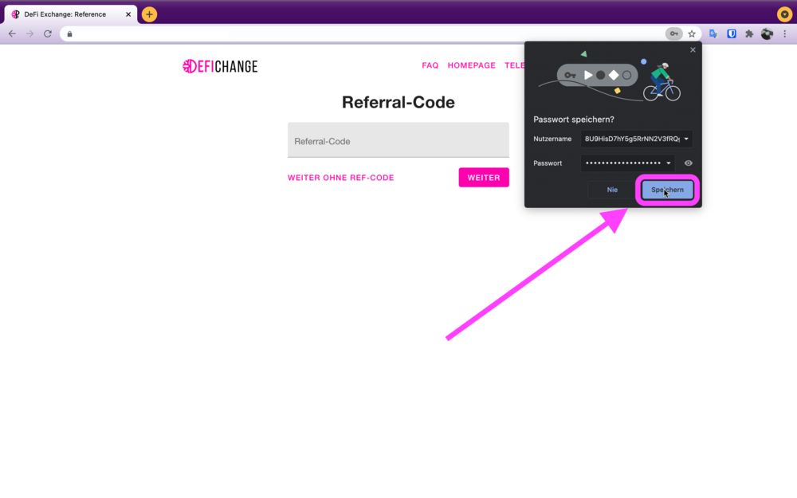

This web page describes how to register on the DFX.swiss Exchange.

[Video tutorial](https://www.youtube.com/watch?v=0C50S1GhBu8) in german.

[Download](https://defichain.com/downloads/) link to Full Node Wallet.

Login on the web [page ↗](https://payment.dfx.swiss/login).

