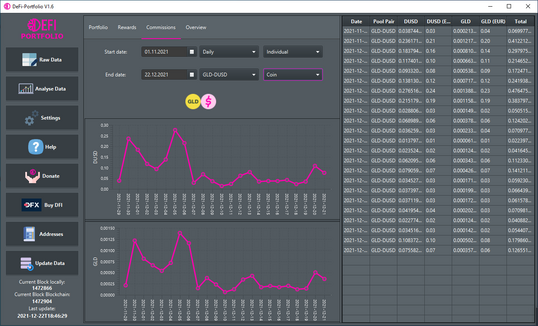
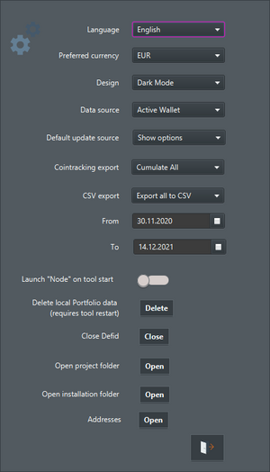

## Community {#community}

If you have ideas for new features, bug reports or questions do not hesitate to create an issue on [GitHub](https://github.com/DeFi-PortfolioManagement/defi-portfolio/issues) or contact the [Telegram Community](https://t.me/DeFiChainPortfolio)

For an introduction to DeFiChain-Portfolio, we recommend the [video from Crypto Explained on YouTube](https://www.youtube.com/watch?v=86xO3_oFXAQ)

## General {#general}

Use DeFi-Portfolio to export, analyse and visualize your transactions, rewards and commissions of your liquidity mining pools or DEX transactions to interact with DeFiChain. The current version of DeFi-Portfolio is released [here](https://github.com/DeFi-PortfolioManagement/defi-portfolio/releases/) on Github.

## Minimum Requirements {#minimum-requirements}

RAM: 4GB

OS: macOS 10.14, Windows 10, Ubuntu LTS 18 and above

DeFiChain Node (Blockchain) v.2.3.1 (You can install the [DeFiChain Desktop Wallet](https://github.com/DeFiCh/app/releases/tag/v2.8.1) and use the SnapShot Service)

## Getting started {#getting-started}

- Install and run the DeFi-Portfolio for [Windows](https://github.com/DeFi-PortfolioManagement/defi-portfolio/releases/download/1.6.0/defi-portfolio-Setup-1.6.0.exe),[Mac](https://github.com/DeFi-PortfolioManagement/defi-portfolio/releases/download/1.6.0/defi-portfolio-1.6.0-mac.tar) or [Linux](https://github.com/DeFi-PortfolioManagement/defi-portfolio/releases/download/1.6.0/DeFi-Portfolio-1.6.0-linux.tar).
- Click on update database (left bottom corner) When you load the data for the first time you have to allow access.

- Now your big data will imported and you can look on the raw data, export them or analyse your rewards and commissions.
- After closing close the defid.exe. (If not then maybe you need a full resync the next time)

## Installation Windows {#installation-windows}

Download the latest version for windows: [here](https://github.com/DeFi-PortfolioManagement/defi-portfolio/releases/latest)

When you start the installer Windows Defender will block the installation. Just click on "more info" and "run anyway".

Once the installation is done a shortcut of the DeFi-Portfolio will be available on the desktop.

## Installation Mac {#installation-mac}

Download the latest version for mac: [here](https://github.com/DeFi-PortfolioManagement/defi-portfolio/releases/latest)

Open the app. The first time you open the DeFi-Portfolio, you will be presented with a security prompt. Press OK to dismiss it. Go to System Preferences and click on Security & Privacy.

Then click on the Open Anyway. Click Open on the confirmation popup. DeFi-Portfolio will launch automatically when the installation is complete.

Move defi-portfolio to applications

## Installation Linux {#installation-linux}

Download the latest version for linux: [here](https://github.com/DeFi-PortfolioManagement/defi-portfolio/releases/latest)

Once you have downloaded the .tar package you have to extract the files. In the "DeFiPortfolio" folder there is the file "launchDeFiPortfolio". Before you can launch the program it must be made executable. Right click on "launchDeFiPortfolio" and cklick in properties. Switch to the tab Permissions and allow executing file as program.

Once this is done you can launch the tool.

## Functionality description {#functionality-description}

#### **Update Database:** {#update-database}

Before you can analyse your rewards and commissions you have to paste the addresses which should be analysed. The window for pasting the addesses can either be found in the settings menu or in the menu when you click upadte data. Copy paste the addresses and add them to the list. You can also delete addresses shich should not be analysed. Once you have added all addresses click save & close. After that you can click on update database. When the blockchain is not up to date on you local system itwill be updated. After that the transactions will be read out and saved locally (appdata). While updating the database the connection to the node will be established (command line window). This will automatically close once the local data are up to date.

#### **Raw Data:** {#raw-data}

All transactions are shown in tabular form. Rewards and Commissions are summarized daily with the time 23:59. When clicking on Blockheight, Blockhash, Owner or Transaction-Hash the Blockchain Explorer will be opened with the respective value. The table can be exported as a csv file. To do this, right-click on the corresponding sub-functions.

##### Export to Cointracking: {#export-to-cointracking}

**Cumulate All:**

All DFI income of the day (rewards and commission from each pool pair) is cumulated into one income and the other commission pool pair (BTC, ETH etc...) -\> 1 income for DFI and X (number of pool pairs) income per day -\> **1 + X (number of pool pair) transactions per day**

Example: BTC-DFI, ETH-DFI

1 reward & commission income DFI, 1 ETH commission income and 1 BTC commission income

**Cumulated Poolpair:**

All DFI income of the day from each Pool Pair (rewards and commission from each pool pair) is cumulated into X (number of pool pairs) income and the other commission pool pair (BTC, ETH etc...) -\> **2 + X (number of pool pair) transactions per day**

Example: BTC-DFI, ETH-DFI

1 reward income DFI , 1 commission income DFI , 1 commission BTC and 1 commission ETH

**Cumulated Rewards and Commissions:**

All DFI income of the day is cumulated into two income (rewards and commissions) and the other commission pool pair (BTC, ETH etc...) -\> 2 income for DFI and X (number of pool pairs) income per day. **2 \* X (number of pool pair) transactions per day**

Example: BTC-DFI, ETH-DFI

1 reward & commission income DFI (BTC-DFI) and 1 commission BTC

1 reward & commission income DFI (ETH-DFI) and 1 commission ETH

**Cumulated None:**

All incomes for each pool pair, rewards and commissions are daily cummulated -\> 2 income DFI for each pool pair and X (number of pool pair) commission for each pool pair. **3 \* X (number of pool pair) transactions per day**

Example: BTC-DFI, ETH-DFI

1 reward income DFI from BTC-DFI pool, 1 commission income DFI from BTC-DFI pool, 1 commission income BTC

1 reward income DFI from ETH-DFI pool, 1 commission income DFI from ETH-DFI pool, 1 commission income ETH

#### **Analyse Data:** {#analyse-data}

##### **Portfolio:** {#portfolio}

In the first pie chart your tokens are displayed with the fiat value from the latest update. The second pie chart show the liquidity mining tokens also with the fiat value from the latest update. In the table on the right side the tokens and the liquidity mining tokens are summarized. It is displayed the amount of tokens and also the value in fiat.

**Total amount:** Balance of complete wallet in choosen FIAT currency

**Total yield:** All rewards and commissions calculated in choosen FIAT currency (Price at date of the last Update **not** daily calculated like in the other tabs)

**Rewards yield:** All rewards calculated in choosen FIAT currency (Price at date of the last Update **not** daily calculated like in the other tabs)

**Commissions yield:** All commissions calculated in choosen FIAT currency (Price at date of the last Update **not** daily calculated like in the other tabs)

**Column description:**

"Token" Name of Token or Liquidity Mining Token

"Crypto value" Amount of token in wallet or LM Token with for example how much BTC or DFI it is

"FIAT value (FIAT)" Same like "Crypto value" but shown in choosen FIAT currency

##### Impermanent Loss {#impermanent-loss}

The "impermanent loss" is the loss of coins that occurs when liquidity is provided. It’s the difference between hodling the coins versus providing liquidity with these coins.

In the table the impermanent loss of each pool is shown. The current value of the coins which were put into the pool are displayed in the second column. Over time, the number of coins in the pool will decrease due to the impermanent loss. The current value of these coins are shown in the third column. The percentage of the loss can be seen in the first column.

##### **Rewards**: {#rewards}

The rewards are displayed in graphical form. You can choose the start date and the end date. In addition, the interval (daily, weekly, monthly, yearly) can be selected and the pool share can be choosen. The plot can be switched between individual and cumulative view. The table
can be also exported as a csv file. To do this, right-click on the corresponding sub-functions.

**Column description:**

"Date" Day, week, month or year (Depend on choosen intervall)

"Pool Pair" LM Pool from which you get the rewards or comissions

"DFI" How many DFI rewards you get on this intervall of the line

"DFI (FIAT)" same like "DFI" but converted to choosen FIAT currency (with daily calculated price of coingecko API)

##### **Commissions**: {#commissions}

The commissions are displayed in graphical form. The setting options are the same as for rewards. You can select the start date and the end date. In addition, the interval (daily, weekly, monthly, yearly) can be selected and the pool share can be choosen. The plot can be switched between individual and cumulative view.

**Column description:**

"Date" Day, week, month or year (Depend on choosen intervall)

"Pool Pair" LM Pool from which you get the rewards or comissions

"DFI" How many DFI commissions you get on this intervall of the line

"DFI (FIAT)" same like "DFI" but converted to choosen FIAT currency (with daily calculated price of coingecko API)

"2nd commission of choosen Pool Pair eg. BTC" is how many commissions you get on this intercall of the line in second pool pair

"BTC (FIAT)" same like "2nd commission of choosen Pool Pair eg. BTC" but converted to choosen FIAT currency (with daily calculated price of coingecko API)

"Total (FIAT)" Total of all commissions of this line (intervall) in choosen FIAT currency

##### **Overview**: {#overview}

The overview is displayed in graphical form. The rewards and commissions are combined in one plot. You can choose the start date and the end date.You can also select the interval (daily, weekly, monthly, yearly).

**Column description:**

"Date" Day, week, month or year (Depend on choosen intervall)

"Pool Pair" LM Pool from which you get the rewards or comissions

"Rewards" How many DFI rewards you get on this intervall of the line

"Rewards (USD)" same like "Rewards" but converted to choosen FIAT currency (with daily calculated price of coingecko API)

"Commissions DFI" is how many DFI commissions you get on this intercall of the line

"Commissions DFI (USD)" same like "Commissions DFI" but converted to choosen FIAT currency (with daily calculated price of coingecko API)

"Commissions 2" is how many BTC, ETH, LTC... etc commission you earned on the intervall of the line... for example on Pool BTC-DFI is commission2 = BTC

"Commissions 2 (USD)" same like "Commissions 2" but converted to FIAT currency (with daily calculated price of coingecko API)

"Total" Total of reward and all commissions of this line (intervall) in choosen FIAT currency

## Settings {#settings}

The following settings can be made in the Settings menu:

- **Language**: Switch between english, german, spanish and danish.
- **Preferred Currency**: Euro, US-Dollar, Swiss franc
- **Design**: Light Mode and dark Mode
- **Cointracking export:** In the raw data table you can export the data to a cointracking format. Here you can choose how the data should be exported.
- **CSV export:** In the raw data table you can export the data to a csv format. Here you can choose how the data should be exported.
- **From:** Choose the start date for exporting the data to csv or cointracking
- **To:** Choose the end date for exporting the data to csv or cointracking.
- **Launch Node on tool start:**
- **Delete local Portfolio data**: You can delete the local transaction data which are generated by the DeFi-Portfolio. Before you click on "update Data" you have to restart the tool.
- **Close Defid:** In some rare cases the defid will not be stopped after "update data". In this case you should not just close the defid by clicking on the x-symbol. You should click on the close defid button in the settings.
- **Open project folder:** The folder where all appication data are stored can be opened.
  - Windows: *`C:\Users\Username\AppData\Roaming\defi-portfolio\`*
  - Mac (right click on the app and open package informationen): *`defi-portfolio.app/Contents/Resources/PortfolioData/`*
  - Linux: Folder where you unzipped the .tar: *`PortfolioData/`*

- **Open installation folder:** The folder where all files will be copied during installation can be opened:
  - Windows: *`C:\Users\Username\AppData\Local\Programs\defi-portfolio\`*
  - Mac (right click on the app and open package informationen): *`defi-portfolio.app/Contents/Resources/`*
  - Linux: Folder where you unzipped the .tar
- **Addresses:** Open the address configuration window

## Help {#help}

In the help menu you will find the link to the [GitHub repository](https://github.com/DeFi-PortfolioManagement/defi-portfolio/blob/master/README.md) as well as the link to our [Telegram community](https://t.me/DeFiChainPortfolio). With the youtube link you will get to the [video about DeFiPortfolio](https://www.youtube.com/watch?v=86xO3_oFXAQ) from crypto explained. There is also the possibility to open the [DeFiChain website](https://defichain.com/).Furthermore a link to this wiki is available and a link to the [DeFiChainExplained](https://defichain-explained.com/) website.

## FAQs {#faqs}

**Q: The defid is not closing after update data. How can I close it?**

A: If the defid does not close automatically, then an error occurred during the update process. You must <u>not</u> close the defid (mostly white or black /terminal) by clicking on the x/o-symbol (close), otherwise a reindex is necessary. There are two ways to close the defid safely:

Click with the left mouse button on the defid and press `[CTRL]` + `[c]` on the keyboard or click the button close defid in the settings menu (min v1.4.2).

**Q: Where can I find the logfile?**

A: In the logfile there are hints why the Defi-Portfolio app does not work properly. This information helps the developers to make the tool more stable. The logfile can be found here:

- Windows: *`C:\Users\Username\AppData\Roaming\defi-portfolio\log.txt`*
- Mac (right click on the app and open package informationen): *`defi-portfolio.app/Contents/Resources/PortfolioData/log.txt`*
- Linux: Folder where you unzipped the .tar: *`PortfolioData/log.txt`*

**Q: How can I keep my old data?**

A: You can use your old transactionData.portfolio to keep your old data

- Windows: Is automatically kept and not overwritten
- Mac & Linux: Make a copy of the file *`transactionData.portfolio`* it is stored in application data folder (described in the below) and restore it in the same folder of the new version.

**Q: Where is the installation folder?**

A: The program files are copied during the installation into following folder:

- Windows: *`C:\Users\Username\AppData\Local\Programs\defi-portfolio\`*
- Mac (right click on the app and open package informationen): *`defi-portfolio.app/Contents/Resources/`*
- Linux: Folder where you unzipped the .tar:

**Q: Where is the application data stored?**

A: The application folder can be found here:

- Windows: *`C:\Users\Username\AppData\Roaming\defi-portfolio\`*
- Mac (right click on the app and open package informationen): *`defi-portfolio.app/Contents/Resources/PortfolioData/`*
- Linux: Folder where you unzipped the .tar: *`PortfolioData/`*

In the application folder following files are available: TransactionData (all data from DeFi Wallet), PortfolioData/defid (node),PortfolioData/defi.conf (config for node), Settings, Logfile, CoinPriceData (stored coinprices)

**Q: Do I need to uninstall the old version when a new version is available?**

A: No,you do not need to uninstall the old version. During the installation process the files of the old version will be replaced with the files of the new version.

## Roadmap 2021 {#roadmap-2021}

#### 2021 - Q2: {#2021---q2}

v1.5:

- Calculate current Impermanent Loss
- Export transactions to a cointracking format together with Jörg Leidinger (Developer of community project DeFiPortfolio2Cointracking)
- Show current prices of token and LP token
- New languages (norwegian & dutch)
- Update Node because of comming hardfork Eunos for token destruction and atomic swap
- Small new features and bug fixes

2021 - Q4:

v1.6:

- Increase Performance
- Update/Import via CSV (DeFi wallet)
- Portfolio and Reward Overview (DeFi wallet)
- Analyse DEX Transactions (DeFi wallet/Cake)
- DeFi Wallet transaction to one export (Raw data, daily cumulated and Cointracking)
- Amount,yield and pool share percentage of liquidity-tokens during the time
- Migration import to Python
- Stocks and other assets

#### 2022 - Q1: {#2022---q1}

- Cointracking with vault & loans
- Standard templates for „Generic Export Function“ like Cointracking, Accointing, Blockfolio, Cryptotax … etc.
- Generic Export Function: User can create his own template to get a personalised export of his data
- Show rewards with/without individual adjustable taxes
