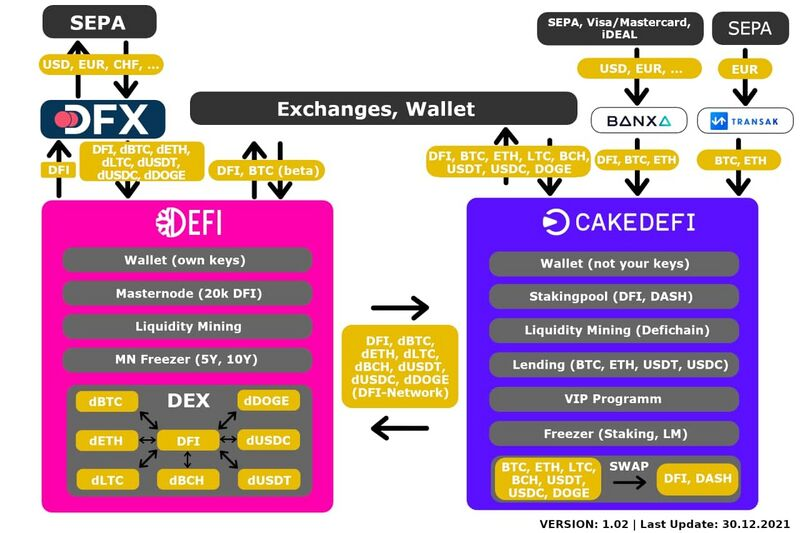

DeFiChain is a SideChain to Bitcoin comparable to Bitcoin Liquid. Only DeFiChain addresses can be used in the DeFi Wallet. The DFI Coin is accepted and supported by many exchanges. The tokens are currently only accepted by CAKE. So it is currently only possible to send BTC to a Bitcoin address via CAKE. The team is working on a technical solution called Atomic Swap to enable DeFi Wallet transaction directly into the Bitcoin network.
