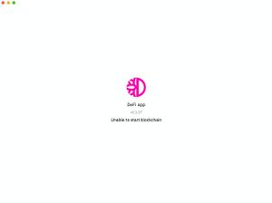

Only error messages and their solutions are documented here. For other types of problems please visit the main page [DeFi Wallet errors](./DeFi_Wallet_errors.md).

If your error message is not documented here, or the documented solution does not work, then add your error message to this wiki page and create an issue on GitHub. Error messages that are already documented here do not need to be posted again on GitHub, they are already known. [How to submit issues for DeFi app](https://github.com/DeFiCh/app/wiki/How-to-submit-issues-for-Defi-App)

## Please wait until your transaction has been added to the next block before proceeding with a new transaction.

### Problem description

*Error: Please wait until your transaction has been added to the next block before proceeding with a new transaction.*  

It is not possible to make a transaction. Often this happens during adding of liquidity in liquidity mining.

Possible reason: for paying transaction fees DFI are needed in the form of coins. Many users mainly have DFI tokens in their wallet, since all rewards are DFI token. The wallet is supposed to convert token to coin in the background but this sometimes fail, so no coins are available to pay transaction fees.

The problem appeared for the first time in version 2.3.0 and is still appearing in 2.3.3.

### Solution

This problem and its solution have not yet been properly researched. You can try the following. For many users this solution helps:

Solution 1

- Create a new address: [Create address](./Create_address.md)
- Send all tokens and coins to the newly created address: [Send all coins](./Send_all_coins.md)
- Try again, now it should work.

Solution 2

- If this happens during adding of liquidity:
- Send a small amount of DFI to the address you try to use a reward address
- After this transaction adding of liquidity is often possible again.

No help found? Go to [Debug.log](./Debug.log.md)

## Corrupted block database

*Corrupted block database*  

Some users report that this error message occurs again and again. Afterwards, the entire blockchain has to be reloaded, which is tedious. The cause of this problem lies in the incorrect termination of the DeFi app. It is important that the app is always shut down correctly.

As a remedy, it is recommended to work with backup solutions. Then the entire blockchain does not have to be reloaded, but only the blocks after creating the backup.

[Create and use backup for blockchain data ↗](./Fullnode.md#create-and-use-backup-for-blockchain-data)

## No data found

Problem: The app cannot be started. Error message "No data found"

To find out more about the reason of the error, you can read the following text: [Debug.log](./Debug.log.md)

Here's what you can try: [Delete .defi](./Delete_dot_defi.md)

If it did not work, we recommend the following:

1.  [Delete all](./Delete_DeFi_App.md)
2.  [Reinstall DeFi App](https://defichain.com/downloads/)

After that, the app can be started normally and is installed correctly.

The team is working on a professional solution!

## Unable to start blockchain

Problem: The app cannot be started. Error message "Unable to start blockchain"

To find out more about the reason of the error, you can read the following text: [Debug.log](./Debug.log.md)

Here's what you can try: [Delete .defi](./Delete_dot_defi.md)

If it did not work, we recommend the following:

1.  [Delete all](./Delete_DeFi_App.md)
2.  [Reinstall DeFi App](https://defichain.com/downloads/)

After that, the app can be started normally and is installed correctly.

The team is working on a professional solution!

## Node disconnected

### Error Message

The error message **Node is disconnected** is shown while the wallet is synchronizing. Most of the time the wallet is already synchronized up to \~90%-95% when the error occurd.

### Reason for the Error

There are different reasons which can lead to this error. You can distinguish between the following different types:

1.  Wallet synchronized normally up to **80%-99%** until the error message is shown: That is the most common type, which is a RAM problem. In this case the wallet needs to much RAM to synchronize.
2.  Wallet does not synchronize and the error message occurred with **0.00%** synchronization: Most likely a network error
3.  The time on your computer is incorrect.

### Troubleshooting

Solution to solve the different reasons for this error message:

1.  There are two different solutions for the first type:
    1.  Activate the "Reindex after saving" option in settings to restart the synchronization and activate the button "Delete peers and blocks" to clean the old block files.
    2.  Start the wallet; wait until the wallet is synchronized up to \~90%-95% and shut the wallet down normally (the error message must not occur up to this moment); after that you can restart your wallet (repeat the steps until the wallet is synchronized. You can check the RAM usage of your PC to know the perfect time to shut the wallet down again)
2.  For second problem type you can try the following solutions:
    1.  Check your firewall settings
    2.  Check your network settings (connect with a private networt instead of a public network)
    3.  Check your Antivirus program
3.  Adjust the time on your computer.

No help found? Go to [Debug.log](./Debug.log.md)

## App stuck when starting

Before you try anything else, restart the computer and see if the problem is solved.

### Version 2.3.1

There is a problem with version 2.3.1.

If the app is not installed as an update, but the first time on a new system, then the blockchain folder is not created and the app cannot start.

The problem and the fix is documented
[here](./V2.3.1.md#known-bugs-with-this-version).

### Other errors that also occur with other versions

#### Error Message

Your app might be stuck in an endless loop when you want to launch it. Trying to launch it via the console might display *request failed with status code 500*. Sometimes, you might also get an *unable to start blockchain* error upon launching the app.

*Unable to start blockchain error message*  

#### Reason for the Error

Most likely it is a memory (RAM and/or disk space) issue.

#### Troubleshooting

Here are a couple of steps that might help:

1.  Quit the app
2.  Close unneeded open programs
3.  Open a system monitor program (Task Manager, Activity Monitor), keep monitoring your RAM utilization
4.  Make sure you have enough disk space available (more than your RAM size), free up enough so that the app can create a swap file if it runs out of RAM
5.  Disable and enable your network connection, possibly use another one temporarily
6.  Try again

If that does not help, try launching the app with the *-reindex* parameter from the command line.

Still not working? Here are some more experimental steps:

1.  Create a backup of your *wallet.dat* file (MacOS: \~/Library/ApplicationSupport/defi/wallets), preferably of the whole *defi* folder to another drive
2.  Remove all *.dat* files in the *blocks* folder (MacOS: \~/Library/ApplicationSupport/defi/blocks). Try again.
3.  Downgrade to the last version that worked for you [here](https://github.com/DeFiCh/app/releases). Try again.
4.  Delete all wallet data from the *defi* folder, start the app again, then quit it. Now the folder structure should have been created again. Copy over *wallet.dat* from your backup and launch the app again.

Everything failed so far? Let's start from scratch. You'll need for mnemonic seed for this.

1.  Delete app data (section above), uninstall *defi-app* entirely.
2.  Reinstall a version you think might work (either an older specific one or the latest)
3.  Launch the app
4.  Recreate the wallet from mnemonic seed.

No help found? Go to [Debug.log](./Debug.log.md)

## Insufficient amount

This problem and its solution has not yet been properly researched. You can try the following. For many users this solution helps:

- Create a new address: [Create address](./Create_address.md)
- Send all tokens and coins to the newly created address: [Send all coins](./Send_all_coins.md)
- Try again, it should now work.
