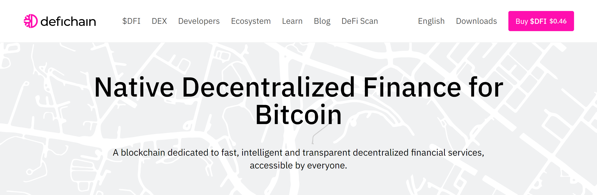
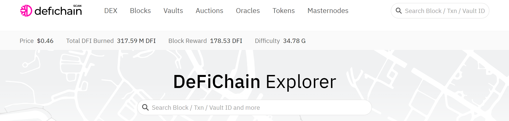
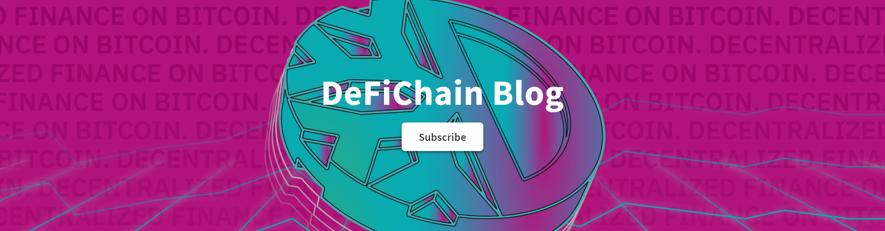
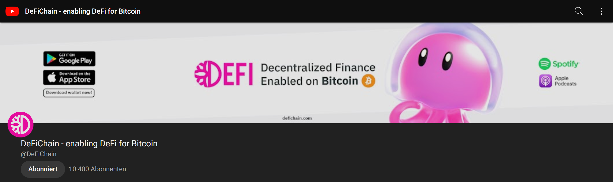
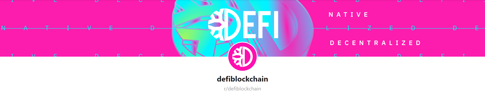

**🔗 You can explore a complete list of all links on [defilinks.io ↗](https://defilinks.io/)**

**🧭 For an overview on how tokens can be aquired, sold or transfered, have a look at [defichain-ecosystem.com ↗](https://defichain-ecosystem.com/)**

## 🌐 Main Website

[defichain.com ↗](https://defichain.com/)

The official DeFiChain website.

## 🔍 Blockchain Explorer

[defiscan.live ↗](https://defiscan.live/)

The main blockchain explorer. See wallet addresses, blocks, transactions, liquidity mining pools and more.

## 📰 DeFiChain Blog

[blog.defichain.com ↗](https://blog.defichain.com/)

Blog which covers the latest topics around DeFiChain.

## 💬 Telegram

[t.me/defiblockchain ↗](https://t.me/defiblockchain)

The official DeFiChain international Telegram group.

_You can find a list of all Telegram groups [here](./Links.md#telegram-channels)._

## 🎬 On YouTube

[YouTube channel ↗](https://www.youtube.com/c/DeFiChain/)

Explainer videos, news show, community interviews, project presentations and more.

## 📷 On Instagram

[Instagram profile ↗](https://www.instagram.com/defichain.official/)

Follow DeFiChain on Instagram to get the latest news on your timeline.

## 🗣️ On Reddit

[Reddit ↗](https://reddit.com/r/defiblockchain/)

