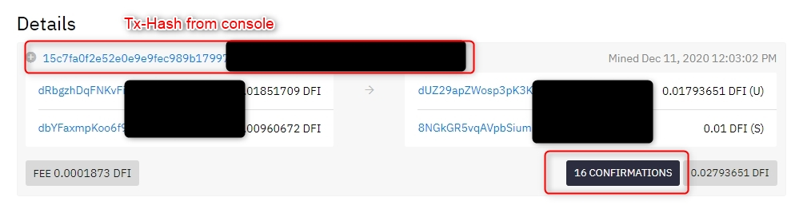
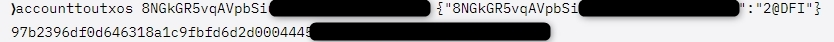

**Disclaimer: Console should be used in care. We are not responsible if the wrong commands are issued resulting in lost coins!**

If you have problems sending your DFI from the Wallet try the following **step-by-step instruction**

## Step 1: Checking DFI-coin vs. DFI-token {#step-1-checking-dfi-coin-vs-dfi-token}

Before starting we should check, if a DFI-sending problem is caused by "unwrapped" DFI

Your DFI-Wallet is showing an DFI amount. To see, how many coins and tokens you have, you need the following 2 commands:

`getbalance`  
`gettokenbalances {} true true`

In the above picture you see, most DFI are Token and not Coins. These Tokens cannot be transferred to another address.

**HINT: You may need some DFI-coins (see getbalance) to execute commands from Step 4.**

## Step 2: Find addresses holding DFI-Token {#step-2-find-addresses-holding-dfi-token}

The above shown DFI-amount are hold by one or more addresses. To find out, which one are hold the token, use the following command:

`listaccounts {} false false true`

You are getting a list of entries, which should look like this:

## Step 3: Checking all tokens on relevant address {#step-3-checking-all-tokens-on-relevant-address}

Before changing token to coin, please check the amount and all the other tokens on this address with:

`getaccount`  
`address_from_command_before`

You should get the following result:

## Step 4: Converting token to coin {#step-4-converting-token-to-coin}

Now, we come to the last, essential step. This will convert an amount of token into coins. Use the command:

`accounttoutxos address_from_above` {"adress_from_above":"DFI_amount_to_convert@DFI"}

### Error {#error}

**If you execute the command from Step 4, you may get the following error:**

Then you need additional steps:

#### Step 4.1: Sending DFI-coin to Token-adress {#step-41-sending-dfi-coin-to-token-adress}

Send a small amount of DFI to this address!

You will get an Tx-Hash as a result.

#### Step 4.2: Check Confirmation {#step-42-check-confirmation}

Please go to <https://explorer.defichain.io/#/DFI/mainnet/home> to check, if it is confirmed before you proceed.

#### Step 4.3: Converting token to coin {#step-43-converting-token-to-coin}

Now, you can run the accounttoutxos command from above again. If it is successful, you will get an Tx-hash, which can be checked in the explorer again (Step 5)

## Step 5: Check conversion {#step-5-check-conversion}

Just to be sure, everythin worked, you can run the commands getaccount address and getbalance again. In the following Picture, you see that the DFI-coin amount is now increased by 2DFI. The token were converted.

[New token and coin balance](./../media/rescueDFI_EN_Check_New_Balance.webp)

## Source {#source}

Daniel Zirkel:
<https://www.reddit.com/r/defiblockchain/comments/kb10d3/stepbystep_changing_dfitoken_to_dficoin/?utm_medium=android_app&utm_source=share>
