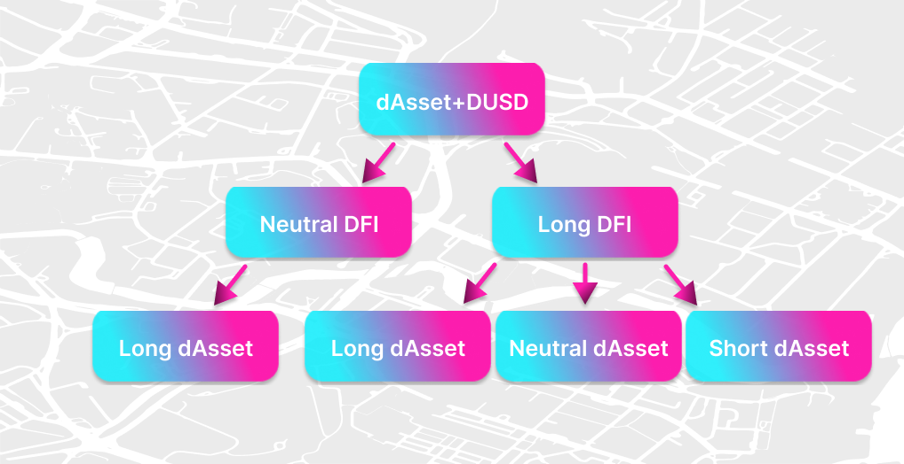

**This page was not fully converted yet to the new wiki format. Coming soon!**

You can find previous version of this page here: https://defichain-wiki.com/wiki/Investing_%26_Trading_with_Decentralized_Loans_and_Assets_on_DeFiChain

## Part 1: Long and short positions with stock token

With decentralized loans and assets on DefiChain, you can invest in different assets betting on increasing (long) or decreasing (short) prices. We will explain 3 different ways of investing.

### Long position - Neutral DFI

#### Investment thesis

The future price of an asset will be higher than it is today.

#### DefiChain procedure

- Sell DFI on DEX for DUSD
- Buy your preferred asset on DEX with **x amount** of DUSD
- Goal in the future
  - Sell asset for **y amount** of DUSD
  - Profit: **(y-x) DUSD**

#### Remarks

- Trades and profit are in DUSD
- DEX prices are relevant for the trade, not the price feed **→ pay attention of the pool ratio**
- Any price movement of DFI will not have an effect on your investment
- Step 1 and 2 will be combined to a composite swap, which is only one step for the user
- Your complete capital is invested

#### Example

With a DFI price of $2.50 you sell 280 DFI, and receive 700 DUSD. You buy 1 TSLA for those 700 DUSD and hold it.

After some time the TSLA price rises to 1000 DUSD and the DFI price to $4.00. Selling TSLA for DUSD gives you 1000 DUSD and you make 300 DUSD profit.

#### Remark

If you want to go back to DFI you will receive 250 DFI for the 1000 DUSD, because the price went up to $4.00.

**→ The best case for this investment: The asset price increases**

### Long position - Long DFI (leverage)

#### Investment thesis

The future price of an asset and DFI will be higher than it is today.

#### DefiChain procedure

- Put some coins (e.g. DFI) up as collateral for a decentralized loan and mint DUSD.
- Buy your preferred asset on the DEX with **x amount** of DUSD
- Goal in the future
  - Sell the asset for **y amount** of DUSD
  - Close a loan by putting tokens + interest back
  - Profit: **(y-x) DUSD - interest**

#### Remarks

- Trades and profits are in DUSD.
- DEX prices are relevant for trades, not the price feed. **→ pay attention to the pool ratio**
- Getting your DFI amount back in step 4 is the same as in step 1. **→ you open a long position on DFI**
- Not all your capital is invested (2/3 – 1/10 with respect to loan collateral). **→ reduced yield for long position on asset**
- You will have a liquidation risk, if the price of your collateral falls too low.

#### Example

With a DFI price of $2.50 you put 280 DFI into a decentralized loan. For the value of $700 you get 350 DUSD (200% collateralization). You use this DUSD to buy 0.5 TSLA on DEX.

After one year TSLA price goes up to $1000 and DFI price up to $4.00. Now you sell the 0.5 TSLA for 500 DUSD. With 357 DUSD (350 DUSD plus 7 DUSD interes) you can close your loan and made 143 DUSD profit.

You also receive back your DFI, which are now $1120 worth and made an additional profit of $ 420. Your DFI long position was right.

**→ The best case for this investment: Asset price increases and DFI price increases**

### Short position - Long DFI

#### Investment thesis

The future price of an asset will be lower than it is today.

#### DefiChain procedure

- Put some coins (e.g. DFI) as a collateral into a decentralized loan and mint a decentralized token (e.g. TSLA token).
- Sell the token on the DEX and get **x amount of DUSD** from selling.
- Goal in the future
  - Buy token + fee back with **y amount of DUSD** (from holding)
  - Close loan by putting token + interest back
  - Profit: **(x-y) DUSD - interest**

#### Remarks

- Asset trades and profits are in DUSD.
- DEX prices are relevant for the trade, not the price feed. **→ pay attention to the pool ratio**
- Putting your DFI amount in vault as a collateral means, that **you open a long position on DFI.**
- Not all your capital is invested (2/3 – 1/10 with respect to loan collateral). **→ reduced yield for short position on asset**
- You will have a liquidation risk if the price of your collateral falls too low.

#### Example

With a DFI price of $2.50 you put 280 DFI into a vault as a collateral worth of $700. For the value of $700 you get 0.5 TSLA (200% collateralization and TLSA price of $700). You sell this 0.5 TSLA on DEX and get 350 DUSD.

After one year the TSLA price decreased to $500 and the DFI price increased to $4.00. Now you buy back the 0.5 TSLA for 250 DUSD and 0.01 TSLA for 5 DUSD (interest). With 0.51 TLSA you can now close your loan and make 95 DUSD profit.

You also receive back your DFI, which are now worth $1120 and you make an additional profit of $ 420. Your DFI long position was the right choice.

**→ The best case for this investment: The Asset price decreases and DFI price increases.**

## Part 2: Liquidity mining

With decentralized loans and assets on DefiChain you can generate cashflow with liquidity mining. In this case you have four different ways depending on your investment strategy.

### Liquidity Mining – Neutral DFI / Long dAsset

#### Investment thesis

- Generate crypto cashflow with liquidity mining.
- In the long term the DFI price will decrease and the asset price will increase.

#### DefiChain procedure

- Sell some DFI on the DEX for DUSD.
- Buy your preferred asset on the DEX with **x amount of DUSD** which is half of the DUSD received in step 1.
- Put DUSD and asset token into the liquidity mining pool.
  \*Goal in the future
  - Get DFI rewards with each minted block + trading fees.
  - Remove liquidity and sell asset token for **y amount DUSD** (long term).
  - Profit: **(y-x) DUSD + LM rewards/fees.**

#### Remarks

- All trade profits are in DUSD.
- LM block rewards are paid in DFI.
- The fees from LM are in asset token and DUSD.
- Any price movements of DFI will not have an effect on your investment.
- Your complete capital is invested and generates cashflow.

#### Example

Swap 560 DFI to 700 DUSD and 1 TSLA, which has an overall value of $1400 (DFI price $2.50). Put both of them into LM with a DEX price of 700 DUSD/TSLA.

liquidity token = √(TSLA token \* DUSD token) = √(1 \* 700) = 26.45

Remove liquidity after some time with increased price of 1000 TSLA.

pool ratio = TSLA/DUSD = 1/1000 → DUSD = 1000 TSLA

26.45 = √(1000 TSLA) → TSLA = 26.45 / √(1000) = 0.836

DUSD = 1000 TSLA → DUSD = 836

Removing liquidity and swapping the 0.836 TSLA abd 836 DUSD into USD will result in an overall amount of 2 \* $836 = $1672 = $1440 + $272.

Additional to your Liquidity Mining rewards, you got $272 profit from price movement of TSLA, this is the profit from asset long position you made.

#### Remark

If in the same time frame DFI goes up to $4.00, you will get only 478 DFI for your DUSD position.

**→ The best case for this investment: The price of the asset increases.**
