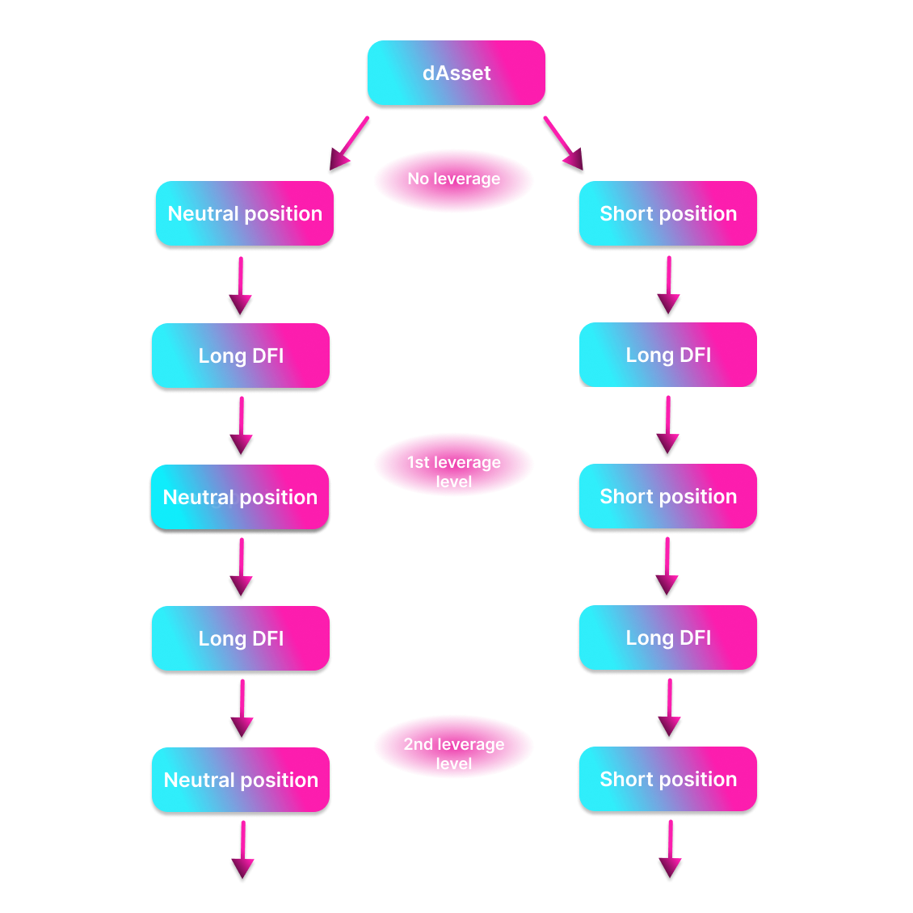
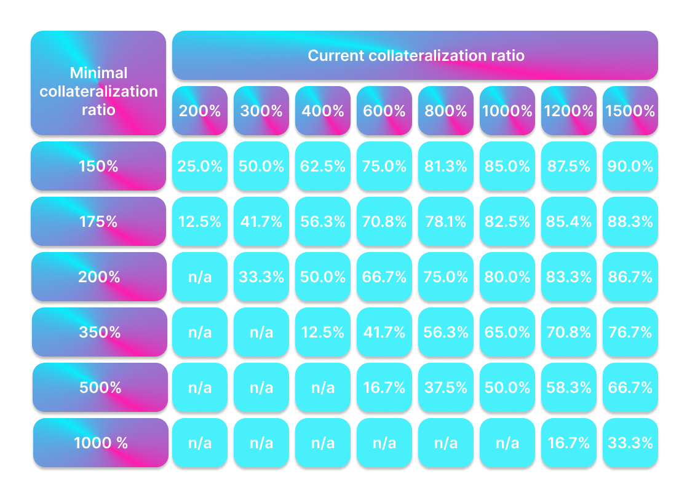
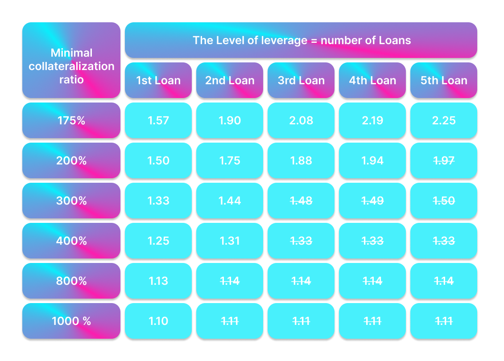

## Long and short positions with decentralized Assets

There are many ways of investing in decentralized Assets (so called "dAssets") using the DefiChain DEX. This chapter is focused on the three basic methods.

The examples are made for the input investment of DFI, but it can be replaced with all crypto tokens of DeFiChain ecosystem (f.e. dBTC, dETH, dUSDT,...).

### Long position - Neutral DFI

#### Investment thesis

The future price of the dAsset will be higher than it is today.

#### DefiChain procedure

- sell DFI on the DEX for **X amount of DUSD**
- buy preferred dAsset on the DEX with **X amount of DUSD**
- The goal of the investment
  - sell the dAsset for **Y amount of DUSD**
  - Profit: **(Y-X) DUSD**

#### Remarks

- the steps of procedure (sell and buy) should be combined to a composite swap, which makes both steps in one transaction
- trades (losses and gains) are measured in DUSD = $1
- the price of dAsset comes from the liquity minig pools, not from the price feed of the Oracles **→ pay attention to the pool ratio**
- any price movement of DFI has no effect on the investment
- whole capital is invested

:::info Example

When **DFI** price is **$2.50**, then **280 DFI** can be swapped to **700 DUSD**. For those **700 DUSD 1 dTSLA** can be bought.

After some time the **dTSLA** price rises to **1000 DUSD** and the **DFI** price rises to **$4.00.** The dTSLA can be sold for 1000 DUSD and makes **300 DUSD profit**, but the **1000 DUSD** can be swapped back **only to 250 DFI**, because the DFI price went up.

**→ The best case for this investment: Only the price of dAsset increases.**

:::

### Long position - Long DFI

#### Investment thesis

The future price of the dAsset and DFI will be higher than it is today.

#### DefiChain procedure

- put DFI in vault as the collateral for a decentralized loan and mint **x amount of DUSD**
- buy preferred dAsset on the DEX with **X amount of DUSD**
- The Goal of the investment
  - sell the dAsset for **Y amount of DUSD**
  - payback loan which equals **X amount of DUSD + interest**
  - Profit: **(Y-X) DUSD - interest**

#### Remarks

- trades (losses and gains) are measured in DUSD = $1
- the price of dAssets comes from the liquity minig pools, not from the price feed of the Oracles **→ pay attention to the pool ratio**
- if the price of the collateral falls too low, the vault will be liquidated **→ pay attention to the collateral ratio**
- not all capital is invested (2/3 – 1/10 with respect to collateral ratio) **→ the yield for long position on dAsset is reduced**

:::info Example

When **DFI** price is **$2.50**, the collateral of **280 DFI** equals **$700** and provides decentralized loan of **350 DUSD** with collateral ratio of 200%. Those **350 DUSD** can be swapped to **0.5 dTSLA** on the DEX.

When after one year **dTSLA** price goes up to **$1000** and **DFI** price rises to **$4.00**, the **0.5 dTSLA** can be swapped for **500 DUSD.** The loan can be closed with **350 + 7 DUSD** (the interest included). **The profit is 500 - 357 = 143 DUSD.**

The price of **DFI** collateral is now **$1120** which means an additional **profit of $420**.

**→ The best case for this investment: dAsset price and DFI price increases**

:::

### Short position - Long DFI

#### Investment thesis

The future price of the dAsset will be lower than it is today.

#### DefiChain procedure

- put DFI in vault as the collateral for a decentralized loan and mint **X amount of preferred dAsset**
- sell the dAsset on the DEX and get **Y amount of DUSD**
- The Goal of the investment
  - buy **X amount of dAsset+loan interest** back with **Z amount of DUSD** (after dAsset price drop)
  - payback loan
  - Profit: **(Y-Z) DUSD**

#### Remarks

- trades (losses and gains) are measured in DUSD = $1
- the price of dAssets comes from the liquity minig pools, not from the price feed of the Oracles **→ pay attention to the pool ratio**
- if the price of the collateral falls too low, the vault will be liquidated **→ pay attention to the collateral ratio**
- not all capital is invested (2/3 – 1/10 with respect to collateral ratio) **→ the yield for short position on dAsset is reduced**

:::info Example

When **DFI** price is **$2.50**, the collateral of **280 DFI** equals **$700** and provides decentralized loan **0.5 dTSLA** (200% collateralization and dTLSA price of $700). This **0.5 dTSLA** can be swapped on the DEX for **350 DUSD.**

When after one year the **dTSLA** price drops to **$500** and the **DFI** price increases to **$4.00,** the loan amount + interest is **0.51 dTSLA**, which can be bought for **255 DUSD. The profit is 350 - 255 = 95 DUSD.**

The price of **DFI** collateral is now **$1120** which means an additional **profit of $420.**

**→ The best case for this investment: The dAsset price decreases and DFI price increases.**

:::

## Liquidity mining

Liquidity mining (LM) is one of the fundaments of the whole DeFiChain. Further information can be founded [here](./Liquidity_Mining.md).  
 In case of investing & trading, liquidity mining can be used to generate cashflow. This chapter describes four different ways depending on the investment strategy.

The examples are made for the input investment of DFI, but it can be replaced with all crypto tokens of DeFiChain ecosystem (f.e. dBTC, dETH, dUSDT,...). However, only dAsset-DUSD pools are used in the examples.

### Neutral DFI / Long dAsset

#### Investment thesis

- generate crypto cashflow with liquidity mining
- in the long term the DFI price will decrease and the dAsset price will increase

#### DefiChain procedure

- sell some DFI on the DEX for **X amount of DUSD**
- buy preferred dAsset on the DEX with **X/2 amount of DUSD**
- put DUSD and dAsset token into the liquidity mining pool
- The Goal of the investment
  - get DFI rewards with each minted block and commissions
  - after some time remove liquidity and sell dAsset token for **Y amount of DUSD**
  - Profit: **(Y-X) DUSD + LM rewards and commissions.**

#### Remarks

- trades (losses and gains) are measured in DUSD = $1
- LM block rewards are paid in DFI
- the commissions from LM are paid in dAsset and DUSD
- any price movements of DFI has no effect on the investment
- whole capital is invested and generates cashflow

:::info Example

When **DFI** price is **$2.50,** the **560 DFI** can be swapped to **700 DUSD** and **1 dTSLA** with an overall value of **$1400.**

Those tokens can be put into LM with the ratio:

**700 DUSD \* $1 = 1dTSLA \* $700**

that leads to following amount of liquidity tokens

**√(1 \* 700) = 26.45**

After some time the price of **dTSLA** increases to **$1000**. That means that the pool ratio is:

**X amount of DUSD \* $1 = Y amount of dTSLA \* 1000**

The rule of the constant amount of LM tokens leads to:

**√(X \* Y) = 26.45 → X = (26.45^2)/Y**

Back to the first equation with substitution:

**(26.45^2)/Y \* $1 = Y \* $1000 → Y = 0.836 → X = 836**

Removing liquidity and swapping the **0.836 dTSLA** into **DUSD** will result in an overall amount of:

**2 \* $836 = $1672 = $1400 + $272**

Additional to Liquidity Mining rewards, the investment provides **$272 profit** from price movement of dTSLA.

When the **DFI** price went up to **$4.00** in the same time period, the **1672** DUSD can be swapped back only to **418 DFI.**

**→ The best case for this investment: Only the price of dAsset increases.**

:::

### Long DFI / Long dAsset

#### Investment thesis

- generate crypto cashflow with liquidity mining
- the DFI and dAsset price will increase

#### DefiChain procedure

- put DFI in vault as the collateral for a decentralized loan and mint **X amount of DUSD**
- sell the **X/2 DUSD** for **Y amount of dAsset**
- put DUSD and dAsset into liquidity mining
- The Goal of the investment
  - get DFI rewards with each minted blocks + commissions
  - remove liquidity (after dAsset price rise) = get **Z DUSD** and the same value in the dAsset
  - swap **dAsset** back to **Z amount od DUSD**, where **Z > X/2**
  - close loan by putting dUSD + loan interest back
    Profit: **(2Z - X) + LM rewards + commissions - loan interest**

#### Remarks

- trades (losses and gains) are measured in DUSD = $1
- LM block rewards are paid in DFI
- the commissions from LM are paid in dAsset and DUSD
- if the price of the DFI (collateral) falls too low, the vault will be liquidated **→ pay attention to the collateral ratio**
- not all capital is invested (2/3 – 1/10 with respect to collateral ratio) **→ the yield for short position on dAsset is reduced**

:::info Example

When **DFI** price is **$2.50,** the collateral of **1120 DFI** equals **$2800** and provides decentralized loan **1400 DUSD** (200% collateralization). **$700 DUSD** can be swapped to **1 dTSLA**.

Those tokens can be put into LM with the ratio:

**700 DUSD \* $1 = 1dTSLA \* $700**

that leads to following amount of liquidity tokens

**√(1 \* 700) = 26.45**

After some time the price of **dTSLA** increases to **$1000**. That means that the pool ratio is:

**X amount of DUSD \* $1 = Y amount of dTSLA \* 1000**

The rule of the constant amount of LM tokens leads to:

**√(X \* Y) = 26.45 → X = (26.45^2)/Y**

Back to the first equation with substitution:

**(26.45^2)/Y \* $1 = Y \* $1000 → Y = 0.836 → X = 836**

Removing liquidity and swapping the **0.836 dTSLA** into **DUSD** will result in an overall amount of:

**2 \* $836 = $1672 = $1400 + $272**

Additional to Liquidity Mining rewards, the investment provides **profit: ($272 -loan interest**) from price movement of dTSLA.

When the **DFI** price went up to **$4.00** in the same time period, **1120 DFI** collateral (after closing the loan) has value of **$4480** which means additional **profit of $1680.**

**→ The best case for this investment: The dAsset price decreases and DFI price increases.**

:::

### Long DFI / Neutral dAsset

#### Investment thesis

- generate crypto cashflow with liquidity mining.
- long term the DFI price will increase and the dAsset price will stay unchanged.

#### DefiChain procedure

- put DFI in vault as the collateral for a decentralized loan and mint **DUSD and dAsset with same value**
- put DUSD and dAsset into liquidity mining
- The Goal of the investment
  - get DFI rewards with each minted blocks + commissions
  - after some time remove liquidity
  - if the pool ratio is different get the needed amount of DUSD and dAsset (swap/buy if needed)
  - close the loan by putting dAsset and dUSD (interest included) back
    Profit: **LM rewards+commissions - interest - loss of pool ratio change**

#### Remarks

- trades (losses and gains) are measured in DUSD = $1
- LM block rewards are paid in DFI
- the commissions from LM are paid in dAsset and DUSD
- pool ratio change reduces your overall profit **→ asset neutral position**
- if the price of the DFI (collateral) falls too low, the vault will be liquidated **→ pay attention to the collateral ratio**
- not all capital is invested (2/3 – 1/10 with respect to collateral ratio) **→ the yield for short position on dAsset is reduced**

:::info Example

When **DFI** price is **$2.50,** the collateral of **1120 DFI** equals **$2800** and provides decentralized loan **1dTSLA** and **700 DUSD** (200% collateralization).

Those tokens can be put into LM with the ratio:

**700 DUSD \* $1 = 1dTSLA \* $700**

that leads to following amount of liquidity tokens

**√(1 \* 700) = 26.45**

After some time the price of **dTSLA** increases to **$1000**. That means that the pool ratio is:

**X amount of DUSD \* $1 = Y amount of dTSLA \* 1000**

The rule of the constant amount of LM tokens leads to:

**√(X \* Y) = 26.45 → X = (26.45^2)/Y**

Back to the first equation with substitution:

**(26.45^2)/Y \* $1 = Y \* $1000 → Y = 0.836 → X = 836**

Removing liquidity provides **0.164 less dTSLA** and **136 more dUSD**. Swapping the **136 dUSD** will result in an overall amount of **dTSLA = 0.836 + 0.136 = 0.972.**

**0.028 dTSLA** is **missing** to close the loan and must be bought from reward income.

If in the same time frame the **DFI** price inccreases to **$4.00,** it will make additional **profit of $1,680** with your **DFI** long position.

**→ The best case for this investment: Pool ratio remains unchanged and DFI increases.**

:::

### Long DFI / Short dAsset

#### Investment thesis

- generate crypto cashflow with liquidity mining.
- long term the DFI price will increase and the dAsset price will decrease.

#### DefiChain procedure

- put DFI in vault as the collateral for a decentralized loan and mint **X amount of dAsset**
- swap **X/2 of dAsset to DUSD**
- put DUSD and dAsset into liquidity mining
- The Goal of the investment
  - get DFI rewards with each minted blocks + commissions
  - after some time (when the dAsset price decrease) remove liquidity
  - swap the **DUSD** back to **Y amount of dAsset**, where **Y > X/2**
  - close the loan by putting dAsset (interest included) back
    Profit: **LM rewards + commissions - interest + unspent dAsset from pool ratio change**

#### Remarks

- trades (losses and gains) are measured in DUSD = $1
- LM block rewards are paid in DFI
- the commissions from LM are paid in dAsset and DUSD
- negative price movement of dAsset generates more – for loan needed – dAsset in LM **→ Short position on dAsset**
- if the price of the DFI (collateral) falls too low, the vault will be liquidated **→ pay attention to the collateral ratio**
- not all capital is invested (2/3 – 1/10 with respect to collateral ratio) **→ the yield for short position on dAsset is reduced**

:::info Example

When **DFI** price is **$2.50,** the collateral of **1120 DFI** equals **$2800** and provides decentralized loan **2 dTSLA** (200% collateralization). **1 dTSLA** can be swapped to **700 DUSD**.

Those tokens can be put into LM with the ratio:

**700 DUSD \* $1 = 1dTSLA \* $700**

that leads to following amount of liquidity tokens

**√(1 \* 700) = 26.45**

After some time the price of **dTSLA** decreases to **$500**. That means that the pool ratio is:

**X amount of DUSD \* $1 = Y amount of dTSLA \* 500**

The rule of the constant amount of LM tokens leads to:

**√(X \* Y) = 26.45 → X = (26.45^2)/Y**

Back to the first equation with substitution:

**(26.45^2)/Y \* $1 = Y \* $500 → Y = 1,18 → X = 590**

Removing liquidity and swapping the **590 DUSD** into **dTSLA** will result in an overall amount of **dTSLA = 2 \* 1.18 = 2.36 = 2 + 0.36.**

The additional **profit** from dAsset short position is **0,36 dTSLA - loan interest**.

If in the same time frame **DFI** goes up to **$4.00,** it will make additional **profit of $1,680** with your **DFI** long position.

**→ The best case for this investment: The price of the dAsset goes down and DFI price goes up.**

:::

## Advanced trading methods - Leverage

There are many advanced investing & trading methods. This chapter describes two different ways depending on the investment strategy.

The examples are made for the input investment of DFI, but it can be replaced with all crypto tokens of DeFiChain ecosystem (f.e. dBTC, dETH, dUSDT,...). However, only dAsset-DUSD pools are used in the examples.

### Leverage Long DFI / Neutral dAsset (Stablecoin)

#### Investment thesis

- the future price of DFI will be higher than it is today and leverage provides more then linear increase of profit.

#### DefiChain procedure

- put **X amount of DFI** in vault as the collateral for a decentralized loan and mint **DUSD**
- sell **DUSD** for **DFI** at price **A**
- for leverage repeat the procedure
- The Goal of the investment
  - sell **DFI** for **DUSD**(when the DFI price increase to **B**)
  - close the loan by putting DUSD (interest included) back (repeat for each level of leverage)
    Profit (1st level of leverage): **(B-A) \* X \* (1 + (1 / collateralization ratio)) - loan interest**

#### Remarks

- trades (losses and gains) are measured in DUSD = $1
- the price of dAssets comes from the liquity minig pools, not from the price feed of the Oracles **→ pay attention to the pool ratio**
- not all capital is invested (2/3 – 1/10 with respect to collateral ratio)
- for effective leverage a low collateralization near 150% is needed, that may cause multiple liquidation risks if the price of collaterals falls too low. **→ pay attention to the collateral ratio**

:::info Example

When **DFI** price is **$2.50** it can be bought **300 DFI** for **$750**, which provides decentralized loan of **500 DUSD** (150% collateralization).
**500 DUSD** can be swapped to **200 DFI** (1st level of leverage), which added to the collateral provides **333.33' DUSD** loan, which can be swapped again to **133.33' DFI** (2nd level of leverage).

When **DFI** price goes up to **$4.00**, then **133.33 DFI** can be swapped to **533.33' DUSD**. Loan payback (interest included) is **350 DUSD**, which provides **$183.33 profit** and release **200 DFI**, which can be swapped to **800 DUSD**. Loan payback (interest included) is **525 DUSD**, which provides **$275 profit** and release **300 DFI** which can be swapped to **$1200**.

**Overall profit for 2nd level of leverage: $450 + $275 + $183.33 = $908.33**  
(profit without leverage: $450)

**→ The best case for this investment: the DFI price increases (and never drops to liquididation level).**

:::

### Leverage Long DFI / Short dAsset

#### Investment thesis

- the future price of DFI will be higher than it is today and leverage provides more then linear increase of profit.
- at the same time the dAsset price decreases.

#### DefiChain procedure

- put **X amount of DFI** in vault as the collateral for a decentralized loan and mint **dAsset**
- sell **dAsset** for **Y amount of DUSD**
- buy **DFI** at price **A** with **DUSD**
- for leverage repeat the procedure
- The Goal of the investment
  - sell **DFI** for **DUSD**(when the DFI price increase to **B**)
  - buy **dAsset** for **Z amount of DUSD**
  - close the loan by putting **dAsset** (interest included) back (repeat for each level of leverage)
    Profit (1st level of leverage): **(B-A) \* X \* (1 + (1 / collateralization ratio)) + (Y - Z) - loan interest**

#### Remarks

- trades (losses and gains) are measured in DUSD = $1
- the price of dAssets comes from the liquity minig pools, not from the price feed of the Oracles **→ pay attention to the pool ratio**
- not all capital is invested (2/3 – 1/10 with respect to collateral ratio)
- betting on two tokens (DFI and dAsset) may provide more profit but also the risk is increased **→ beware of price volatility**
- for effective leverage a low collateralization near 150% is needed, that may cause multiple liquidation risks if the price of collaterals falls too low. **→ pay attention to the collateral ratio**

:::info Example

When **DFI** price is **$2.50** it can be bought **300 DFI** for **$750**, which provides decentralized loan of **0.5 dTSLA** (150% collateralization, 1dTSLA = $1000).
**0.5 dTSLA** can be swapped to **500 DUSD** for which can be swapped to **200 DFI** (1st level of leverage).

When **DFI** price goes up to **$4.00** and **dTsla** fals to **$500**, then **200 DFI** can be swapped to **800 DUSD**, which provides **$300 profit**. Loan payback (interest included) is **dTSLA worth of 262.5 DUSD**, which provides **$273.5 profit** and release **300 DFI** which can be swapped to **$1200**.

**Overall profit for 1st level of leverage: $450 + $237.5 + $300 = $987.5**  
(profit without leverage: $450)

**→ Best case for this investment: DFI price goes up and dAsset price goes down**

:::

### Leverage of DFI – Liquidation risk

If the value of collateral might drop below the defined loan level, it has to be increased. Otherwise loan will be auctioned off. Using a combination of DFI and some stable coins like DUSD, USDC or USDT as a collateral can reduce the risk, because they are stable against US-Dollar.

For a better understanding and comparabillity some figures are introduced below.

Token value: **V**  
Collateral value: **C**  
Current collateral ratio: **r = C / V**  
Minimum collateral ratio: **L**

To avoid liquidation the following inequality must always be fullfilled:  
**L <= r**

The level of overcollateralization is representedd by **x**:  
**L = r \* x → x = L / r**

How much can current collateral ratio drop, can be derived:  
**d = 1 - x = 1 - (L / r)**

:::info Example

When the **DFI** price is **$2.50**, then **100 DFI** is worth of **$250** and provides **dAsset loan** worth of **$100** (collateralization ratio 200%). **The Collateral** must stay above **$200** to avoid liquidation.

→ Possible reduction of collateral value before liquidation:
**d = 1 - (200% / ($250 / $100)) = 1 - (200% / 250%) = 20%**

:::

Depending on the current (planned) collateral ratio, it can be decided which minimum collateral ratio fits to the strategy compared to the risk of liquidation. It should be considered, that the lower collateral ratios bring higher interest.

**The "allowed" decrease of collateral value for common schemes is evaluated in the table below. ↓**

### Leverage of DFI – Level of Leverage

The leverage level depends on the number of iterativly created loans and converges to a fix ratio. This depends on the used collateralization ratio.

:::info Example

When the **DFI** price is **$2.50**, then **400 DFI** is worth of **$1000** and provides **500 DUSD loan** (collateralization ratio 200%). Those **500 DUSD** can be swapped for **200 DFI** must stay above **$200**. The input investment of **400 DFI** provides holdings of **600 DFI**.

Then the leverage factor is: **600 / 400 = 1.5**

:::

**The table with leverage factors for different collateralization ratio can be seen below ↓**

**→ For effective leveraging is needed a low collateralization ratio, which will be near the liquidation level - higher risk!**
