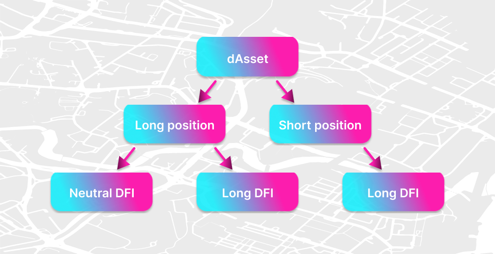

**This page was not fully converted yet to the new wiki format. Coming soon!**

Previous version of this page can be found here: https://defichain-wiki.com/wiki/Investing_%26_Trading_with_Decentralized_Loans_and_Assets_on_DeFiChain

## Part 1: Long and short positions with decentralized Assets

There are many ways of investing in decentralized Assets (so called "dAssets") using the DefiChain DEX. This chapter is focused on the three basic methods.

The examples are made for the input investment of DFI, but it can be replaced with all crypto tokens of DeFiChain ecosystem (f.e. dBTC, dETH, dUSDT,...).  

### Long position - Neutral DFI

#### Investment thesis

The future price of the dAsset will be higher than it is today.

#### DefiChain procedure

- sell DFI on the DEX for DUSD
- buy preferred dAsset on the DEX with X amount of DUSD
- The goal of the investment
  - sell the dAsset for Y amount of DUSD
  - Profit: (Y-X) DUSD

#### Remarks

- the steps of procedure (sell and buy) should be combined to a composite swap, which makes both steps in one transaction
- trades (losses and gains) are measured in DUSD = $1
- the price of dAsset comes from the liquity minig pools, not from the price feed of the Oracles **→ pay attention to the pool ratio**
- any price movement of DFI has no effect on the investment
- whole capital is invested

#### Example

When DFI price is $2.50, then **280 DFI can be swapped to 700 DUSD**. For those 700 DUSD 1 dTSLA  can be bought.

After some time the dTSLA price rises to 1000 DUSD and the DFI price rises to $4.00. The dTSLA can be sold for 1000 DUSD and **makes 300 DUSD profit**, but the 1000 DUSD can be swapped back **only to 250 DFI**, because the DFI price went up.

**→ The best case for this investment: Only the price of dAsset increases.**

### Long position - Long DFI (leverage)

#### Investment thesis

The future price of the dAsset and DFI will be higher than it is today.

#### DefiChain procedure

- put DFI in vault as the collateral for a decentralized loan and mint **x amount of DUSD**
- buy preferred dAsset on the DEX with **x amount of DUSD**
- The Goal of the investment
  - sell the dAsset for **y amount of DUSD**
  - payback loan which equals **x amount of DUSD + interest**
  - Profit: **(y-x) DUSD - interest**

#### Remarks

- trades (losses and gains) are measured in DUSD = $1
- the price of dAssets comes from the liquity minig pools, not from the price feed of the Oracles **→ pay attention to the pool ratio**
- if the price of the collateral falls too low, the vault will be liquidated **→ pay attention to the collateral ratio**
- not all capital is invested (2/3 – 1/10 with respect to collateral ratio) **→ the yield for long position on dAsset is reduced**

#### Example

When DFI price is $2.50, the collateral of **280 DFI equals $700 and provides** decentralized loan of 350 DUSD** with collateral ratio of 200%. Those 350 DUSD can be swapped to 0.5 dTSLA on the DEX.

When after one year dTSLA price goes up to $1000 and DFI price rises to $4.00, the 0.5 dTSLA can be swapped for 500 DUSD. The loan can be closed with 350 + 7 DUSD (the interest included). **The profit is 500 - 357 = 143 DUSD.**

**The price of DFI collateral is now $1120 which means an additional profit of $420**.

**→ The best case for this investment: dAsset price and DFI price increases**

### Short position - Long DFI

#### Investment thesis

The future price of the dAsset will be lower than it is today.

#### DefiChain procedure

- put DFI in vault as the collateral for a decentralized loan and mint **x amount of** preferred dAsset
- sell the dAsset on the DEX and get **y amount of DUSD**
- The Goal of the investment
  - buy **x amount of dAsset+loan interest** back with **z amount of DUSD** (after dAsset price drop)
  - payback loan 
  - Profit: **(y-z) DUSD**

#### Remarks

- trades (losses and gains) are measured in DUSD = $1
- the price of dAssets comes from the liquity minig pools, not from the price feed of the Oracles **→ pay attention to the pool ratio**
- if the price of the collateral falls too low, the vault will be liquidated **→ pay attention to the collateral ratio**
- not all capital is invested (2/3 – 1/10 with respect to collateral ratio) **→ the yield for short position on dAsset is reduced**

#### Example

When DFI price is $2.50, the collateral of **280 DFI equals $700 and provides decentralized loan 0.5 dTSLA** (200% collateralization and dTLSA price of $700). This 0.5 dTSLA can be swapped on the DEX for 350 DUSD.

When after one year the dTSLA price drops to $500 and the DFI price increases to $4.00, the loan amount + interest is 0.51 dTSLA, which can be bought for 255 DUSD. **The profit is 350 - 255 = 95 DUSD.**

**The price of DFI collateral is now $1120 which means an additional profit of $420.**

**→ The best case for this investment: The dAsset price decreases and DFI price increases.**

## Part 2: Liquidity mining

 Liquidity mining (LM) is one of the fundaments of the whole DeFiChain. Further information can be founded [here](./Liquidity_Mining.md).  
 In case of investing & trading, liquidity mining can be used to generate cashflow. This chapter describes four different ways depending on the investment strategy. 

The examples are made for the input investment of DFI, but it can be replaced with all crypto tokens of DeFiChain ecosystem (f.e. dBTC, dETH, dUSDT,...). However, only dAsset-DUSD pools are used in the examples. 

### Liquidity Mining – Neutral DFI / Long dAsset

#### Investment thesis

- generate crypto cashflow with liquidity mining
- in the long term the DFI price will decrease and the dAsset price will increase

#### DefiChain procedure

- sell some DFI on the DEX for **x amount of DUSD**
- buy preferred dAsset on the DEX with **x/2 amount of DUSD** 
- put DUSD and dAsset token into the liquidity mining pool
- The Goal of the investment
  - get DFI rewards with each minted block and commissions
  - after some time remove liquidity and sell dAsset token for **y amount of DUSD**
  - Profit: **(y-x) DUSD + LM rewards and commissions.**

#### Remarks

- trades (losses and gains) are measured in DUSD  = $1
- LM block rewards are paid in DFI
- The commissions from LM are paid in dAsset and DUSD
- any price movements of DFI has no effect on the investment
- whole capital is invested and generates cashflow

#### Example

When DFI price is $2.50, the 560 DFI can be swapped to 700 DUSD and 1 dTSLA with an overall value of $1400.  

Those tokens can be put into LM with the ratio: 

`700 DUSD \* $1 = 1TSLA \* $700`  
  
that leads to following amount of liquidity tokens

`√(1 \* 700) = 26.45`

After some time the price of dTSLA increases to $1000. That means that the pool ratio is:

`x amount of DUSD \* $1 = y amount of dTSLA \* 1000`

The rule of the constant amount of LM tokens leads to:

`√(x \* y) = 26.45 → x = (26.45^2)/y`

Back to the first equation with substitution:

`(26.45^2)/y \* $1 = y \* $1000  → y = 0.836 → x = 836`  

Removing liquidity and swapping the 0.836 dTSLA and 836 DUSD into USD will result in an overall amount of: 

`2 \* $836 = $1672 = $1400 + $272`

**Additional to Liquidity Mining rewards, the investment provides $272 profit from price movement of dTSLA.**

**When the DFI price went up to $4.00 in the same time period, the 1672 DUSD can be swapped back only to 418 DFI.**

**→ The best case for this investment: Only the price of dAsset increases.**

