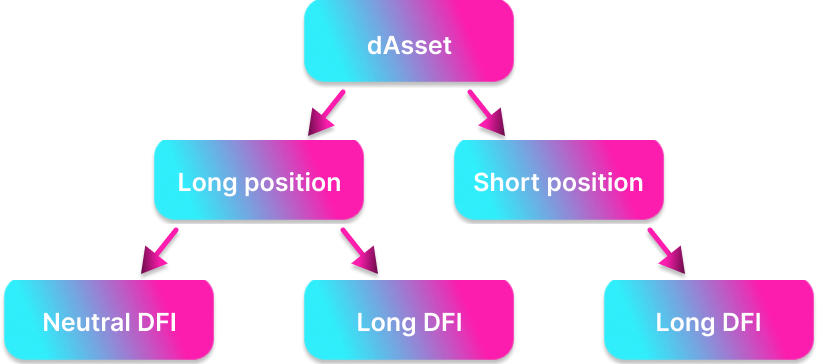

Liquidity mining (LM) is one of the fundaments of the whole DeFiChain. Further information can be founded [here](../category/liquidity-mining).  
 In case of investing & trading, liquidity mining can be used to generate cashflow. This chapter describes four different ways depending on the investment strategy.

The examples are made for the input investment of DFI, but it can be replaced with all crypto tokens of DeFiChain ecosystem (f.e. dBTC, dETH, dUSDT,...). However, only dAsset-DUSD pools are used in the examples.

### Neutral DFI / Long dAsset

#### Investment thesis

- generate crypto cashflow with liquidity mining
- in the long term the DFI price will decrease and the dAsset price will increase

#### DefiChain procedure

- sell some DFI on the DEX for **X amount of DUSD**
- buy preferred dAsset on the DEX with **X/2 amount of DUSD**
- put DUSD and dAsset token into the liquidity mining pool
- The Goal of the investment
  - get DFI rewards with each minted block and commissions
  - after some time remove liquidity and sell dAsset token for **Y amount of DUSD**
  - Profit: **(Y-X) DUSD + LM rewards and commissions.**

#### Remarks

- trades (losses and gains) are measured in DUSD = $1
- LM block rewards are paid in DFI
- the commissions from LM are paid in dAsset and DUSD
- any price movements of DFI has no effect on the investment
- whole capital is invested and generates cashflow

:::info Example

When **DFI** price is **$2.50,** the **560 DFI** can be swapped to **700 DUSD** and **1 dTSLA** with an overall value of **$1400.**

Those tokens can be put into LM with the ratio:

**700 DUSD \* $1 = 1dTSLA \* $700**

that leads to following amount of liquidity tokens

**√(1 \* 700) = 26.45**

After some time the price of **dTSLA** increases to **$1000**. That means that the pool ratio is:

**X amount of DUSD \* $1 = Y amount of dTSLA \* 1000**

The rule of the constant amount of LM tokens leads to:

**√(X \* Y) = 26.45 → X = (26.45^2)/Y**

Back to the first equation with substitution:

**(26.45^2)/Y \* $1 = Y \* $1000 → Y = 0.836 → X = 836**

Removing liquidity and swapping the **0.836 dTSLA** into **DUSD** will result in an overall amount of:

**2 \* $836 = $1672 = $1400 + $272**

Additional to Liquidity Mining rewards, the investment provides **$272 profit** from price movement of dTSLA.

When the **DFI** price went up to **$4.00** in the same time period, the **1672** DUSD can be swapped back only to **418 DFI.**

**→ The best case for this investment: Only the price of dAsset increases.**

:::

### Long DFI / Long dAsset

#### Investment thesis

- generate crypto cashflow with liquidity mining
- the DFI and dAsset price will increase

#### DefiChain procedure

- put DFI in vault as the collateral for a decentralized loan and mint **X amount of DUSD**
- sell the **X/2 DUSD** for **Y amount of dAsset**
- put DUSD and dAsset into liquidity mining
- The Goal of the investment
  - get DFI rewards with each minted blocks + commissions
  - remove liquidity (after dAsset price rise) = get **Z DUSD** and the same value in the dAsset
  - swap **dAsset** back to **Z amount od DUSD**, where **Z > X/2**
  - close loan by putting dUSD + loan interest back
    Profit: **(2Z - X) + LM rewards + commissions - loan interest**

#### Remarks

- trades (losses and gains) are measured in DUSD = $1
- LM block rewards are paid in DFI
- the commissions from LM are paid in dAsset and DUSD
- if the price of the DFI (collateral) falls too low, the vault will be liquidated **→ pay attention to the collateral ratio**
- not all capital is invested (2/3 – 1/10 with respect to collateral ratio) **→ the yield for short position on dAsset is reduced**

:::info Example

When **DFI** price is **$2.50,** the collateral of **1120 DFI** equals **$2800** and provides decentralized loan **1400 DUSD** (200% collateralization). **$700 DUSD** can be swapped to **1 dTSLA**.

Those tokens can be put into LM with the ratio:

**700 DUSD \* $1 = 1dTSLA \* $700**

that leads to following amount of liquidity tokens

**√(1 \* 700) = 26.45**

After some time the price of **dTSLA** increases to **$1000**. That means that the pool ratio is:

**X amount of DUSD \* $1 = Y amount of dTSLA \* 1000**

The rule of the constant amount of LM tokens leads to:

**√(X \* Y) = 26.45 → X = (26.45^2)/Y**

Back to the first equation with substitution:

**(26.45^2)/Y \* $1 = Y \* $1000 → Y = 0.836 → X = 836**

Removing liquidity and swapping the **0.836 dTSLA** into **DUSD** will result in an overall amount of:

**2 \* $836 = $1672 = $1400 + $272**

Additional to Liquidity Mining rewards, the investment provides **profit: ($272 -loan interest**) from price movement of dTSLA.

When the **DFI** price went up to **$4.00** in the same time period, **1120 DFI** collateral (after closing the loan) has value of **$4480** which means additional **profit of $1680.**

**→ The best case for this investment: The dAsset price decreases and DFI price increases.**

:::

### Long DFI / Neutral dAsset

#### Investment thesis

- generate crypto cashflow with liquidity mining.
- long term the DFI price will increase and the dAsset price will stay unchanged.

#### DefiChain procedure

- put DFI in vault as the collateral for a decentralized loan and mint **DUSD and dAsset with same value**
- put DUSD and dAsset into liquidity mining
- The Goal of the investment
  - get DFI rewards with each minted blocks + commissions
  - after some time remove liquidity
  - if the pool ratio is different get the needed amount of DUSD and dAsset (swap/buy if needed)
  - close the loan by putting dAsset and dUSD (interest included) back
    Profit: **LM rewards+commissions - interest - loss of pool ratio change**

#### Remarks

- trades (losses and gains) are measured in DUSD = $1
- LM block rewards are paid in DFI
- the commissions from LM are paid in dAsset and DUSD
- pool ratio change reduces your overall profit **→ asset neutral position**
- if the price of the DFI (collateral) falls too low, the vault will be liquidated **→ pay attention to the collateral ratio**
- not all capital is invested (2/3 – 1/10 with respect to collateral ratio) **→ the yield for short position on dAsset is reduced**

:::info Example

When **DFI** price is **$2.50,** the collateral of **1120 DFI** equals **$2800** and provides decentralized loan **1dTSLA** and **700 DUSD** (200% collateralization).

Those tokens can be put into LM with the ratio:

**700 DUSD \* $1 = 1dTSLA \* $700**

that leads to following amount of liquidity tokens

**√(1 \* 700) = 26.45**

After some time the price of **dTSLA** increases to **$1000**. That means that the pool ratio is:

**X amount of DUSD \* $1 = Y amount of dTSLA \* 1000**

The rule of the constant amount of LM tokens leads to:

**√(X \* Y) = 26.45 → X = (26.45^2)/Y**

Back to the first equation with substitution:

**(26.45^2)/Y \* $1 = Y \* $1000 → Y = 0.836 → X = 836**

Removing liquidity provides **0.164 less dTSLA** and **136 more dUSD**. Swapping the **136 dUSD** will result in an overall amount of **dTSLA = 0.836 + 0.136 = 0.972.**

**0.028 dTSLA** is **missing** to close the loan and must be bought from reward income.

If in the same time frame the **DFI** price inccreases to **$4.00,** it will make additional **profit of $1,680** with your **DFI** long position.

**→ The best case for this investment: Pool ratio remains unchanged and DFI increases.**

:::

### Long DFI / Short dAsset

#### Investment thesis

- generate crypto cashflow with liquidity mining.
- long term the DFI price will increase and the dAsset price will decrease.

#### DefiChain procedure

- put DFI in vault as the collateral for a decentralized loan and mint **X amount of dAsset**
- swap **X/2 of dAsset to DUSD**
- put DUSD and dAsset into liquidity mining
- The Goal of the investment
  - get DFI rewards with each minted blocks + commissions
  - after some time (when the dAsset price decrease) remove liquidity
  - swap the **DUSD** back to **Y amount of dAsset**, where **Y > X/2**
  - close the loan by putting dAsset (interest included) back
    Profit: **LM rewards + commissions - interest + unspent dAsset from pool ratio change**

#### Remarks

- trades (losses and gains) are measured in DUSD = $1
- LM block rewards are paid in DFI
- the commissions from LM are paid in dAsset and DUSD
- negative price movement of dAsset generates more – for loan needed – dAsset in LM **→ Short position on dAsset**
- if the price of the DFI (collateral) falls too low, the vault will be liquidated **→ pay attention to the collateral ratio**
- not all capital is invested (2/3 – 1/10 with respect to collateral ratio) **→ the yield for short position on dAsset is reduced**

:::info Example

When **DFI** price is **$2.50,** the collateral of **1120 DFI** equals **$2800** and provides decentralized loan **2 dTSLA** (200% collateralization). **1 dTSLA** can be swapped to **700 DUSD**.

Those tokens can be put into LM with the ratio:

**700 DUSD \* $1 = 1dTSLA \* $700**

that leads to following amount of liquidity tokens

**√(1 \* 700) = 26.45**

After some time the price of **dTSLA** decreases to **$500**. That means that the pool ratio is:

**X amount of DUSD \* $1 = Y amount of dTSLA \* 500**

The rule of the constant amount of LM tokens leads to:

**√(X \* Y) = 26.45 → X = (26.45^2)/Y**

Back to the first equation with substitution:

**(26.45^2)/Y \* $1 = Y \* $500 → Y = 1,18 → X = 590**

Removing liquidity and swapping the **590 DUSD** into **dTSLA** will result in an overall amount of **dTSLA = 2 \* 1.18 = 2.36 = 2 + 0.36.**

The additional **profit** from dAsset short position is **0,36 dTSLA - loan interest**.

If in the same time frame **DFI** goes up to **$4.00,** it will make additional **profit of $1,680** with your **DFI** long position.

**→ The best case for this investment: The price of the dAsset goes down and DFI price goes up.**

:::
