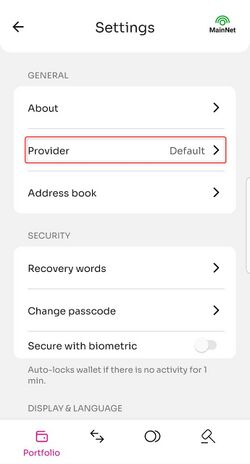

The Lightwallet of DeFiChain interacts with the blockchain via Ocean infrastructure. Every user action is saved in a signed transaction and send to Ocean, which then executes it. So, a running ocean infrastructure is mandatory to have access to your funds with the Lightwallet. DeFiChain is a decentralized project and has alternatives to the standard infrastructure here as well.

**Attention: Use only ocean infrastructures that you trust.**

## How to change Ocean infrastructure {#how-to-change-ocean-infrastructure}

If you want to change the ocean infrastructure (e.g. default ocean is down and you want access to your funds), then you can do it in the settings menu.

*Provider entry in the settings menu of the Lightwallet*

In the provider menu you can enter a new endpoint URL for the ocean infrastructure. The default setting is <https://ocean.defichain.com> and can also be restored with the button *Reset provider* (will be enabled after ocean was changed). You need your passcode to save the changes.

*Provider menu to change the ocean infrastructure*

## Available Ocean infrastructures {#available-ocean-infrastructures}

1.  The default ocean infrastructure is set up and maintained by the core team. Because of the broad usage they need a lot of servers to handle the requests. There was a CFP ([CFP-2205-04](https://github.com/DeFiCh/dfips/issues/147)) to finance these servers on AWS. You can reach ocean via <https://ocean.defichain.com>
2.  A community driven ocean infrastructure was set up by mydefichain and is also financed via a CFP ([CFP-2207-18](https://github.com/DeFiCh/dfips/issues/187)). You can use it with the link <https://ocean.mydefichain.com/>
3.  Another ocean infrastructure was set up by Jan and Lukas, who also have an alternative Defiscan Explorer <https://ocean.explore-defichain.com/>
