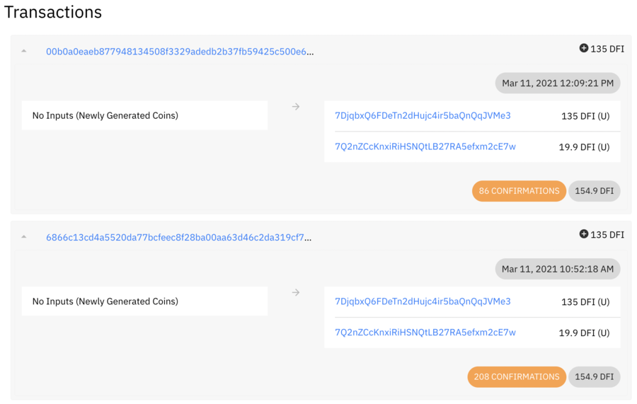
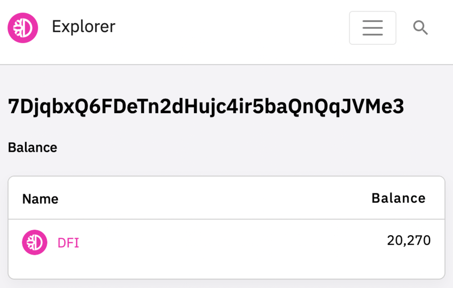

## DeFiChain Masternode {#defichain-masternode}

In January 2021, the Masternodes decided in [DFI Proposal #4](https://github.com/DeFiCh/dfips/issues/6) to reduce the collateral for one masternode to 20,000 DFI from 1,000,000 DFI.

On March 1, 2021, the hard fork named DAKOTA was implemented in Block 678,000 and finally reduced the collateral.

### How to Run a Masternode {#how-to-run-a-masternode}

There are several ways to operate a Masternode in the DeFiChain Network.

#### Option 1 - Ownernode at "Home" {#option-1---ownernode-at-home}

The first possibility is to run the Masternode on a Personal Computer, Laptop or Apple MacBook or something similar in your Home Network. You can place the hardware, in your office, living room or even in your child's room. You can decide.

The only things you need:

- Internet connection (no static IP needed)
- Any hardware with installed app/wallet
- 20,000 DFI in this Wallet for the node, 11 DFI for creation and fees.

**Pros:**

- This is the simplest setup and you only need a few clicks to run it.
- You don't need extra Hardware, you can use your existing machine with the wallet on it.

**Cons:**

- When your machine is offline or your internet connection is down, you can't participate in the network and staking - no rewards in this time.
- If you want to make the network more stable with your masternode and want to offer services for other nodes, you have to open port 8555 externally for everyone.1
- When you open the Port, you present your wallet.dat to the public internet, maybe a possible target for attackers.

>[1] You do **NOT** have to open the Port to participate in staking, but without this open port, you don't help to stabilize the Network and no one can use your node for synchronization or other implemented features

#### Option 2 - Ownernode and Operatornode at "Home" {#option-2---ownernode-and-operatornode-at-home}

In this scenario you have two nodes or wallet apps in your home network. One machine acts as the ownernode and holds the Collateral of 20,000 DFI. This can be your Macbook, Laptop or Personal Computer. You start this machine, when you need it, only to transfer some token or use the DEX, LM or send Rewards to another address.

The other machine is your Operatornode. This can be another Laptop or PC or Raspberry or a home server. You only need the actual nodeversion on it. No collateral, no wallet app required. You can open Port 8555 in your router to this machine to present network services and make this node public for other nodes.

Because this Node has no coins or tokens, the security risk is much less than in option 1.

**Pros:**

- Open Port only to the Node without Coins or Token in it.
- You run the Node at home, nevertheless stabilize the network over opened Port 8555 (only possible with static IP.)

**Cons:**

- When your Operatornode is offline or your internet connection is down, you cannot participate in the network and staking - there are no rewards in this time.
- Hardware for home is not very suitable for 24/7 continuous operation (Power Supply, SSD or another disc etc.) Risky for hardware damage.
- Need another device for the Operatornode
- You need a static IP-Address to present your Node in the Network.
- Open port 8555 externally for everyone to your Home-Network.
- An unstable or slow internet connection (upload) is bad for the stability of the network

#### Option 3 - Ownernode and Operatornode in a Data Center {#option-3---ownernode-and-operatornode-in-a-data-center}

The preferred scenario is a Hot/Cold wallet solution with the Operatornode "in the Cloud". Your APP-Wallet run at your own machine at home like in option 2. In best case with Ledgersupport as a "Cold-Wallet".

This wallet contains the collateral of 20,000 DFI and only needs to be active when you want to use with your Wallet or Node.

The operatornode is hosted in a professional tier 2 or 3 Datacenter. A simple virtual private Server is enough, no big rootserver or something else needed.

**Pros:**

- No Port Forwarding needed at Home.
- High Availability, 24/7 Infrastructure and redundant Internet Connection for your Masternode (Operatornode)
- Full Service for the DeFiChain Network: high-availability node with redundant hardware and internet connection stabilizes the Network and is a boost for the decentralization.

**Cons:**

- VPS needed in a data center and some knowledge to handle and update it.

## Masternode Issues {#masternode-issues}

### I have found a block, but the rewards are not apparent {#i-have-found-a-block-but-the-rewards-are-not-apparent}

Problem:

I set up a masternode in the testnet and after a few hours I already found 2 blocks. But the rewards are not displayed in the wallet.

Mining Rewards are displayed correctly in the explorer.

The balance in the Wallet is smaller than the distributed rewards.

Solution:

DFI Rewards are only released after a certain block time has elapsed. To see the coins that have not been released yet, you need to enter the following code in the console: `getbalances`

After the expiration of the blocking period, the coins will be displayed correctly in the wallet.
