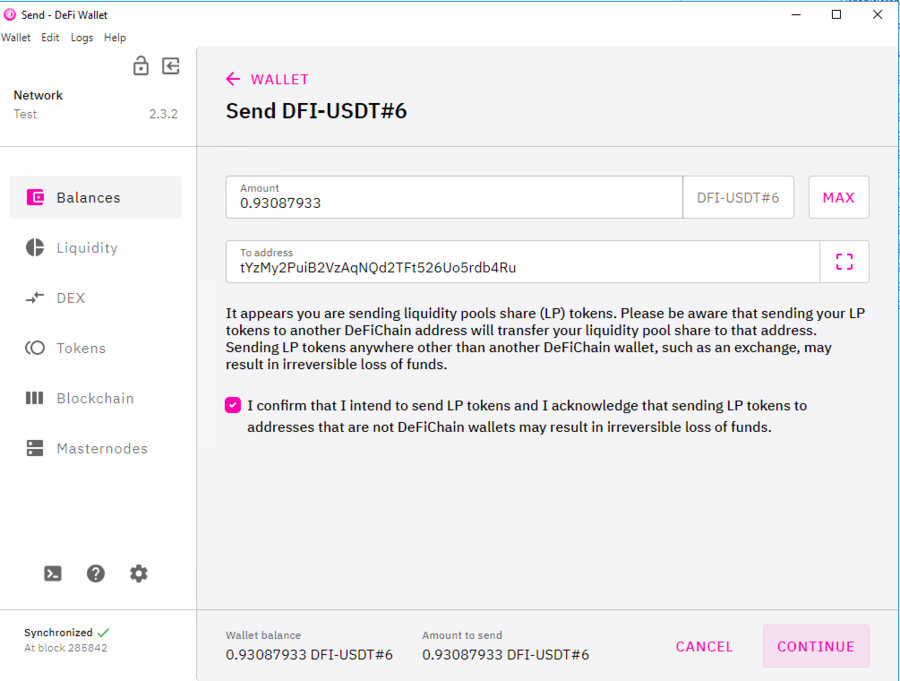

Instructions how to send all coins and tokens of a DeFi Wallet:

_DeFi Wallet with Coin and Tokens_  

To move all assets it is best to move the liquidity tokens first. To do this, open the corresponding wallet and send the assets to the new address.

_Click on the DeFi Wallet and then click on Send_  

_Insert new address, click MAX, confirm note, and then click Next and Send_  

Note: Liquidity tokens may not be sent to exchanges or other providers. Send liquidity tokens to your own address only!

After you have transferred the liquidity tokens to the new address, all rewards will now also be distributed to the new address. Now you can also transfer all other tokens like BTC or USDT.

Only when all other tokens have been transferred, you can transfer your DFI last. The DFI only as last, because you need this as a means of payment for the transaction fees.
