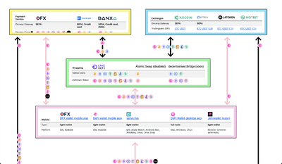
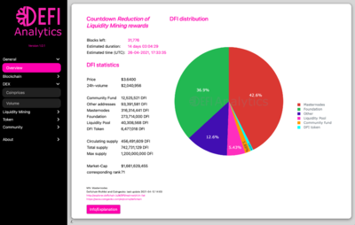
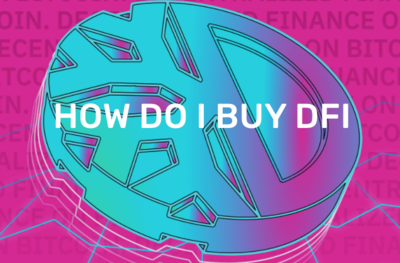

Links to independent portals with DeFiChain content

## Helpful Tools

- [Stock Token APR](https://www.krypto-sprungbrett.com/stock-token-apr/)
- [DEX Live Data I (dfi.terac.de)](https://dfi.terac.de/dex)
- [DEX Live Data II (dfidex.live)](https://dfidex.live/)
- [DFI UTXO Recharger](https://utxo.mydefichain.com/)
- [Liquidity Mining Calculator](https://docs.google.com/spreadsheets/d/1gTAzSyJWnm6z7z4c77gJNb2fxG9teqaxAGaarBzAyPM/edit?usp=sharing)
- [DefiChain Stock Rewards Calculator](https://docs.google.com/spreadsheets/d/1omT9PpxlgM0cSUWV27hIds-6fTyHsspS0Rje5J_Vhf4/edit?usp=sharing)
- [DeFiChain Loan Rechner](https://defichain-loan-calculator.vercel.app)
- [dStocks Quickcheck](https://dstocks-defichain.web.app)
- [DeFiChain-Votings (CFP/DFIP-Monitoring)](https://www.defichain-votings.com/#/round/latest)

## Telegram Bots

- [DeFiChain CFP Voting](https://t.me/DFI_cfp_election_bot)
- [DFI Signal](https://t.me/DFI_Signal_bot)

## Other Services

### DeFiChain Lottery
Take part in the first lottery on the DeFiChain and get a chance to win DFI in weekly draws

https://defichain-lottery.com/

### DeFiChain Bridge
Easily Move Token Between Defichain and Blockchain X

https://defichain-bridge.com/

### DeFiChain Ecosystem
An overview about payment ways from and to the DeFiChain.

https://defichain-ecosystem.com/

### DeFiChain Value
Decentralizing finance leads to information accessable for everyone. Collecting data, sorting, analyzing, and interpreting generates knowledge. Excess knowledge enables our community to have an advantage over other market participants. Defichain Value makes use of traditional finance theory, data analysis and interactive software to provide all the information you need. Decentral finance is all about substituting financial services. Knowledge that was gathered in the last 150 years of finance should not be forgotten; it should be used to our advantage. You do not know much about finance? Don t you worry we will learn it together!

https://defichain-value.com/

### DeFiChain Dobby
Dobby will be ready to monitor your own vaults when you are. Just go to the setup wizard again whenever you like.

https://defichain-dobby.com/

### mydeficha.in
Everything about Masternodes (Calculator, Faucet, Statistics, Management)

https://mydeficha.in/

### DFI.tax
DFI.tax analyses your rewards from Liquidity Mining and Staking for multiple DeFiChain addresses.

https://dfi.tax/

### DeFiChain Dashboard
This community project is now in the second version as a complete standalone Dashboard for DefiChain. The idea is to track public data of the blockchain and community, evaluate it and show the progress of the decentral project. These keys and figures should help the community to get a feeling if all the developments are going in the right direction.

https://www.defichain-analytics.com/

### Masternode-Tracking-Google-Sheet
A simple Google Sheets document for tracking your masternodes.See how many blocks your nodes have minted so far, how many rewards are remaining on your collateral addresses and (manually) keep track of your rewards.

[Masternode-Tracking-Google-Sheet](./Masternode-Tracking-Google-Sheet.md)

### DeFi Scan
DeFiChain Explorer

https://defiscan.live/

### Defichain INCOME
Track your DeFiChain-Portfolio

- Autoload rewards and assets from your addresses
- masternode support
- automated DFX-Staking import
- manual staking from Cake
- charts
- one login and use on all devices

https://www.defichain-income.com/

### DeFiChain Explained
https://defichain-explained.com/

### DeFiChain Rewardhelper
A simple Website which gives you the possibility to convert the CSV-Files from CAKE, DeFiChain or the DeFiPortfolio-App to a compatible format for Cointracking, Accointing, Cryptotax or Blockpit.

https://defichain-rewardhelper.com/

### CRYPTO ID
https://chainz.cryptoid.info/dfi/

### DeFiChain Masternode Monitor
See what's going on on your Masternodes without having the DeFiChain Wallet desktop app running.

So, you can check the activities of your masternodes right from your smartphone or any other computer with internet access.

Have a look on the corresponding [DeFiChain-Wiki page of the Masternode Monitor](./DeFiChain-Masternode-Monitor.md).

https://www.defichain-masternode-monitor.com/

### DeFiChain-Wiki
https://defichain-wiki.com/

### Decentralized Finance Exchange
https://dfx.swiss/

### Freezer Reward Simulator
https://www.krypto-sprungbrett.com/freezer-reward-simulator/

### How do i buy DFI
Explanation from fastest and easiest way from buying to staking and other purchase opportunities.

https://defichain-buy.com/

### DeFiNode - Raspberry Pi 4
With this project you can 3D print your DeFiNode case and run a node or wallet locally on a Raspberry Pi 4. [Information here](./App_on_Raspberry-Pi.md).

https://github.com/definode/definode

### DeFiChain related NFTs
NFTs have joined Punks and Jellyfishs in the DeFiChain community. Show your connection and treat yourself to one as your profile picture.

[Information here](./Punks.md)

