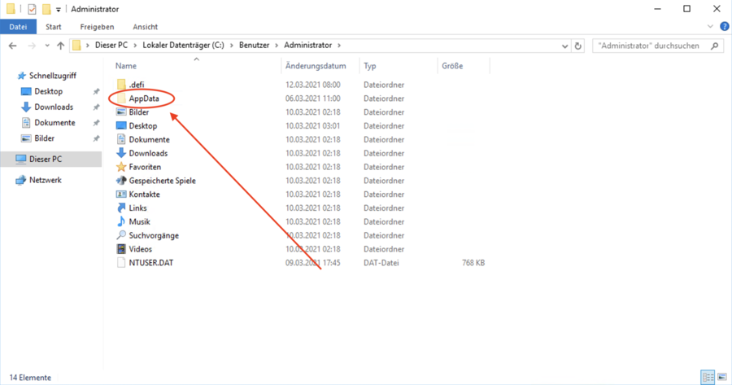
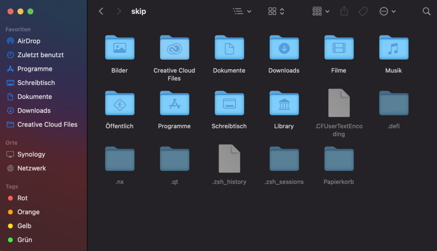

## Windows {#windows}

In the default setting hidden folders are not shown. For some troubleshooting of the DeFi App it is necessary to have access to these folders. To do this, proceed as follows.

_View without hidden folders_  

_Activate display_  

_The hidden folders are now displayed_  

## Mac {#mac}

### Hidden folders {#hidden-folders}

The following key combination can be used to display hidden folders in Mac OS.

_[cmd] + [shift] + [.]_  
![[cmd] + [shift] + [.]](./../media/hiddenfolder_EN_4.jpg)

_Before_  

_After_  

### Library {#library}

On Mac OS, access is often needed to the Library folder, which is not shown by default.

_Library folder_  

Do a right click and then click Show display options.

_Show display options_  

_Show Library folder_  

After that, the Library folder will be displayed correctly.

### Files in an application {#files-in-an-application}

How to view files in an application. Example folder: `/Applications/defi-app.app/Contents/Resources/binary/mac`

_Right-click on the application and then on Show Package Contents_  

_The folders in the application are now displayed_  

