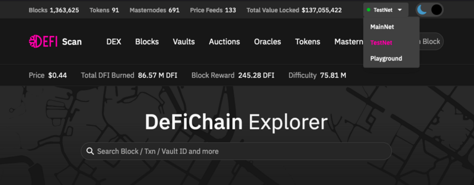

## Motivation

If you just want to try out some things, like maybe new features or while developing you own bot, you maybe don’t want to risk your hardly earned ‚real life‘ DFI, the Testnet is the place to be.

## Switch to the Testnet

### Switch to the Testnet on the light wallet / DefiCahin Wallet App

### Switch to the Testnet on the Desktop Wallet / Full node

### Switch to the Testnet on the Page defiscan.live

## Differences to the Mainnet

The functions on the blockchain are the same as in the Mainnet. For sure there are much less masternodes and users in the Testnet. New Updates of the chain (hardforks) are released on the Testnet earlier. Then there is enough time to test everything there before it goes live on the mainnet. Also you don’t have all the tokens and liquidity pairs on the DEX. There is just a small subset available on the Testnet.

## How to get DFI on the Testnet

There is a page <https://testnet-utxo.mydefichain.com/> where you can request 1.000 DFI every 6 hours.

The DFI are sent to a testnet address you can provide in the form on the page. Note that testnet addresses always start with **t** and not with **d** as on the mainnet. You only need to solve a capcha and then the DFI are sent quickly.
