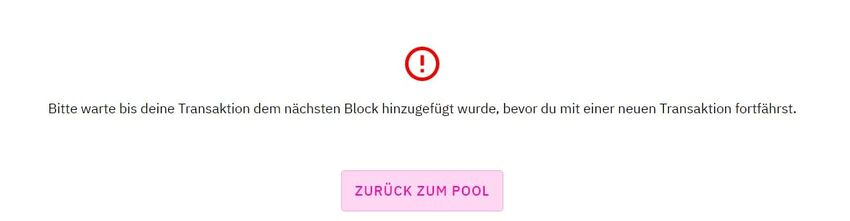

Testimonials from the community about the installation of DeFi Wallet V2.3.2

## General recommendations for installation {#general-recommendations-for-installation}

- Before installation, make sure that your backup is stored in a safe place. For example, on a memory stick.
- Optionally, it may be useful to always run the DeFi Wallet on 2 devices in parallel. This way you always have access to your coins, even if the update fails on one device. This helps to stay calm and not to get nervous.

## Known problems from the community with the installation {#known-problems-from-the-community-with-the-installation}

### Wrong addresses are displayed {#wrong-addresses-are-displayed}

One user reports that DeFi Wallet displays incorrect addresses after the update. Some addresses that were not displayed before the update are now displayed, and some addresses that were displayed and used before the update are now no longer displayed.

This is very easy to explain. The DeFi Wallet with version 2.3.2 shows all addresses after the update that own or once owned DFI UTXO. If you have an address that only has tokens and no DFI UTXO, this address will not be displayed after the update. You can add the address again manually.

- [Create address#Display an old address again:](./Create_address.md#display-an-old-address-again)

To check whether an address has DFI UTXO or not, you can use this explorer:

- <https://explorer.defichain.com/#/DFI/mainnet/home>

To check if an address has DFI tokens you can use this explorer:

- <https://dex.defichain.com/mainnet/pool>

Please note that DFI UTXO and DFI Token are not the same.

## Transactions are not displayed in the history {#transactions-are-not-displayed-in-the-history}

This problem is well known. The developers are working on a solution.

### The wallet does not synchronize {#the-wallet-does-not-synchronize}

Many antivirus programs are not compatible with Bitcoin Core and also not with DeFi Wallet 2.3.2. Disable the antivirus software to run DeFi Wallet.

### Insufficient amount {#insufficient-amount}

This error message seems to occur more often after the update to 2.3.2.
Solution:

- Create a new address: [Create address](./../finalized/Create_address.md)
- Send all tokens and coins to the newly created address: [Send all coins](./../finalized/Send_all_coins.md)
- Try again. Now it should work.

No help found? Go to [Debug.log](./../finalized/Debug.log.md)

### Please wait until your transaction has been added to the next block before proceeding with a new transaction {#please-wait-until-your-transaction-has-been-added-to-the-next-block-before-proceeding-with-a-new-transaction}

*Error: Please wait until your transaction has been added to the next block before proceeding with a new transaction.*  
 is not possible to make a transaction. Solution:

- Create a new address: [Create address](./../finalized/Create_address.md)
- Send all tokens and coins to the newly created address: [Send all coins](./../finalized/Send_all_coins.md)
- Try again. Now it should work.

No help found? Go to [Debug.log](./../finalized/Debug.log.md)

## Comments {#comments}

*defi-app to DeFi Wallet*  

As of version 2.3.2, the wallet is no longer called defi-app but DeFi Wallet. The old app remains and must be uninstalled manually.

*old folder defi-app that can be deleted*  

folder `/Users/*<username>*/Library/Application Support/defi-app` can be deleted.
