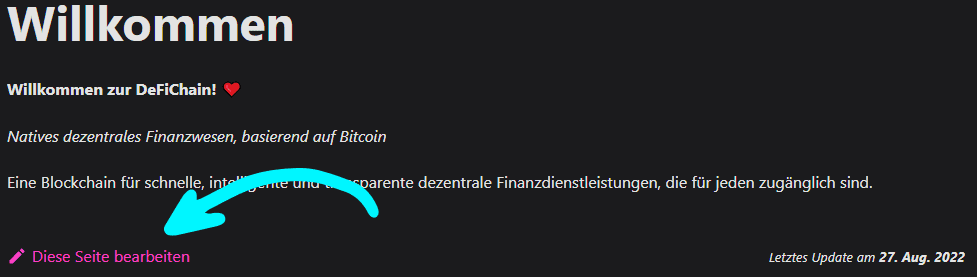
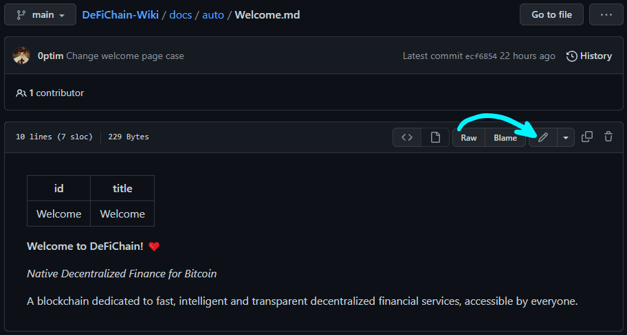

## Voraussetzungen

- Um an dem Wiki mitzuarbeiten, benötigst du ein GitHub-Konto. [hier](https://github.com/join) kannst du ein kostenloses Konto erstellen.
- Alle Seiten sind in der **Markdown**-Syntax geschrieben. Hier ist eine praktische [Übersicht](https://www.markdownguide.org/cheat-sheet/) aller Formatierungen.

## Quick Edit

### 1. Eine Wiki-Seite öffnen

Öffne die Wiki-Seite, welche du bearbeiten möchtest.

Beispielsweise die Seite ["Staking"](./Staking.md).

### 2. Bearbeitung starten

Klicke auf `Diese Seite bearbeiten` am Ende der Seite.

### 3. Editor aufrufen

### 4. Mache Änderungen & Speichere

Ändere nun auf der Seite, was immer du möchtest

Wenn du fertig bist, gib einen Titel und eine Beschreibung deiner Bearbeitung ein und klicke auf `Propose changes`.

### 5. Erstelle einen Pull-Request

Klicke auf den grossen grünen `Create pull request` Knopf.

Klicke erneut auf den `Create pull request` Knopf zum zweiten Mal.

Du hast erfolgreich eine Änderung eingereicht. 🔥

**Dankeschön!** ❤

> _Ein Wiki-Betreuer wird deine Anfrage bald überprüfen und akzeptieren oder ablehnen._
