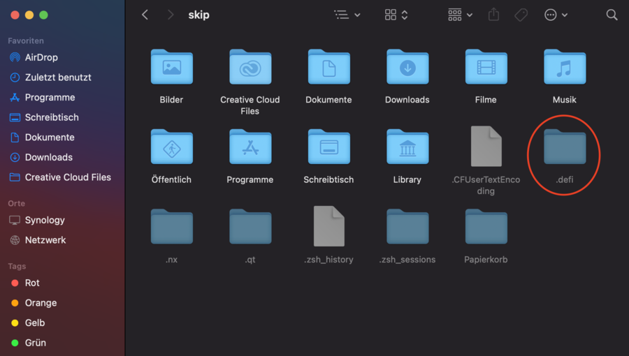

Anleitung um die DeFi App vollständig zu löschen.

**Wichtig: Es wird dringend empfohlen, das Wallet-Backup (eine Datei mit der Endung .dat) an mehreren sicheren Orten zu speichern. Zum Beispiel auf einem Speicherstick in einem Bankschließfach. Bevor du Dateien löschst, stelle sicher, dass du ein Backup deiner wallet.dat Dateien erstellt hast! Wenn du dir unsicher bist, ob deine Sicherungsdatei alle benötigten Informationen enthält und wirklich funktioniert, solltest du diese Sicherung zunächst auf einem anderen Computer ausprobieren. [Lies unsere Anleitung, wie du die DeFi App sicher nutzen kannst.](./Suggestion_for_using_the_DeFi_app.md)**

Um alle Dateien löschen zu können, ist es notwendig Zugriff auf versteckte Ordner zu besitzen. Die Anleitung dafür findest du hier: [Versteckte Ordner anzeigen](./Show_hidden_folders.md)

Folgende Ordner müssen gelöscht werden:

### Windows: {#windows}

C:\Users\\%username%\\.defi

C:\Users\\%username%\AppData\Local\defi-app-updater

C:\Users\\%username%\AppData\Local\Programs\defi-app

C:\Users\\%username%\AppData\Roaming\DeFi Blockchain

C:\Users\\%username%\AppData\Roaming\defi-app

### Mac: {#mac}

/Applications/defi-app

/Users/%username%/.defi

/Users/%username%/Library/Application Support/DeFi

/Users/%username%/Library/Application Support/defi-app

