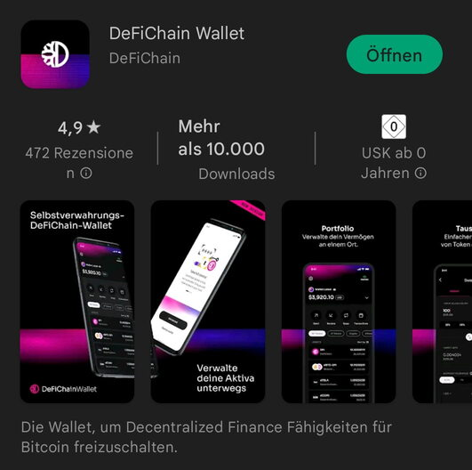

Falls du Videos bevorzugst, kannst du [hier 🎬](https://www.youtube.com/watch?v=q4MUebLlLzM&list=PLc-FB8e3YKYtju2G0O7bcUB1FE2t2SD0j) starten. Bitte beachte dabei, dass Informationen aufgrund der permanenten Weiterentwicklung der DeFiChain und des Videoalters überholt sein können.

Ansonsten haben wir hier noch etwas in Textform für dich vorbereitet.

## Entscheidung für eine Wallet {#decision-which-wallet-should-you-use}

Mit einer Wallet-App bekommst du Zugriff auf deine DFI-Coins, die auf der Blockchain gespeichert sind.

Du kannst damit u.a.

- deinen DFI-Bestand verwalten
- Coins senden und empfangen
- die DEX zum Tauschen von Coins nutzen
- [Liquidity Mining](./Liquidity_Mining.md) betreiben
- einen Vault ("Tresor") erstellen und damit Sicherheiten für einen Loan verwalten
- einen Loan ("Kredit") erstellen und zurückzahlen
- Future Swaps nutzen

Derzeit hast du die Auswahl zwischen mehreren Wallets.

### DeFiChain Light Wallet {#defichain-light-wallet}

Die Light Wallet ist verfügbar für dein Smartphone mit Android oder iOS. Die Lightwallet synchronisiert nicht die vollständige Blockchain. Sie benötigt dadurch weniger Speicherplatz und ist schneller einsatzbereit. Darüber hinaus erleichtert die bedienerfreundliche Benutzeroberfläche den Einstieg in das DeFiChain-Ökosystem.

Die DeFiChain-Light-Wallet setzt auf eine 24-Wörter-Seed-Phrase als Zugriffsmechanismus. Bitte beachte die einschlägigen Sicherheitsvorkehrungen beim Einsatz der App.

Die folgende Auflistung ist ohne Anspruch auf Vollständigkeit. Du bist allein für deinen Seed verantwortlich.

- Bewahre deine 24 Wörter sicher auf.
- Teile diese niemandem mit - außer einer Vertrauensperson für einen Notfall
- Insbesondere Betrüger in Telegram-Channels sind sehr kreativ, wenn es um deine 24 Wörter geht. Teile diese nie jemanden mit, der dich einfach so anschreibt.
- Hinterlege deine 24 Wörter nicht in irgendeiner App / Bot, die dir jemand anpreist

Für die Bequemlichkeit (um nicht jedes Mal die App mit 24 Wörtern starten zu müssen) vergibst du einen sechsstelligen PIN-Code, um in der App Transaktionen freizugeben. Nach dreimaliger Falscheingabe wird die App zurückgesetzt und du musst deine 24 Wörter parat haben, um auf deine Coins zugreifen zu können.

### DFX Light Wallet {#dfx-light-wallet}

Die DFX Light Wallet ist eine abgewandelte Form der DeFiChain Light Wallet mit diversen Zusatzfunktionen des Anbieters DFX.Swiss. Unter anderem wird damit die Verwaltung deines DFX-Staking-Guthabens und die Teilnahme an Votings ermöglicht.

Näheres dazu findest du [hier im DFX-Bereich](./DFX_FAQ.md#Schritt-f.C3.BCr-Schritt_Anleitung) des Wiki.

### Jellywallet {#jellywallet}

Die Jellywallet ist das jüngste Mitglied der Wallet-Familie auf der DeFiChain. Es handelt sich dabei um eine Chrome-Extension, ist also eine Browser-Anwendung und damit für Nutzer geeignet, die lieber am PC als am Smartphone arbeiten.

Sie nutzt ebenso wie die zuvor genannten Lightwallets einen 24-Wörter-Seed.

Die Nutzung von Vaults und Loans sind mit der Jellywallet zum Zeitpunkt der Verfassung dieses Artikels noch nicht möglich.

Den Download und weitere Informationen findest du [hier](https://jellywallet.io/).

### Full-Node-Wallet {#full-node-wallet}

Für einen Anfänger ist der Einstieg über die Full-Node-Wallet nicht unbedingt zu empfehlen, weil die Bedienbarkeit am wenigsten intuitiv ist. Für technisch affine Nutzer, die nicht nur eine grafische Oberfläche benutzen wollen, sondern auch über Kommandozeile arbeiten wollen, ist die Full-Node-Wallet aber alternativlos. Ebenso ist die Full-Node-Wallet dann notwendig, wenn man eine Masternode selbst betreiben möchte.

- Die Full-Node-Wallet ist nicht so einfach zu bedienen wie Wallets für das Smartphone
- Es wird stets die ganze Blockchain synchronisiert; dies braucht Zeit und Speicherplatz
- Es werden keine Seed Phrases (24 Wörter) verwendet. Stattdessen arbeitet die Full-Node-Wallet mit einer Sicherungsdatei. Man muss die Datei "wallet.dat" und das Passwort sichern, um im Notfall eine Wiederherstellung durchführen und auf die Coins zugreifen zu können.
- Den Download findest du hier: <https://defichain.com/downloads> für macOS, Windows und Linux

## Die ersten DFI-Coins erwerben ("On-ramp") {#getting-your-first-dfi-coins-on-ramp}

Das Erwerben deiner Coins -auch on-ramp genannt- funktioniert bei DeFiChain auf mehreren Wegen. Diese zeigen wir an dieser Stelle auf. Da sich Gebühren in einem ständigen Wandel befinden, verzichten wir auf die Angabe und bitten dich bei Bedarf und tagesaktuell beim jeweiligen Anbieter nachzusehen.

Das Off-Ramp, also die Umwandlung von Kryptocoins in FIAT-Geld, funktioniert übrigens -außer bei Cake- über die gleichen Wege.

### Börsen (Exchanges) {#exchanges}

Krypto-Börsen sind der klassische Weg, um FIAT-Geld in Kryptowährungen umzuwandeln. Du musst dazu bei einer Exchange ein Benutzerkonto erstellen. In der Regel funktioniert dies mittels einer Benutzernamen / Passwort-Kombination. Zudem ist meistens ein KYC-Prozess erforderlich. Das heißt, du musst dich mit einem gültigen usweis legitimieren. Anschließend wird dein Konto freigeschaltet und du kannst z.B. per Überweisung, Kreditkarte oder Paypal deine Euros, Franken oder Dollar zur Börse transferieren und sodann DFI kaufen.

Derzeit ist DeFiChain bei folgenden Börsen gelistet:

- Bittrex
- Kucoin
- Huobi
- bit.com
- bybit
- Deepcoin
- Hotbit
- Latoken
- bitrue
- Hoo
- Uniswap

Detailinformationen kannst du [hier](https://defichain-ecosystem.com/de/overview/exchanges/) abrufen.

Nachdem du deine DFI auf der Börse gekauft hast, kannst du diese vom der Exchange an deine bereits eingerichtete Wallet senden. Du benötigst dazu deine DeFiChain-Adresse. Diese findest du in deiner Wallet-App. Diese Versenden-Transaktion ist vergleichbar mit einer Überweisung bzw. Umbuchung zwischen zwei Bankkonten - nur eben in der Kryptowelt.

Sobald die Coins in deiner Wallet angekommen sind, stehen dir alle oben genannten wunderbaren Möglichkeiten des DeFiChains-Ökosystems offen.

### DFX-Swiss {#dfx-swiss}

DFX-Swiss ist aus der Community entstanden und bietet einen sehr einfachen On-ramp mittels SEPA-Überweisung, mittlerweile sogar in Echtzeit. Das heißt, wenn du von deiner Bank die Überweisung losgeschickt hast, findest du deine Coins innerhalb von wenigen Minuten in deiner Wallet und kannst loslegen. Viele Detailinformationen dazu gibt's im [DFX-Bereich](./DFX_FAQ.md) im Wiki.

### Cake {#cake}

Als Cake-Nutzer hast du auch die Möglichkeit, über eine Banküberweisung oder mittels anderer Kryptowährungen deine ersten DFI kaufen. Nach deinem Login bei Cake kannst du die DFI an deine Wallet senden.
