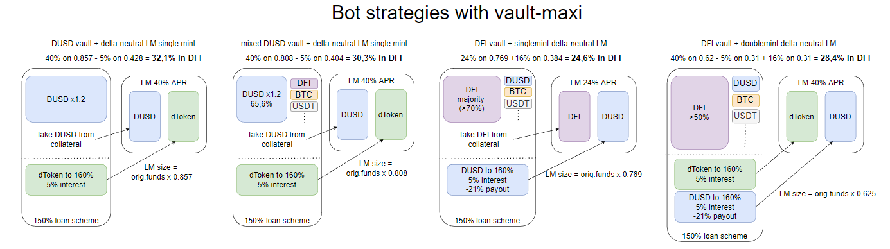

Auf der DeFiChain haben wir viele großartige Möglichkeiten, dem Ökosystem einen Wert zu verleihen und dafür Cashflow zu erhalten. Abhängig von deinem Vermögen und deiner Risikobereitschaft kannst du die beste Lösung wählen. In diesem Beitrag versuche ich, alle Möglichkeiten zusammenzufassen, um dir die Auswahl zu erleichtern. Vielleicht findest du auch einige Optionen, die du bisher übersehen hast. Mit dem kommenden Update werden sich auch die Rewards für einige Optionen ändern, also lies und finde deine beste Option.

:::info Disclaimer
Wie immer ist dies keine Finanzberatung, die Renditen sind eine Momentaufnahme zum Zeitpunkt der Erstellung und werden sich wahrscheinlich von Tag zu Tag ändern (nach oben oder unten). Jede Option beinhaltet natürlich das allgemeine Risiko, dass die gesamte Chain auf null geht.
:::

Die delta-neutralen Strategien basieren auf 40 % APR im dToken-Pool. Diese delta-neutralen Strategien unterliegen immer noch einem möglichen kleinen Impermanent Loss, weshalb ich immer empfehle, weniger volatile dTokens dafür zu verwenden. Eine 20%ige Bewegung des dTokens führt zu einem Verlust von 0,5 % aufgrund von Poolverschiebungen.

## Einfache, manuelle Strategien {#simple-manual-strategies}

Beginnen wir mit Optionen, die kein oder nur ein geringes Risiko beinhalten.

*Manuelle Cashflow-Optionen auf DeFiChain*.  

### Staking DFI {#staking-dfi}

- Eingabe: **100 % DFI**
- Risiko: Kontrahentenrisiko des zentralisierten Dienstes
- Belohnungen: **20,8 % APY - 23,7 % APR in DFI**

Dies ist der einfachste, aber dennoch effektive Weg: Füge deinem Cake- oder DFX-Konto einen beliebigen Betrag an DFI hinzu und erhalte Cashflow. Sie reinvestieren sogar automatisch für dich, damit du vom Zinseszins-Effekt profitierst.

Wenn du über 20.000 DFI besitzt, kannst du auch deine eigene [Masternode](./Masternode.md) betreiben, was das Kontrahentenrisiko verringert und deine Rendite erhöht.

Du kannst deine DFI einfrieren, um zusätzliche Belohnungen zu erhalten. 5 Jahre für 35 % APR oder 10 Jahre für 47 % APR.

### LM-Stablecoin-Pools {#lm-stablecoin-pools}

- Eingabe: **50 % dUSD + 50 % (USDT oder USDC)**
- Risiko: IL (de/repeg von dUSD)
- Belohnungen: **36-45 % in DFI**

Du musst deine Mittel zu gleichen Teilen in dUSD und USDC/T aufteilen. Wenn du das hast, ist dies ein großartiger Ort, um Rendite auf Stablecoins zu verdienen.

### LM Krypto-Pools {#lm-crypto-pools}

- Input: **50 % DFI + 50 % andere Kryptowährungen** (BTC, ETH, USDT, USDC, dUSD, LTC, BCH, DOGE)
- Risiko: IL (Verschiebung von DFI vs. andere Kryptowährungen)
- Belohnungen: **11-40 % in DFI**

Du musst deine Mittel zu gleichen Teilen auf DFI und andere Kryptos aufteilen. Wenn du das hast, ist dies ein großartiger Ort, um Rendite auf dein bestehendes Krypto-Exposure zu erzielen.

### LM dStock-Pools {#lm-dstock-pools}

- Eingabe: **50 % dUSD + 50 % dStock** (SPY, QQQ, TLT, GLD, TSLA,GME...)
- Risiko: IL
- Belohnungen: **10-40 % in DFI**

Dies ist der beste Weg, um einen Cashflow auf dein diversifiziertes Aktienportfolio zu erwirtschaften, besonders wenn du ein Marktengagement, aber kein Krypto-Exposure wünschst.

## Manuelle Strategien mit Vaults {#manual-strategies-with-vaults}

Vaults auf DeFiChain sind unglaubliche Werkzeuge, aber um sie sicher zu nutzen, musst du sie verstehen. Wenn du denkst, dass das alles zu kompliziert ist, dann ist das nicht schlimm. Höre jetzt auf zu lesen und halte dich an eine der oben genannten Optionen.

Ansonsten folge mir in den Kaninchenbau.

*Vault-Strategien, die manuell ausgeführt werden können*  

### dUSD-Vault + delta-neutraler LM {#dusd-vault--delta-neutral-lm}

- Eingabe: **100 % dUSD**
- Risiko: dToken IL + Sie müssen Ihren Vault je nach Ihrem Besicherungsquote überwachen
- Belohnung: **28-30 % in DFI** (für ein Besicherungsquote zwischen 180 und 200 %)

Lege einen Teil deiner dUSD in den Vault und minte einen dToken deiner Wahl, sodass der Betrag des geminteten dTokens dem der verbleibenden dUSD entspricht. Nun kannst du beide zusammen in den LM einbringen. Dies ist eine delta-neutrale Strategie, da du mit dem dToken weder long noch short bist. Du schuldest sie dem Vault, besitzt aber gleichzeitig die gleiche Menge an dToken, die sich im LM-Pool befinden.

Stelle jedoch sicher, dass du ein Besicherungsquote wählst, mit dem du dich wohlfühlst. Da dUSD im Vault stabil ist, bedeutet ein Verhältnis von 180 % in diesem Fall, dass deine dToken um 20 % steigen können, bevor du liquidiert wirst. Wenn du also einen Token mit geringer Volatilität wählst, könnte es ausreichen, ihn täglich zu beobachten.

Wenn dir diese Idee gefällt, du aber deinen Vault nicht manuell überwachen/anpassen möchtest, lies bitte weiter.

## Zusätzliche Strategien mit Bots wie vault-maxi {#additional-strategies-with-bots-like-vault-maxi}

Das Hauptrisiko bei Vaults ist die Liquidation. Du kannst dies verhindern, indem du einen ausreichenden Puffer in der Besicherungsquote hast. Aber das wird deine Gewinne drastisch reduzieren.

Bots wie vault-maxi können hier helfen, indem er Ihren Vault ständig überwacht und dafür sorgt, dass er immer innerhalb des festgelegten Bereichs bleibt.

Aber Bots bringen auch andere Risiken mit sich (Codefehler, Ausfallzeiten von Cloud-Providern, Hacks usw.). **Verwende Bots nur, wenn du alle damit verbundenen Risiken verstehst und akzeptierst.**

Wenn du dich eingehender mit Bots befassen willst, ist vault-maxi eine großartige Option. Version 2.3 ([veröffentlicht auf GitHub, mit Setup-Anleitung](https://github.com/kuegi/defichain_maxi/releases/tag/v2.3)) bietet alle hier gezeigten Optionen. Wenn du befürchtest, dass vault-maxi zu kompliziert einzurichten ist, sieh dir dieses Video an und entscheide dich selbst: https://youtu.be/NOeXa69Z4GU

Die folgenden Strategien gehen von einer Zielsicherheitsquote von 160 % aus.

*Cashflow-Optionen über vault-maxi*  

### dUSD-Vault + delta-neutraler LM {#dusd-vault--delta-neutral-lm-1}

- Eingabe: **dUSD (66 % - 100 %)** + beliebige Mischung aus BTC, ETH, USDT, USDC, DFI
- Risiko: alle mit dem Betrieb von Bots verbundenen Risiken + IL
- Belohnungen: **30,3-32,1 % in DFI**

Der Single-Mint-Modus von vault-maxi ermöglicht es dir, die oben beschriebene Strategie zu automatisieren (dUSD aus Sicherheiten nehmen und dToken minten). Auf diese Weise musst du selbst keine Berechnungen durchführen und kannst die Gewinne sicher genießen.

### DFI-Vault + einzelne Münze delta-neutral LM {#dfi-vault--single-mint-delta-neutral-lm}

- Eingabe **DFI (mindestens 70 %)** + beliebige Mischung aus BTC, ETH, USDT, USDC, dUSD
- Risiko: alle mit dem Betrieb von Bots verbundenen Risiken + IL
- Belohnungen: **24,6 % in DFI**

Die Strategie ist die gleiche wie in der dUSD-Version, aber mit DFI aus den Sicherheiten und dem Minten von dUSD. Durch die Auszahlung der DEX-Gebühr erhält diese Strategie zusätzliche Belohnungen für das dUSD-Darlehen. Für LM wird der dUSD-DFI-Pool verwendet.

### Gemischter Vault + doppeltes Minten delta-neutrale LM {#mixed-vault--double-mint-delta-neutral-lm}

- Eingabe: **>50 % DFI** + beliebige Mischung aus BTC, ETH, USDT, USDC, dUSD
- Risiko: alle mit dem Betrieb von Bots verbundenen Risiken + IL
- Belohnungen: **28,4 % in DFI**

Bei dem Doppel-Minting werden sowohl dUSD als auch der dToken aus dem Vault gemintet und in LM eingezahlt. Auch hier erhöht der negative Zinssatz die Belohnung für diese Strategie. Mit der Aktualisierung benötigst du 50 % der erforderlichen Sicherheiten in DFI.

## Zusammenfassung {#summary}

*Übersicht über alle verschiedenen Optionen*  

Wie du sehen kannst, gibt es in diesem schönen Ökosystem mehrere Möglichkeiten für den Cashflow.
