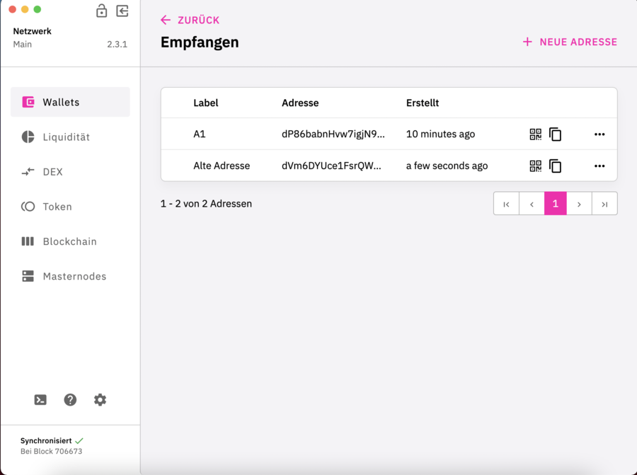

## Eine neue Adresse erstellen: {#eine-neue-adresse-erstellen}

Klick auf DFI Wallet

Klick auf Empfangen

Klick auf neue Adresse

Benenne die neue Adresse mit einer beliebigen Bezeichnung

Klick auf erstellen

Die neue Adresse wird angezeigt

## Eine alte Adresse wieder anzeigen: {#eine-alte-adresse-wieder-anzeigen}

Klick auf DFI Wallet

Klick auf Empfangen

Klick auf neue Adresse

Schalter nach links.
Alte Adresse eintragen.  
Benenne die Adresse mit einer beliebigen Bezeichnung.  
Klick auf erstellen.

Die alte Adresse wird jetzt wieder angezeigt.

## Alte Adressen finden {#alte-adressen-finden}

Mit folgender Funktion können die alten Adressen über die Konsole
herausgelesen werden:

`listaddressgroupings`
