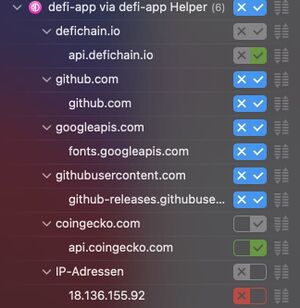

## Technische Probleme {#technische-probleme}

### Keine funktionierende App {#keine-funktionierende-app}

Aktuell gibt es keine DeFi App die sich ohne Probleme auf einem neuen Gerät installieren lässt. Alle Versionen vor 2.3.0 sind nicht mehr mit dem Netzwerk kompatibel. Die Version 2.3.0 hat einen Fehler im Installationsprozess, so dass die Installation nicht vollständig ausgeführt wird und die Blockchain nicht gestartet werden kann. Die nachfolgende Version 2.3.1 musste aus Sicherheitsgründen zurückgezogen werden. Aktuell gibt es also keine funktionierende Software die zum Download auf ein neues Gerät empfohlen werden kann.

### Updateprozess löscht bestehende Wallets {#updateprozess-löscht-bestehende-wallets}

Einige Nutzer der DeFi App haben ihr Guthaben verloren, weil die Wallet Datei während dem Updateprozess auf 2.3.0 oder 2.3.1 gelöscht worden ist.

<https://github.com/DeFiCh/app/issues/641>

### Die DeFi App greift auf mehrere zentralisierte API Schnittstellen zu {#die-defi-app-greift-auf-mehrere-zentralisierte-api-schnittstellen-zu}

Die DeFi App greift auf folgende zentralisierte Server zu:

1.  api.defichain.io
2.  github.com
3.  fonts.googleapis.com
4.  github-releases.githubusercontent.com
5.  api.coingecko.com
6.  18.136.155.92

Zugriffspunkte der DeFi App

### DEX ist von zentralisierter API abhängig {#dex-ist-von-zentralisierter-api-abhängig}

Die DEX ist nicht so dezentral wie beworben. Die Software greift auf eine API von Coingecko zurück. Wird die IP Adresse von Coingecko auf dem Router gesperrt, dann funktioniert die DEX nicht mehr.

### Masternode Benutzeroberfläche unbrauchbar {#masternode-benutzeroberfläche-unbrauchbar}

Die Masternode Benutzeroberfläche ist fehlerhaft. Die Anzeige auf der Oberfläche stimmt nicht mit dem überein was die Node wirklich macht. Teilweise ist die Node on, zeigt aber off an und umgekehrt.

<https://github.com/DeFiCh/app/issues/650>

### Transaktionen werden nicht angezeigt {#transaktionen-werden-nicht-angezeigt}

Die DeFi App zeigt nicht alle Transaktionen korrekt an. Transaktionen mit Legasy Adressen werden nicht korrekt verarbeitet. Eingehende Rewards aus dem Betrieb einer Masternode werden in der Benutzeroberfläche nicht angezeigt.

<https://github.com/DeFiCh/app/issues/624>

### CAKE Zertifikat auf der DeFi App Software {#cake-zertifikat-auf-der-defi-app-software}

Die DeFi App ist mit einem CAKE Zertifikat geschützt.

Cake Pte Ltd

### Kein sicherer Masternode Betrieb in einem Rechenzentrum möglich {#kein-sicherer-masternode-betrieb-in-einem-rechenzentrum-möglich}

Text folgt

## Community Probleme {#community-probleme}

### CAKE besitzt 99.9% aller Masternodes {#cake-besitzt-999-aller-masternodes}

CAKE besitzt 15'150 DFI Masternodes. 40 Masternodes werden durch andere Community Mitglieder betrieben.

