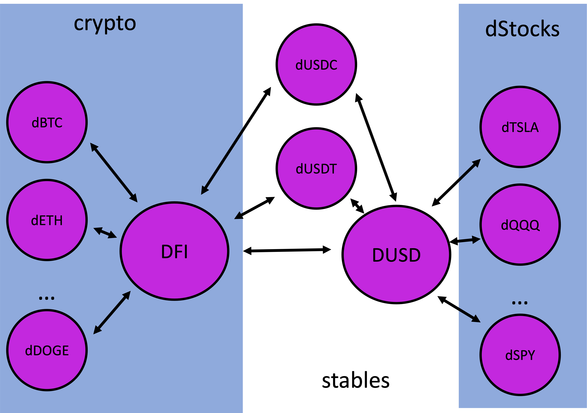

## DEX und dezentraler Handel von Tokens

*Was ist „die DEX“ überhaupt und wie kommt ein Handel zu Stande?*

DEX steht für **d**ezentrale **Ex**change und ist der Handelsplatz im Defichainsystem. Im Gegensatz zu einer Zentralen Exchange gibt es auf der DEX kein Orderbuch, sondern der Handel findet über Pools statt. Diese Pools sind jeweils mit 2 Assets befüllt. Das Verhältnis dieser beiden Tokens im Pool legt den aktuellen Preis für den Wechsel eines Assets in das andere fest. Das Verhältnis bestimmt also quasi den Wechselkurs.

## Trading Pools

Auf der DeFiChain unterscheidet man zwischen Krypto- und dStock-Pools.

Die Krypto Pools handeln immer mit DFI, dem nativen coin der DeFiChain, zB dETH-DFI oder dBTC-DFI. Eine Unterkategorie davon sind die Stablecoin Pools dUSDT-DFI und dUSDC-DFI.

Die dStock-Pools handeln immer mit DUSD, dem stablecoin der DeFiChain. zB sTSLA-DUSD, dQQQ-DUSD, usw. Auch von DUSD aus kann direkt mit den Stablecoins getauscht werden - dUSDT-DUSD und dUSDC-DUSD Eine Lister der handelspaare nach Anlagekategorien finet sich hier: [Tradable dAssets on DeFiChain](./Tradable_dAssets_on_DeFiChain.md)

Ein Pool verbindet die beiden Poolarten: DFI-DUSD

## Liquidity Mining

An den Pools kann man sich beteiligen und Liquidity Mining betreiben. Dazu wählt man einen Pool für den man beide Token besitzt (zB dTSLA und DUSD). Die beiden Assets können nur entsprechend dem aktuellen Poolverhältnis hinzugefügt werden. Der Anteil am Pool wird wiederum als ein separater Pool Token der Wallet gutgeschrieben. Block für Block bekommt man für diesen Pool Token nun Belohnungen/Rewards (in DFI) und einen Teil der Wechselgebühren/Commission (im jeweiligen Asset das geswapped wurde).

Ein Risiko, das man bei Bereitstellung von Liquidität zu den Pools, also beim Betreiben von Liquidity Mining, beachten muss ist die des [Impermanent Loss](./Impermanent_Loss.md).
