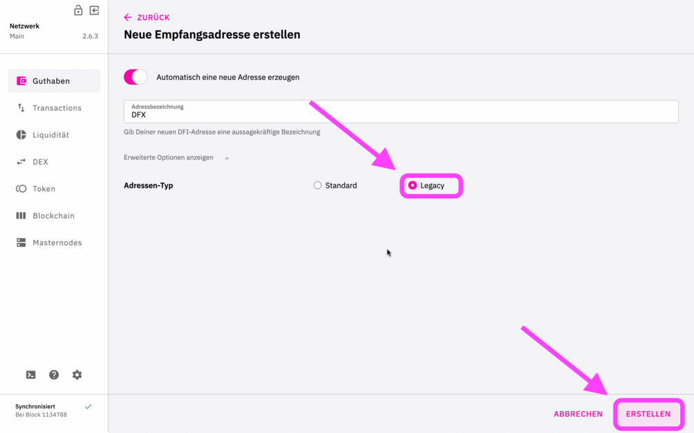
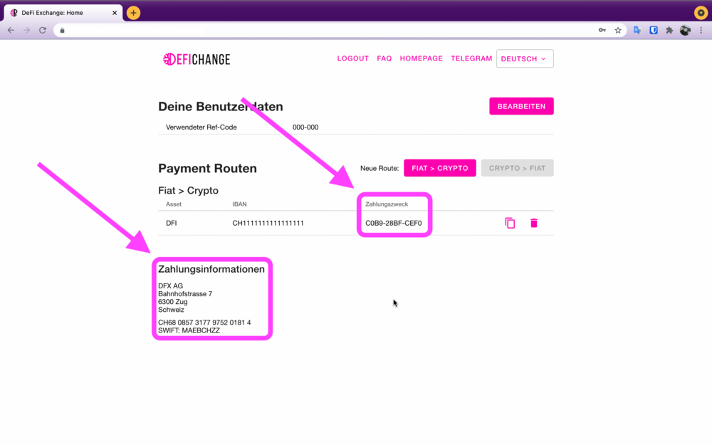

Diese Webseite beschreibt, wie man sich an der DFX.swiss Exchange registrieren kann.

[Videoanleitung](https://www.youtube.com/watch?v=0C50S1GhBu8) anschauen.

[Download](https://defichain.com/downloads/) link zur Full Node Wallet.

Login auf der [Seite ↗](https://payment.dfx.swiss/login).

