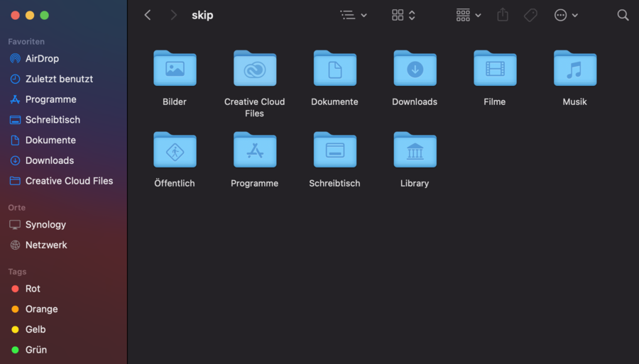
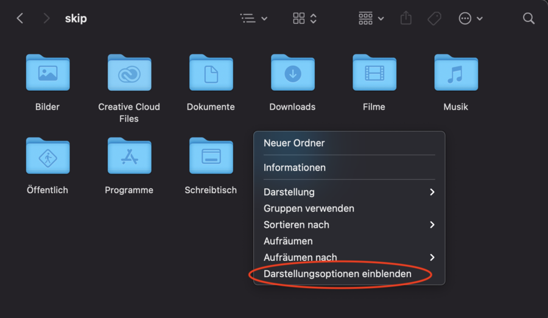
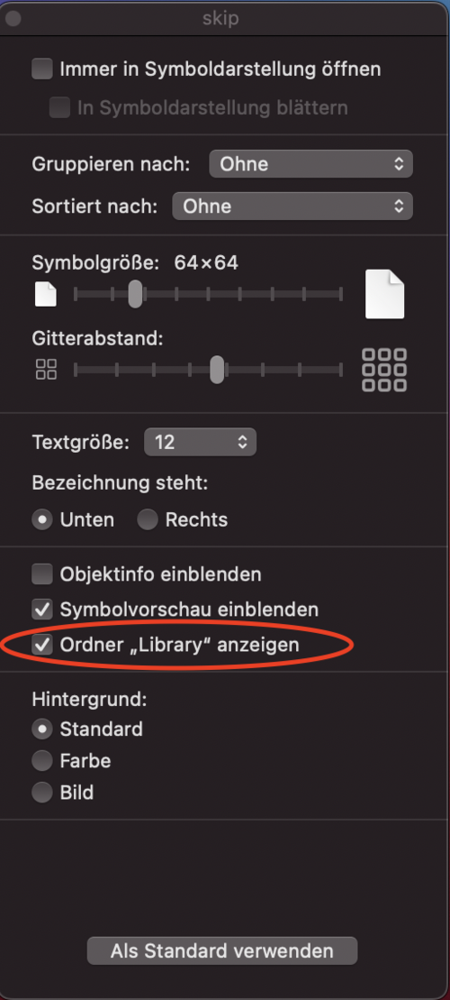

## Windows {#windows}

In der Standard Einstellung werden versteckte Ordner nicht angezeigt.
Für einige Problemlösungen an der DeFi App ist es jedoch notwendig auf
diese Ordner zugreifen zu können. Dazu wie folgt vorgehen.

_Ansicht ohne versteckte Ordner_  

_Aktivieren der Anzeige_  

_Die versteckten Ordner werden jetzt angezeigt_  

## Mac {#mac}

### Versteckte Ordner {#versteckte-ordner}

Die folgende Tastenkombination kann verwendet werden, um versteckte Ordner in Mac OS anzuzeigen.

_[cmd] + [shift] + [.]_  
![[cmd] + [shift] + [.]](./../media/hiddenfolder_DE_4.jpg)

_Vorher_  

_Nachher_  

### Library {#library}

Unter Mac OS wird oft Zugriff auf den Library Ordner benötigt, der nicht standardmässig angezeigt wird.

_Library Ordner_  

Mache einen Rechtsklick und klicke dann auf Darstellungsoptionen einblenden

_Darstellungsoptionen einblenden_  

_Ordner Library anzeigen_  

Danach wird der Library Ordner korrekt angezeigt.

### Dateien in einer Anwendung {#dateien-in-einer-anwendung}

Wie man Dateien in einer Anwendung anzeigt. z. B.: `/Applications/defi-app.app/Contents/Resources/binary/mac`

_Rechtsklick auf die Anwendung und dann auf Paketinhalt anzeigen_  

_Die Ordner der Anwendung werden nun angezeigt_  

