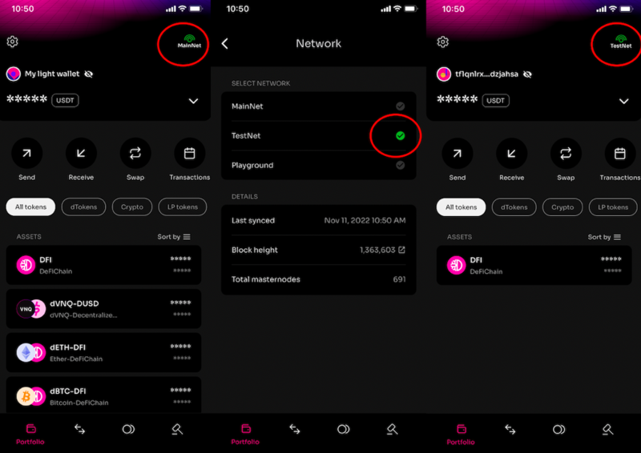

## Motivation

Möchte man gewisse Dinge ausprobieren, wie zum Beispiel neue Features testen oder eigene Bots entwickelt und dabei nicht die hart verdienten echten DFI riskieren möchte, kann man das Testnet verwenden.

## Zugang zum Testnet

### Wechsel auf das Testnet in der Light wallet / DefiCahin Wallet App

### Wechsel auf das Testnet in der Desktop Wallet / Full node

### Wechsel auf das Testnet auf der Seite defiscan.live

## Unterschiede zum Mainnet

Die Funktionen auf der Blockchain sind gleich wie im Mainnet. Natürlich gibt es weit weniger Masternodes und Teilnehmner im Testnet. Neuer Updates (Hardforks) werden am zuerst am Testnet ausgerollt und dort verprobt. In dieser Zeit, bis zum geplanten Hardfork des Mainnets sollte also viel getestet werden. Das das TVL und die Anzahl der Teilnehmer hier viel geringer sind, gibt es nicht nur wenige dToken und deren Liquidity Mining Pools im gegensatz zur großen Auswahl im Mainnet.

## DFI am Testnet ‚einzahlen‘

_Wie bekommt man DFI auf seine Testnet Adresse?_

Auf der Seite <https://testnet-utxo.mydefichain.com/> kann man sich alle 6 Stunden neue 1.000 DFI auf eine Testnet Adresse schicken lassen

Dafür muss man nur die Testnet Adresse angeben (diese beginnt mit einem **t** und nicht **d** wie im Mainnet) und ein Capcha lösen. Die DFI werden dann zügig gesendet.
