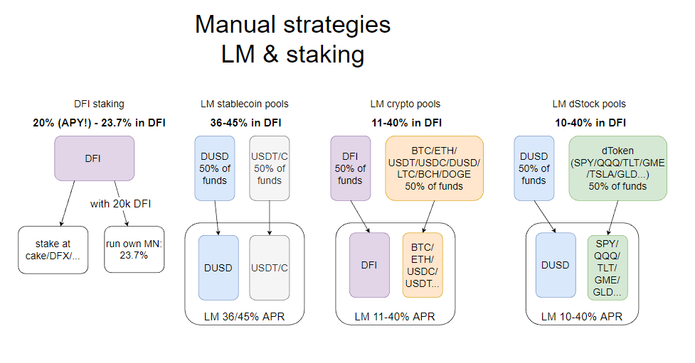
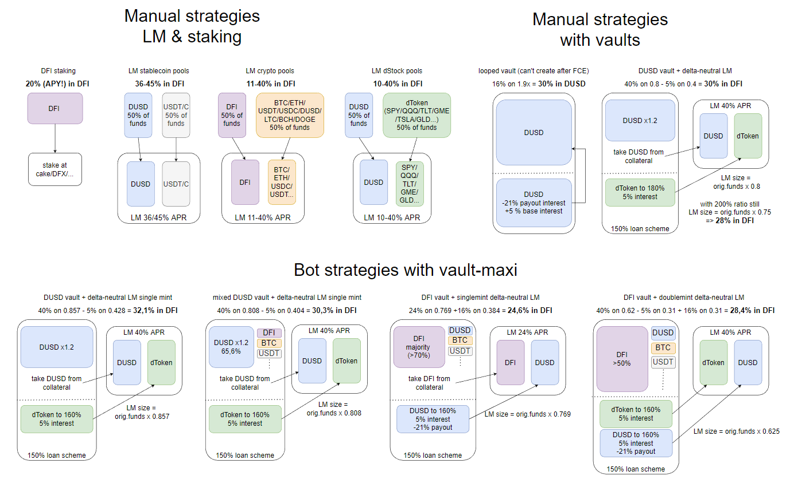

DeFiChain'de, ekosisteme değer sağlamanın ve bunun için nakit akışı elde etmenin birçok harika yolu var. Varlıklarınıza ve risk iştahınıza bağlı olarak, size en uygun olanı seçebilirsiniz. Bu yazıda, seçim yapmanızı kolaylaştırmak için tüm yolları özetlemeye çalışıyorum. Belki daha önce gözden kaçırdığınız bazı seçenekler de bulabilirsiniz. Gelecek güncelleme ile bazı seçeneklerdeki ödüller de değişecek, bu yüzden okuyun ve en iyi seçeneğinizi bulun.

:::info Yasal Uyarı
Her zaman olduğu gibi, bu finansal bir tavsiye değildir, ödüller yazım sırasında anlık bir görüntüdür ve muhtemelen günden güne değişecektir (yukarı veya aşağı). Elbette her seçenek, tüm zincirin sıfıra inmesi genel riskini içerir.
:::

Delta-nötr stratejiler, dToken havuzundaki %40 APR'ye dayanmaktadır. Bu delta-nötr stratejiler hala olası küçük bir Kalıcı Kayba tabidir, bu yüzden her zaman bunun için daha az değişken dToken'lar kullanmanızı öneririm. dToken'daki %20'lik bir hareket, değişen havuzlar nedeniyle %0,5'lik bir kayba neden olur.

## Basit, manuel stratejiler {#simple-manual-strategies}

Hiç risk içermeyen veya düşük risk içeren seçeneklerle başlayalım.

DeFiChain'de *Manuel nakit akışı seçenekleri*  

### Staking DFI {#staking-dfi}

- Giriş: **%100 DFI**
- Risk: merkezi hizmetin karşı taraf riski
- Ödüller: **%20,8 APY - DFI'da %23,7 APR**

Bu en basit ama yine de etkili yoldur: Pastanıza veya DFX hesabınıza istediğiniz miktarda DFI ekleyin ve nakit akışı alın. Hatta sizin için otomatik bileşikleme bile yaparlar.

20 bin DFI'nız varsa kendi MN'nizi de çalıştırabilirsiniz, karşı taraf riskini azaltır ve ödülünüzü artırır.

Ek ödüller almak için DFI'nızı stake etmeye de kilitleyebilirsiniz. 35 APR için 5 yıl veya %47 APR için 10 yıl.

### LM stablecoin havuzları {#lm-stablecoin-pools}

- Girdi: **%50 DUSD +%50 (USDT veya USDC)**
- Risk: IL (de/repeg of DUSD)
- Ödüller: DFI'da **%36-45**

Fonlarınızın DUSD ve USDC/T'ye eşit parçalara bölünmesi gerekir. Buna sahipseniz, burası sabit coinlerden getiri elde etmek için harika bir yerdir.

### LM kripto havuzları {#lm-crypto-pools}

- Girdi: **50 DFI + %50 diğer kriptolar** (BTC, ETH, USDT, USDC, DUSD, LTC, BCH, DOGE)
- Risk: IL (DFI'ın diğer kriptolara karşı hareketi)
- Ödüller: DFI'da **%11-40**

Fonlarınızın DFI ve diğer kriptolara eşit parçalara bölünmesi gerekir. Buna sahipseniz, burası mevcut kripto maruziyetinizden getiri elde etmek için harika bir yerdir.

### LM dStock havuzları {#lm-dstock-pools}

- Girdi: **%50 DUSD +%50 dStock** (SPY,QQQ,TLT,GLD,TSLA,GME...)
- Risk: IL
- Ödüller: DFI'da **%10-40**

Bu, çeşitlendirilmiş hisse senedi portföyünüzden nakit akışı elde etmenin en iyi yoludur, özellikle de piyasaya maruz kalmak istiyor ancak kriptoya maruz kalmak istemiyorsanız.

## Kasa ile manuel stratejiler {#manual-strategies-with-vaults}

DeFiChain'deki kasalar inanılmaz araçlardır, ancak onları güvenli bir şekilde kullanmak için onları anlamanız gerekir. Her şeyin çok karmaşık olduğunu düşünüyorsanız: bunda yanlış bir şey yok. Şimdi okumayı bırakın ve yukarıdaki seçeneklerden birine bağlı kalın.

Aksi takdirde, beni tavşan deliğinden aşağı takip edin.

*Manuel olarak yapılabilecek kasa stratejileri*  

### Döngülü DUSD kasası {#looped-dusd-vault}

- Girdi: **%100 DUSD**
- Risk: "yok" (negatif faizin ortadan kalktığı ve ödemeye başladığınız zamanı kaçırmak)
- Ödüller: DUSD olarak **%30**

Diğer tüm seçeneklerin aksine, bu stratejideki ödüller adresinize ödenmez, ancak kredi tutarınızı azaltır. Bileşik için daha fazla kredi almanız (ve tekrar döngü yapmanız) gerekir ki bu da FCE güncellemesinden sonra mümkün olmayacaktır.

FCE güncellemesinden sonra bunları oluşturmak genellikle mümkün olmayacaktır.

Şu anda burası DUSD'nizle olmak için harika bir yer. Ama okumaya devam edin.

### DUSD kasası + delta-nötr LM {#dusd-vault--delta-neutral-lm}

- Girdi: **%100 DUSD**
- Risk: dToken IL + teminat oranınıza bağlı olarak kasanızı izlemeniz gerekir
- Ödüller: DFI'da **%28-30** (teminat oranı %180 ile %200 arasında ise)

DUSD'nizin bir kısmını teminata koyun ve seçtiğiniz bir dToken'ı basarak, basılan dToken miktarının kalan DUSD ile aynı olmasını sağlayın. Şimdi bunları LM'de bir araya getirebilirsiniz. Bu delta-nötr bir stratejidir, çünkü dToken'da ne uzun ne de kısasınız. Kasaya borçlusunuz, ancak aynı zamanda LM havuzunda bulunan aynı miktarda dToken'a sahipsiniz.

DUSD'nin çatallanmadan sonra teminat olarak 1,2 $ değerinde olmasıyla, bu muhtemelen döngülü DUSD kasasından bile daha karlı olacaktır, özellikle de DFI yükseldiğinde bu daha karlı hale geldiğinden.

Ancak kendinizi rahat hissedeceğiniz bir teminat oranı seçtiğinizden emin olun. DUSD kasada sabit olduğundan, bu durumda %180'lik bir oran, dToken'ınızın likide edilmeden önce %20 yükselebileceği anlamına gelir. Dolayısıyla, düşük volatiliteli bir token seçerseniz, günlük olarak izlemek yeterli olabilir.

Bu fikri beğendiyseniz ancak kasanızı manuel olarak izlemek/ayarlamak istemiyorsanız, otomatik seçenekleri okumaya devam edin.

## Vault-maxi gibi botlarla ek stratejiler {#additional-strategies-with-bots-like-vault-maxi}

Kasalarla ilgili ana risk likidasyondur. Teminat oranında yeterli tampon bulundurarak bunu önleyebilirsiniz. Ancak bu, ödüllerinizi önemli ölçüde azaltacaktır.

Vault-maxi gibi botlar, kasanızı sürekli izleyerek ve her zaman tanımlanan aralıkta kalmasını sağlayarak burada yardımcı olabilir.

Ancak botlar denkleme başka riskler de ekler (kod hataları, bulut sağlayıcı kesintileri, hack'ler vb.) **Botları yalnızca beraberinde gelen tüm riskleri anlıyor ve kabul ediyorsanız kullanın.

Botları daha derinlemesine incelemek istiyorsanız, vault-maxi harika bir seçenektir. v2.3 ([kurulum kılavuzu ile GitHub'da yayınlandı](https://github.com/kuegi/defichain_maxi/releases/tag/v2.3)) burada gösterilen tüm seçenekleri sağlar. Vault-maxi'nin kurulumunun çok karmaşık olmasından korkuyorsanız, bu videoyu izleyin ve kendiniz karar verin: https://youtu.be/NOeXa69Z4GU

Aşağıdaki stratejiler %160'lık bir hedef teminat oranı varsaymaktadır.

*Vault-maxi* aracılığıyla nakit akışı seçenekleri  

### DUSD kasası + delta-nötr LM {#dusd-vault--delta-neutral-lm-1}

- Girdi: **DUSD (%66 - %100)** + herhangi bir BTC, ETH, USDT, USDC, DFI karışımı
- Risk: botların çalıştırılmasıyla ilgili tüm riskler + IL
- Ödüller: DFI'da **%30,3-32,1**

Kasa-maxi'nin tek nane modu, stratejiyi yukarıdan otomatikleştirmenize olanak tanır (DUSD'yi teminattan alın ve dToken'ı daraltın). Bu şekilde kendiniz herhangi bir hesaplama yapmanıza gerek kalmaz ve ödüllerin tadını güvenle çıkarabilirsiniz.

### DFI kasa + tek nane delta-nötr LM {#dfi-vault--single-mint-delta-neutral-lm}

- Giriş **DFI (en az %70)** + herhangi bir BTC, ETH, USDT, USDC, DUSD karışımı
- Risk: botların çalıştırılmasıyla ilgili tüm riskler + IL
- Ödüller: DFI'da **%24,6**

Strateji DUSD versiyonundaki ile aynıdır, ancak teminattan DFI kullanır ve DUSD basar. DEX-ücret ödemesi ile bu strateji DUSD kredisi üzerinden ek ödüller alır. LM için DUSD-DFI havuzu kullanılır.

### Karışık kasa + çift darphane delta-nötr LM {#mixed-vault--double-mint-delta-neutral-lm}

- Girdi: **>%50 DFI** + BTC, ETH, USDT, USDC, DUSD'nin herhangi bir karışımı
- Risk: botların çalıştırılmasıyla ilgili tüm riskler + IL
- Ödüller: DFI'da **%28,4**

Çift darphane durumunda, hem DUSD hem de dToken kasadan basılır ve LM'ye konur. Yine, negatif faiz oranı bu strateji için ödülleri artırır. Güncelleme ile DFI'da gerekli teminatın %50'sine ihtiyacınız var.

## Özet {#summary}

*Tüm farklı seçeneklere genel bakış*  

Gördüğünüz gibi, bu güzel ekosistemde nakit akışı için birden fazla yol var.
