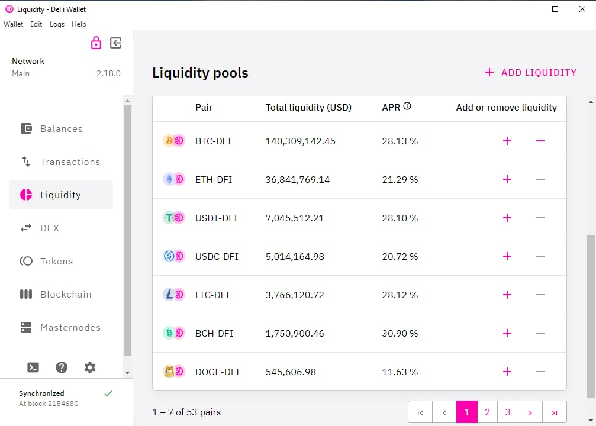

DEX (Decentralised Exchange) merkeziyetsiz borsa anlamına gelir. Aracı olmadan bilgisayarınıza veya telefonunuza indirdiğiniz borsa yazılımıyla merkeziyetsiz takas ve arbitraj imkanı sağlar.

## DeFiChain DEX

DeFiChain DEX, DeFiChain (DeFi Blokzinciri) üzerinde çalışan denetlenmiş, tamamen merkezi olmayan ve gözetimsiz bir borsadır.

30 Kasım 2020'de piyasaya sürülen DeFiChain DEX, şu anda DFI'nin BTC, ETH, USDT'ye ve tam ters yönde de takas edilmesine izin veriyor. DeFiChain DEX bir çok merkeziyetsiz varlıklara da yer veriyor ve topluluk düzenli olarak yeni varlıklar eklemeye devam ediyor.

*DeFiChain DEX Desktop Uygulaması / Likidite Havuzları Ekranı*  

DeFiChain'de, DeFi işlemleri ([Likidite madenciliği](./Liquidity_Mining.md) ve takaslar dahil), tüm node'lar tarafından doğrulanan gerçek yerel konsensüs işlemleridir. İlk katman protokolü olan DeFiChain, DeFi işlemleri için daha güçlü güvenlik ve güvenilirlik sağlar. Ayrıca, DeFiChain güvenlik için Bitcoin blok zincirine düzenli olarak çapa atar (anchoring) ve böylece Bitcoin'in tartışılmaz yüksek güvenliğinden faydalanır.

DeFiChain DEX'in benzersiz bir özelliği, madencilik gelirlerini çekmek için herhangi bir ücret gerekmemesidir. Bu ödüller, her blokta (ortalama 30+ saniye) bir kullanıcının adresine otomatik olarak yatırılır. Bu, her büyüklükteki kullanıcının likidite madenciliğine karlı bir şekilde katılmasını sağlar.

DeFiChain ve DeFiChain DEX, SlowMist ve KnownSec tarafından denetlenmiş ve hiçbir güvenlik açığı bulunmadan geçirilmiştir.

### DeFiChain Desktop Uygulaması

DeFi Cüzdanı desktop uygulamasının son sürümünü [defichain.com](https://defichain.com/downloads) adresinden indirebilirsiniz.

### DeFiChain Mobil Uygulama

Parmaklarınızın ucunda, kullanımı kolay DeFiChain cüzdanı mobil uygulamasını appstore veya google play'den indirebilir ve hemen kullanmaya başlayabilirsiniz.

*Appstore DeFiChain Cüzdan Uygulaması*  

DeFiChain Cüzdan, merkezi olmayan finansı Bitcoin'in güvenliği ve değişmezliği ile birleştiren güvenli bir blok zinciri olan DeFiChain tarafından desteklenen açık, merkezi olmayan ve kazançlı finans ekosistemi olan #NativeDeFi'ye açılan kapınızdır.

#### Portföy

Kolaylık ilkeleri üzerine tasarlanan Portföy sayfasını kullanarak artık DeFiChain üzerindeki tüm varlıklarınızı rahatlıkla yönetebilir ve görüntüleyebilirsiniz.

#### Merkeziyetsiz Varlıklar

Cüzdan ile DEX'te [merkeziyetsiz varlıklarınızı](./Decentralized_Assets.md) (dToken) ve kripto varlıklarını sorunsuz bir şekilde takas edebilirsiniz. DFI-DUSD gibi DEX havuzlarına likidite sağlayıp merkezi olmayan borsayı güçlendirirken [likidite madenciğinin](./Liquidity_Mining.md) sağladığı yüksek getirilerden faydalanabilirsiniz.

#### Merkeziyetsiz Krediler (Vault)
Güven gerektirmeyen (Trustless) merkezi olmayan kredilerle daha fazla finansal potansiyelin kilidini açın ve blok zincirinde teminatlı kasalarla merkeziyetsiz varlıklara erişin. Tasfiye edilmiş kasalar için müzayedelere katılarak büyük bir değerde teminat jetonlarına erişim kazanın.

#### Non-Custodial
6 basamaklı bir şifre ile korunan 24 kelimelik kurtarma ifadenizin gözetimini alarak paranızın tam kontrolünü elinizde tutarsınız ve herhangi bir aracıya ihtiyaç duymazsınız..

#### Faydalı İpuçları

Masaüstü cüzdan uygulamasından geçiş yapıyorsanız, masaüstü cüzdan uygulamasındaki kurtarma kelimeleriniz ve wallet.dat, mobil cüzdan uygulamasıyla uyumlu değildir. Masaüstü uygulamasından mobil uygulamaya geçmek için şu adımları izleyin:

1. Mobil uygulamayı indirin ve yükleyin
2. Mobil uygulamada yeni bir cüzdan oluşturun
3. Mobil uygulamada yeni bir alıcı adresi oluşturun
4. Masaüstü uygulamasındaki tüm DFI, jetonlar ve LP (likidite sağlayıcı) jetonlarını üçüncü adımda oluşturulan mobil uygulama alıcı adresine gönderin.
