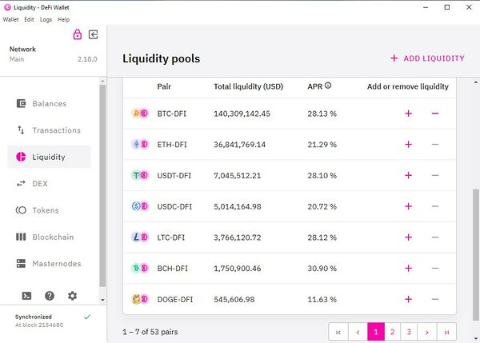

Likidite madenciliğinin genel tanımı, DeFi protokolündeki katılımcıların, başkalarının ticaret yapabilmesi için kendi kripto varlıklarını likidite havuzuna eklemeleri ve karşılığında yeni çıkarılan tokenlerden ve takas esnasında ödenen işlem ücretlerinden düşen pay ile ödüllendirilmeleridir.

## DeFiChain'de Likidite Madenciğili

DeFiChain'deki likidite havuzları, DeFiChain DEX (Merkeziyetsiz Borsa) tarafından kullanılan madeni para çiftlerindeki likiditeden oluşur. DEX üzerinden likidite madenciği yapmak isteyenler aşağıdaki adımları izlemeliler:

### Adım 1: DeFiChain uygulamasını indir

Öncelikle DEX olarak adlandırğımız "DeFi Wallet desktop app" uygulamasını bilgisayarımıza indiriyor ve kurulumunu gerçekleştiriyoruz.

Bir diğer seçenek ise cep telefonumuza Lightwallet olarak adlandırdığımız "DeFiChain wallet mobile app"i kullanmayı tercih edebiliriz.

Uygulamaların son sürümünlerini bu linkten indirebilirsiniz: https://defichain.com/downloads

### Adım 2: Liquidity havuzunu seç

Kurulum tamamlandıktan ve cüzdanlar oluşturulduktan sonra sol taraftaki "Liquidity" bağlantısını tıklayarak mevcut likidite havuzlarıne göz at.

_DEX üzerinde likidite havuzları_  

Pek çok sayıda mevcut olan likidite havuzlarının yıllık getirilerini APR yazan sekmeden kontrol edebilirsin. Şeçim yaparken hangi coin'leri tutmak istediğin de kararında bir rol oynayabilir. Bu yazının yazıldığı tarihte (17.08.2022) DEX üzerinde toplam 53 çeşit havuz mevcut ve USDT-DUSD havuzunun APR'si %53,28'lerde.

Not: Burada belirtilen APR oranları takas komisyonlarını içermiyor; dolayısıyla buradaki yüzdeleri bloko ödüllerinden oluşan minimum APR'ler olarak değerlendirebilirsiniz.

### Adım 3: Likidite sağlayarak madenciliğe başla

Dilediğin havuzun yanındaki artı işaretini tıklayarak eşit değerde her iki madeni paradan eklemen gerekir. Örnek olarak 100 USD ile BTC-DFI havuzuna katılarak likidite sağlamak istersen, 50 USD'lık BTC ve 50 USD'lık DFI ekleyerek likidite madenciliğine başlamış olursun. DeFiChain üzerinde bulunan her blok ile madencilik ödüllerin hesabına yansıyacaktır.

## Likidite Madenciliği Gelirleri

Likidite sağlayıcılarını teşvik etmek ve olası kayıplara neden olabilecek fiyat oynaklığını telafi etmek için iki farklı türde gelir ödenir:

### Takas Komisyonları

Uzun vadede "Likidite Sağlayıcıların" ana geliri takas komisyonlarındn oluşuyor. Bunun için DEX kullanıcılarının takaslarından elde edilen komisyonlar kullanılıyor. Her takastan, verilen madeni paranın %0,2'si kesilir ve likidite sağlayıcılara orantılı olarak dağıtılır. Hacim arttıkça elde edilen takas komisyonları da artacaktır. Başlangıçta likidite sağlamayı daha cazip hale getirmek için ilave olarak blok ödülleri ödenir.

### Blok Ödülü

Blok başına DFI ödülleri şu anda likidite sağlayıcılarına uygun ödülleri sağlamak için yeterli takas komisyonu olmaması nedeniyle verilmektedir. Masternode'ların blok ödüllerinin bir kısmı likidite madencileri için ayrılır ve orantılı olarak dağıtılır. Yazılımsal olarak bu ödüller zamanla azalıyorlar ve hacimin artmasıyla birlikte likidite madencilerin ana gelirleri takas komisyonları olacaktır.
